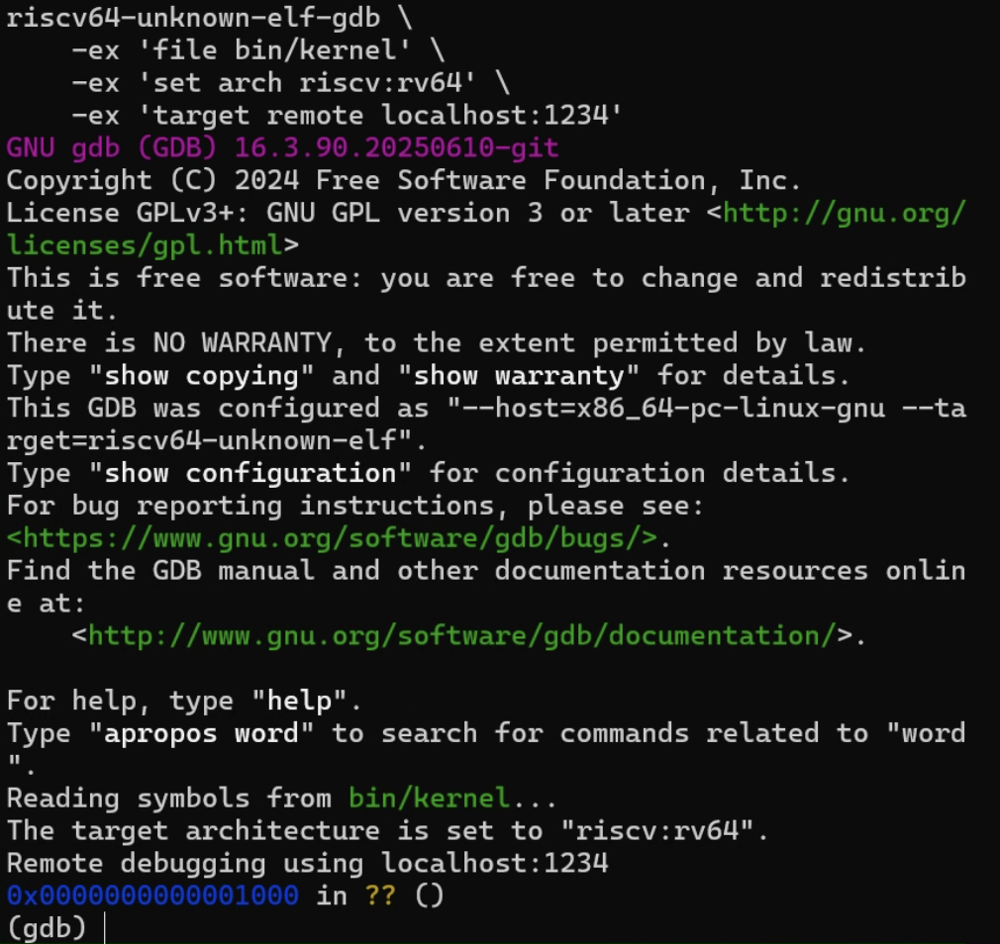
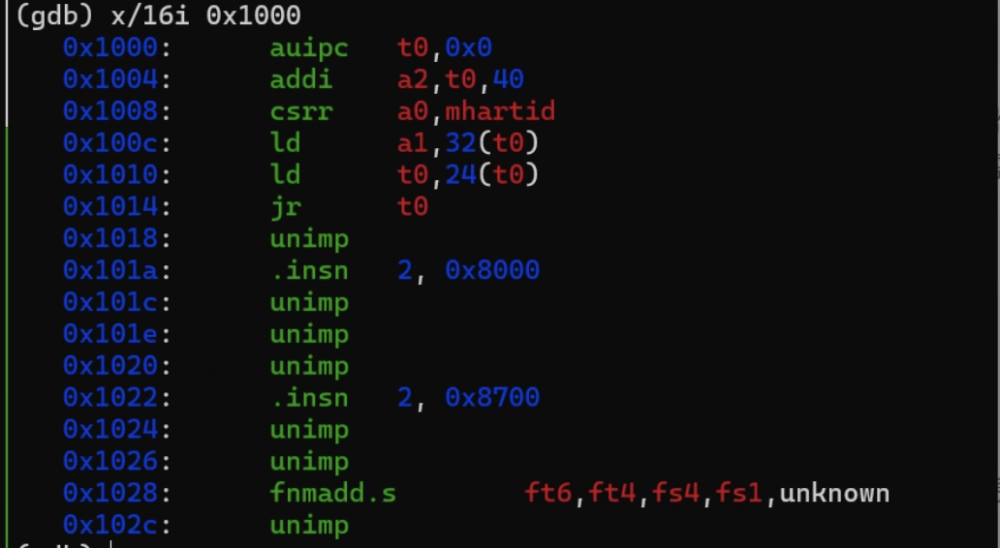

# 2025 操作系统 Lab1
## 练习 1：理解内核启动中的程序入口操作

### 要求
阅读 kern/init/entry.S内容代码，结合操作系统内核启动流程，说明

1. 指令 `la sp, bootstacktop` 完成了什么操作，目的是什么？ 
2. 指令 `tail kern_init` 完成了什么操作，目的是什么？

### 解答
首先回顾一下操作系统最小可执行内核的启动流程：

1. QEMU 启动后模拟上电复位过程，CPU 跳转复位地址执行固件代码，完成初始化后启动固件 OpenSBI 并将其加载到指定物理内存地址
2. CPU 跳转执行 OpenSBI，完成对处理器运行环境的初始化，随后 OpenSBI 将内核镜像文件加载到指定物理内存地址
3. OpenSBI 工作结束后跳转到操作系统内核加载地址开始执行，内核镜像开头是链接脚本设置的 `entry.S` 代码段，`entry.S` 执行结束后将按照RISC-V的调用约定跳转到 `kern_init()` 函数

对应到程序 `entry.S` 中：

`.globl kern_entry` 导出内核入口符号，链接脚本会把它放在内核镜像起始处，使 OpenSBI 跳转到这里开始执行。

`la sp, bootstacktop` 设置内核栈指针，其中 `la` 是伪指令，在汇编阶段会展开成 `auipc + addi`，将 `bootstacktop` 地址加载到栈指针 `sp`；而结合后续指令 `bootstack: / .space KSTACKSIZE / bootstacktop:` 可以知道，`bootstacktop` 其实就指向内核栈栈顶，因此这条指令是为了**在内核启动阶段完成引导栈的初始化**。

`tail kern_init` 无返回地跳转 `kern_init`，其中 `tail` 伪指令等价于无链跳转，不向 `ra` 写回返回地址，跳转到 C 入口函数 `kern_init` 进行清理内存环境、清零未初始化的全局变量，输出内核启动信息、初始化关键子系统等内核初始化工作。**这条指令实现从汇编到 C 语言的过渡，真正启动内核自身逻辑。**

## 练习2：理解内核启动中的程序入口操作

### 要求
使用 GDB 跟踪 QEMU 模拟的 RISC-V，从加电开始，直到执行内核第一条指令（跳转到 0x80200000）的整个过程。通过调试，请思考并回答：

1. RISC-V 硬件加电后最初执行的几条指令位于什么地址？
2. 它们主要完成了哪些功能？

请在报告中简要记录你的**调试过程**、**观察结果**和**问题的答案**。

### 调试过程

#### 阶段1：复位代码执行与跳转

**QEMU & GDB 启动与连接**

为了使用 GDB 调试操作系统内核执行过程，分别使用以下命令先后启动 QEMU 和 GDB。

```bash
make debug
make gdb
```

其中 Makefile 文件对 `debug` 命令定义的 `-S` 参数规定了虚拟 CPU 将在一启动就停止，也就意味着加电启动后硬件执行将中止于复位代码位置，即 `0x1000`，`-s` 参数则规定 QEMU 和 GDB 将连接于 1234 端口。



事实上 RISC-V 硬件加电后，PC 会被设置为 MROM 区域的复位向量地址 `0x1000`，CPU 跳转执行复位代码。复位代码将完成基本的引导跳转，将控制权转交给 OpenSBI。

**查看寄存器状态**

使用以下命令查看寄存器状态：
```bash
(gdb) info register
```
确认程序计数器指向 `0x1000`，即OpenSBI固件的入口点；其它寄存器均为0，表示尚未执行任何指令。
```bash
ra             0x0      0x0
sp             0x0      0x0
gp             0x0      0x0
tp             0x0      0x0
t0             0x0      0
t1             0x0      0
t2             0x0      0
fp             0x0      0x0
s1             0x0      0
a0             0x0      0
a1             0x0      0
a2             0x0      0
a3             0x0      0
a4             0x0      0
a5             0x0      0
a6             0x0      0
a7             0x0      0
s2             0x0      0
s3             0x0      0
s4             0x0      0
s5             0x0      0
s6             0x0      0
s7             0x0      0
s8             0x0      0
s9             0x0      0
s10            0x0      0
s11            0x0      0
t3             0x0      0
t4             0x0      0
t5             0x0      0
t6             0x0      0
pc             0x1000   0x1000
dscratch       Could not fetch register "dscratch"; remote failure reply 'E14'
mucounteren    Could not fetch register "mucounteren"; remote failure reply 'E14'
```

**加电初始指令分析**

使用以下命令展示复位地址（即加电后 PC 所指向的地址） `0x1000` 后 16 字的内存内容（即 16 条指令）。

```bash
x/16i 0x1000
```

观察分析指令可以注意到：

`auipc t0, 0x0` 事实上是向 `t0` 写入当前指令地址，即 `0x1000`，这也是 MROM 区数据表的基址。 

随后涉及三个参数寄存器，`a0` 存放 hard ID（CPU 核编号），`a1` 存放设备树 FDT 物理地址，`a2` 存放配置信息指针，遵守 RISC-V 平台接口约定为 OpenSBI 跳转传递必要参数。

最后 `ld t0, 24(t0)` 从数据表基址偏移 24 字节处取得目标入口地址，即 OpenSBI 基址，随后由 `jr t0` 完成跳转。



使用以下命令在 `0x1010` 处设置断点，然后检查t0的值：
```bash
(gdb) break *0x1010
(gdb) continue
(gdb) info registers t0

```
输出结果：
```bash
t0             0x80000000       2147483648
```

说明CPU将跳转到地址 `0x80000000` 继续执行。

#### 阶段2: OpenSBI 初始化与内核加载

#### 阶段3: 内核初始化

### 问题答案

**问题1**

RISC-V 硬件加电后，PC 设置为 `0x1000` 复位向量地址，CPU 跳转到该处开始执行复位代码，即最初的几条指令地址就是 `0x1000` 处开始的。

**问题2**

如前文所述，复位代码执行主要为 OpenSBI 固件初始化传递必要参数同时实现固件加载跳转。具体而言：

1. **获取硬件信息**：
   - `csrr a0,mhartid` - 获取当前硬件线程ID

2. **加载启动函数指针**：
   - `ld t0,24(t0)` - 从内存地址0x1018处加载函数指针
   - 准备跳转到下一阶段

3. **跳转到BIOS入口**：
   - `jr t0` - 跳转到加载的函数地址
   - 将控制权交给BIOS启动代码

