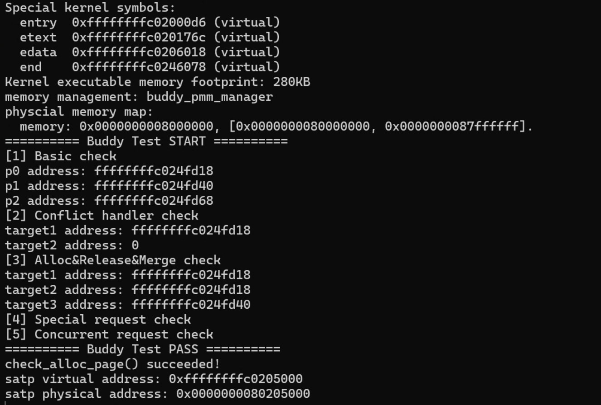

# 2025 操作系统 Lab2
> 团队成员: 2313857陈天祺 & 2311208魏来 & 2312166王旭

## 实验目的

- 理解页表的建立和使用方法
- 理解物理内存的管理方法
- 理解页面分配算法

## 实验内容

### 练习1：理解first-fit 连续物理内存分配算法（思考题）

first-fit 连续物理内存分配算法作为物理内存分配一个很基础的方法，需要同学们理解它的实现过程。

请大家仔细阅读实验手册的教程并结合`kern/mm/default_pmm.c`中的相关代码，认真分析`default_init`，`default_init_memmap`，`default_alloc_pages`， `default_free_pages`等相关函数，并描述程序在进行物理内存分配的过程以及各个函数的作用。 请在实验报告中简要说明你的设计实现过程。

请回答如下问题：*你的first fit算法是否有进一步的改进空间*？


### 练习2：实现 Best-Fit 连续物理内存分配算法（需要编程）

在完成练习一后，参考kern/mm/default_pmm.c对First Fit算法的实现，编程实现Best Fit页面分配算法，算法的时空复杂度不做要求，能通过测试即可。 

请在实验报告中简要说明你的设计实现过程，阐述代码是如何对物理内存进行分配和释放，并回答如下问题：

你的 Best-Fit 算法是否有进一步的改进空间？

### 扩展1：扩展练习Challenge：buddy system（伙伴系统）分配算法（需要编程）

Buddy System算法把系统中的可用存储空间划分为存储块(Block)来进行管理, 每个存储块的大小必须是2的n次幂(Pow(2, n)), 即1, 2, 4, 8, 16, 32, 64, 128...

参考伙伴分配器的一个极简实现， 在ucore中实现buddy system分配算法，要求有比较充分的测试用例说明实现的正确性，需要有设计文档。

### 扩展2：任意大小的内存单元slub分配算法（需要编程）
slub算法，实现两层架构的高效内存单元分配，第一层是基于页大小的内存分配，第二层是在第一层基础上实现基于任意大小的内存分配。可简化实现，能够体现其主体思想即可。

参考linux的slub分配算法/，在ucore中实现slub分配算法。要求有比较充分的测试用例说明实现的正确性，需要有设计文档。

### 扩展3：硬件的可用物理内存范围的获取方法（思考题）
如果 OS 无法提前知道当前硬件的可用物理内存范围，请问你有何办法让 OS 获取可用物理内存范围？

## 实验过程
### 练习1：理解first-fit 连续物理内存分配算法（思考题）

#### 1.1 设计实现过程

First-Fit（首次适应）连续物理内存分配算法的核心思想是：**在空闲链表中按地址顺序查找，找到第一个满足请求大小的空闲块就进行分配**。该算法实现简单，分配速度快，但容易产生外部碎片。

#### 1.2 核心函数分析

##### 初始化函数 `default_init()`

```c
static void default_init(void) {
    list_init(&free_list);  // 初始化空闲链表
    nr_free = 0;           // 清零空闲页面计数
}
```

- **功能**：初始化空闲区管理器，包括建立空链表、清空全局计数
- **实现要点**：
  - 调用`list_init()`初始化双向链表结构
  - 将空闲页面总数`nr_free`设置为0
  - 为后续的内存分配和释放操作做准备

##### 内存映射初始化 `default_init_memmap()`

**第一阶段：页面属性初始化**
```c
for (; p != base + n; p ++) {
    assert(PageReserved(p));    // 确保页面是保留状态
    p->flags = p->property = 0; // 清空页面标志和属性
    set_page_ref(p, 0);         // 设置页面引用计数为0
}
```

- **功能**：将保留状态的页面转换为可用状态，为加入空闲链表做准备
- **实现要点**：
  - `assert(PageReserved(p))`确认页面当前确实是保留状态
  - 在`page_init()`中，所有页面最初都被标记为`PG_reserved`
  - `p->flags = 0`清除了所有标志位，包括`PG_reserved`，将页面从保留状态转换为可用状态
  - 将页面引用计数设置为0，表示页面未被使用，可以被分配

**第二阶段：链表插入**
```c
base->property = n;        // 设置连续页面数量
SetPageProperty(base);     // 标记为空闲页面块
nr_free += n;              // 更新空闲页面总数

// 按地址顺序插入到空闲链表中
if (list_empty(&free_list)) {
    list_add(&free_list, &(base->page_link));
} else {
    list_entry_t* le = &free_list;
    while ((le = list_next(le)) != &free_list) {
        struct Page* page = le2page(le, page_link);
        if (base < page) {
            list_add_before(le, &(base->page_link));  // 插入到第一个大于base的页面之前
            break;
        } else if (list_next(le) == &free_list) {
            list_add(le, &(base->page_link));         // 插入到链表末尾
        }
    }
}
```

- **功能**：将连续页面块按地址升序插入空闲链表
- **实现要点**：
  - 设置`base->property = n`记录连续页面数量
  - 使用`SetPageProperty(base)`标记base页面为空闲块头部
  - 遍历链表找到合适的插入位置，保持地址从小到大排序

##### 内存分配 `default_alloc_pages()`

**First-Fit算法核心实现**：
```c
static struct Page *default_alloc_pages(size_t n) {
    assert(n > 0);
    if (n > nr_free) {
        return NULL;  // 空闲内存不足
    }

    struct Page *page = NULL;
    list_entry_t *le = &free_list;

    // First-Fit算法：遍历空闲链表，找到第一个满足条件的空闲块
    while ((le = list_next(le)) != &free_list) {
        struct Page *p = le2page(le, page_link);
        if (p->property >= n) {  // 找到第一个足够大的空闲块
            page = p;
            break;               // 立即分配，不再继续搜索
        }
    }
```

- **功能**：按照First-Fit策略查找并分配内存
- **算法特点**：
  - 线性扫描空闲链表，从地址最低处开始搜索
  - 找到第一个满足`property >= n`的块就停止搜索
  - 时间复杂度为O(n)，其中n为空闲块数量

**分配和分割逻辑**：
```c
    if (page != NULL) {
        list_entry_t* prev = list_prev(&(page->page_link));
        list_del(&(page->page_link));  // 从空闲链表中移除

        if (page->property > n) {
            // 如果空闲块大于请求大小，进行分割
            struct Page *p = page + n;
            p->property = page->property - n;  // 剩余部分的大小
            SetPageProperty(p);                // 标记为空闲块
            list_add(prev, &(p->page_link));   // 将剩余部分重新加入链表
        }

        nr_free -= n;           // 更新空闲页面计数
        ClearPageProperty(page); // 清除分配页面的空闲标志
    }
    return page;
}
```

- **功能**：处理内存块的分割和状态更新
- **实现要点**：
  - 如果找到的空闲块大于请求大小，则进行分割
  - 剩余部分重新插入空闲链表，保持地址顺序
  - 更新相关页面属性和空闲计数

##### 内存释放 `default_free_pages()`

**第一阶段：页面初始化**
```c
struct Page *p = base;
for (; p != base + n; p ++) {
    assert(!PageReserved(p) && !PageProperty(p));
    p->flags = 0;
    set_page_ref(p, 0);
}

base->property = n;        // 设置连续页面数量
SetPageProperty(base);     // 标记为空闲页面块
nr_free += n;              // 更新空闲页面总数
```

**第二阶段：链表插入**
```c
// 按地址顺序插入到空闲链表（与init_memmap相同逻辑）
if (list_empty(&free_list)) {
    list_add(&free_list, &(base->page_link));
} else {
    list_entry_t* le = &free_list;
    while ((le = list_next(le)) != &free_list) {
        struct Page* page = le2page(le, page_link);
        if (base < page) {
            list_add_before(le, &(base->page_link));
            break;
        } else if (list_next(le) == &free_list) {
            list_add(le, &(base->page_link));
        }
    }
}
```

**第三阶段：合并相邻空闲块**
```c
// 向前合并
list_entry_t* le = list_prev(&(base->page_link));
if (le != &free_list) {
    p = le2page(le, page_link);
    if (p + p->property == base) {  // 检查是否连续
        p->property += base->property;  // 合并大小
        ClearPageProperty(base);        // 清除base的空闲标志
        list_del(&(base->page_link));   // 从链表中删除base
        base = p;                       // 更新base指针
    }
}

// 向后合并
le = list_next(&(base->page_link));
if (le != &free_list) {
    p = le2page(le, page_link);
    if (base + base->property == p) {   // 检查是否连续
        base->property += p->property;  // 合并大小
        ClearPageProperty(p);           // 清除p的空闲标志
        list_del(&(p->page_link));      // 从链表中删除p
    }
}
```

- **功能**：将释放的内存块插入空闲链表并尝试合并
- **实现要点**：
  - 首先将释放的块按地址顺序插入链表
  - 然后检查前后相邻的块，如果物理地址连续则合并
  - 合并可以减少外部碎片，提高内存利用率

#### 1.3 物理内存分配过程

内核启动后，跳转到 `kern_init` 继续执行内核自身初始化，其中 `pmm_init` 将完成物理内存管理初始化，具体步骤如下：

1. **管理器初始化**：以 `init_pmm_manager` 为入口指定目标物理内存管理器，并调用`default_init()`初始化管理器实例
2. **物理内存探测**：以 `page_init` 为入口探测物理内存，通过从设备树 DTB 解析得到物理内存基址和大小来确定可用物理空间范围，同时初始化页数组 `pages[]` 并对齐可用空闲区
3. **空闲块注册**：以 `init_memmap` 为入口回调`default_init_memmap()`函数，将探测到的空闲内存区域注册到空闲链表中
4. **内存分配**：使用 `default_alloc_pages()` 完成内存分配，按照 **First-Fit算法** 搜索符合条件的空闲块，并调整空闲块头与空闲链表
5. **内存回收**：使用 `default_free_pages()` 完成内存回收，按地址插入空闲链表并尝试合并相邻空闲块

#### 1.4 First-Fit算法的改进空间

##### 性能优化
- **降低线性扫描成本**：引入平衡二叉搜索树或跳表，将时间复杂度从O(n)降至O(log n)
- **维护桶结构**：按空闲块大小分级管理，加速定位过程
- **优化插入操作**：使用更高效的数据结构减少插入时的遍历时间

##### 碎片管理
- **减少外部碎片**：设置切割阈值，避免产生过小的碎片块
- **主动合并策略**：定期整理内存，合并相邻的碎片块
- **智能分割**：根据请求大小优化分割策略

##### 混合分配策略
- **分层分配**：小内存使用slab分配器，大内存使用First-Fit算法
- **伙伴系统补充**：引入Buddy System处理特定大小的分配请求
- **缓存机制**：优先重新分配最近释放的内存块

尽管First-Fit算法存在这些改进空间，但其实现简单、分配快速的优点使其在某些场景下仍然是合适的选择。

---
### 练习2：实现 Best-Fit 连续物理内存分配算法（需要编程）


#### 2.1 设计实现过程

`Best-Fit`连续物理内存分配算法的核心思想是：**按地址顺序遍历整个空闲列表的所有空闲块，找到满足空闲块大小大于请求块大小，且块大小最小的空闲块。即最接近请求块大小n的空闲块。然后将这个空闲块分配出去。**。相对于`First-Fit`算法来说，`Best-Fit`算法的核心在于，在分配函数`best_fit_alloc_pages`实现时，要做到的不是找到第一个块大小满足>=请求块大小n的空闲块，而是要找到**最接近n**的空闲块，从而避免产生大量的空闲块浪费，以及块的切割与返回操作。

该Best-Fit算法相对于First-Fit算法来说，分配速度更慢一些，所需要的分配时间更长，因为Best-Fit必须遍历整个空闲块列表`free_list`。

对于优点来说，`Best-Fit`算法能最大限度地保留大的连续空闲块。它倾向于消耗掉和请求大小差不多的“边角料”空闲块，而把大的、完整的空闲块留给未来可能的大请求，这能更有效地利用内存。


#### 2.2 核心函数分析

`Best-Fit`算法的具体实现我们参照着`First-Fit`算法的实现方式来对比实现，实际上对于四个主要的pmm函数:`init()`、`init_memmap()`、`alloc_pages()`、`free_pages()`来说，`Best-Fit`算法在链表初始化、初始化链接空闲内存、释放内存三个方面的原理与`First-Fit`算法在原理上都是相同的，只有在**分配空闲内存**时，`Best-Fit`算法才采用了与`First-Fit`不同的思想，即遍历空闲链表`free_list`来寻找块大小最接近请求大小`n`的空闲块。

明白了这一点，我们来实现下面的`Best-Fit`算法理解起来就非常直观了。

##### (1) 初始化函数 `best_fit_init()`

```c
static void best_fit_init(void) {
    list_init(&free_list);
    nr_free = 0;
}
```

初始化方式与`First-Fit`算法的实现方式是完全相同的，调用`list_init()`初始化双向链表`free_list`，并将全局变量`nr_free`设置为0，代表目前可用的空闲页面数量为0，进行最基本的初始化工作。

##### (2)内存映射初始化 `best_fit_init_memmap()`

对于`best_fit_init_memmap(struct Page *base, size_t n)`函数，我们的目的是，把接收到的从`base`所指向的页开始的一共包含`n`页的连续空闲内存块，按照我们的规则，把空闲块的第一页链接到全局变量空闲链表`free_list`中，用于管理一个接一个的空闲块。同时同步更新全局变量`nr_free`空闲页面总数。

在具体函数实现中，我们首先对接收到的这段空闲内存进行逐页的遍历检验，接下来我们所需要补充的代码与`First-Fit`是相同的，在检验之前是reserved预留的同时，逐页初始化清空原来的标志与属性信息和引用计数。

```c
for (; p != base + n; p ++) {
    assert(PageReserved(p));
    // 清空当前页框的标志和属性信息，并将页框的引用计数设置为0
    p->flags = p->property = 0;
    set_page_ref(p,0);
}
```

后续进行的工作就是，将这块空闲内存的首页base所指向的页设置好相关属性，并更新`nr_free+=n`，然后我们要将base所对应的首页**按地址顺序**链接到全局变量空闲链表`free_list`中，通过遍历`free_list`中的所有le所对应的首页`page`，以地址对比的方式，若我们要新加入的`base`的地址小于当前遍历到的`page`，那么将base所对应的`page_link`链接到当前的le之前，如果一直都没有找到这个page，那么说明要新加入的`base`的地址是最大的，就将它加入到链表的尾部，即最后一个遍历到的le的后面。原理与`First-Fit`是相同的。如下所示:

```c
// 1、当base < page时，找到第一个大于base的页，将base插入到它前面，并退出循环
// 2、当list_next(le) == &free_list时，若已经到达链表结尾，将base插入到链表尾部
if (base < page) {
    list_add_before(le, &(base->page_link));
    break;
} else if (list_next(le) == &free_list) {
    list_add(le, &(base->page_link));
}
```


##### (3)内存分配 `best_fit_alloc_pages()`

`best_fit_alloc_pages(size_t n)`，该函数的作用是分配出内存块大小为`n`的连续内存。这也是我们要实现的`Best-Fit`算法的核心部分，也只有在这个页面分配的时候，所进行的具体实现思想与`First-Fit`是不同的。

首先`best_fit_alloc_pages(size_t n)`函数先进行最基本的合法性判断，排除`n<0`和`n>nr_free`两种最基本的不合法的情况。

然后，为了能够实现`Best-Fit`算法中想要实现的思想:遍历空闲链表，找到块大小最小的**满足块大小大于请求大小n的内存块**，因此我们采用类似**求数组中元素最小值**的思想，在遍历空闲链表`free_list`的同时，维护一个`Page *`指针`Page`来指向当前找到的满足`Best-Fit`的目标内存块的首页，然后用`min_size`来代表当前找到的满足条件的最小的目标内存块的块大小，在遍历的同时不断更新维护`Page`与`min_size`，最后所找到的就是目标内存块的首页Page。

```c
    // 遍历空闲链表，查找满足需求的空闲页框
    // 如果找到满足需求的页面，记录该页面以及当前找到的最小连续空闲页框数量
    while ((le = list_next(le)) != &free_list) {
        struct Page *p = le2page(le, page_link);
        if ((p->property >= n) && (p->property < min_size)) {
            page = p;
            min_size = p->property;
        }
    }
```
后续的操作与`First-Fit`相同，将找到的目标首页`page`的`page_link`从空闲链表`free_list`中删除，并且如果该空闲块的大小大于请求的`n`，就对这个空闲内存块进行分割并将分割后剩余下来的小块再链接回空闲链表`free_list`中。最后更新空闲页面的总数`nr_free`，并清除分配页面的空闲标志。

##### (4)内存释放 `best_fit_free_pages()`

`best_fit_free_pages(struct Page *base, size_t n)`函数的作用是，释放以`base`为首页的含`n`个页的连续内存块。这个内存释放函数的实现与`First-Fit`思想也是一致的。

首先先对这个目标内存块进行初始化，逐页遍历，清除页面的属性与引用数量。然后由于我们释放了这部分内存，所以要把这个首页base的属性以及空闲页总数对应设置好,如下:

```c
// 具体来说就是设置当前页块的属性为释放的页块数、并将当前页块标记为已分配状态、最后增加nr_free的值
    base->property = n;
    SetPageProperty(base);
    nr_free += n;
```

完成之后，我们要将base的`page_link`插入到空闲链表`free_list`中，这一部分逻辑与`init_memmap()`函数实际上是一致的，都是保持按地址顺序插入base。在插入之后，由于我们将这块原来分配出去的内存块给释放回来了，我们不知道这块内存块的前后内存块是否是空闲或者已分配的，因此我们要判断，是否满足前面紧邻的内存块空闲，或后面紧邻的内存块空闲，从而可以进行内存块的合并。以与前面内存块合并为例，如果前一块内存块的结尾地址与base相同，即`p + p->property == base`,那么说明是紧邻着的，可以进行合并，对应设置好新内存块的property等属性即可。如下:

```c
// 编写代码
// 1、判断前面的空闲页块是否与当前页块是连续的，如果是连续的，则将当前页块合并到前面的空闲页块中
// 2、首先更新前一个空闲页块的大小，加上当前页块的大小
// 3、清除当前页块的属性标记，表示不再是空闲页块
// 4、从链表中删除当前页块
// 5、将指针指向前一个空闲页块，以便继续检查合并后的连续空闲页块
if (p + p->property == base) {
    p->property += base->property;
    ClearPageProperty(base);
    list_del(&(base->page_link));
    base = p;
}
```

#### 2.3 Best-Fit实现正确性测试

实际系统进行pmm初始化指定内存管理方式时，是调用`pmm_init()`函数中的`init_pmm_manager()`函数来进行的，而`init_pmm_manager()`函数通过手动指定`pmm_manager`的实际对象，来确定pmm管理器的具体实例。我们将实例改为我们实现的`best_fit_pmm_manager`。

```c
static void init_pmm_manager(void) {
    pmm_manager = &best_fit_pmm_manager;
    cprintf("memory management: %s\n", pmm_manager->name);
    pmm_manager->init();
}
```

然后通过make grade指令，调用`tools/grade.sh`脚本来对`best_fit_pmm_manager`进行测试。结果如下:

```bash
oswangxu@DESKTOP-S35PM1V:~/OSlab/lab2$ make grade
>>>>>>>>>> here_make>>>>>>>>>>>
make[1]: Entering directory '/home/oswangxu/OSlab/lab2' + cc kern/init/entry.S + cc kern/init/init.c + cc kern/libs/stdio.c + cc kern/debug/panic.c + cc kern/driver/dtb.c + cc kern/driver/console.c + cc kern/mm/pmm.c + cc kern/mm/default_pmm.c + cc kern/mm/best_fit_pmm.c + cc libs/string.c + cc libs/printfmt.c + cc libs/readline.c + cc libs/sbi.c + ld bin/kernel riscv64-unknown-elf-objcopy bin/kernel --strip-all -O binary bin/ucore.img make[1]: Leaving directory '/home/oswangxu/OSlab/lab2'
>>>>>>>>>> here_make>>>>>>>>>>>
<<<<<<<<<<<<<<< here_run_qemu <<<<<<<<<<<<<<<<<<
try to run qemu
qemu pid=13543
<<<<<<<<<<<<<<< here_run_check <<<<<<<<<<<<<<<<<<
  -check physical_memory_map_information:    OK
  -check_best_fit:                           OK
Total Score: 25/25
```

可以看到成功通过了所有测试样例。

#### 2.4 Best-Fit算法的改进空间

#### 采用分离适配（Segregated Fit）的方法

这是最常用、最有效的改进策略，现代操作系统中的内存分配器（如 jemalloc, tcmalloc）都采用了类似的思想。

- 不再使用单一的 free_list，而是维护一个空闲链表的数组（或哈希表），我们称之为 free_lists。
- free_lists[i] 中存放的是所有大小在某个特定范围内的空闲块。例如：
free_lists[0]：存放大小为1的块。
free_lists[1]：存放大小为2的块。
free_lists[2]：存放大小为3-4的块。
free_lists[3]：存放大小为5-8的块。
...
free_lists[k]：存放所有大于某个阈值的块。

这样，根据请求的大小 n，就可以直接计算出它应该属于哪个链表，比如 free_lists[j]。这样就通过“分而治之”的思想，极大地缩小了搜索范围，使得分配和释放操作的平均时间复杂度都非常低，接近 O(1)。提高并改进了Best-Fit的效率，避免了遍历空闲链表`free_list`的方式。

---
### 扩展1--设计文档

#### 算法原理

伙伴分配器是一种内存管理算法，通过将内存分割为 \(2^{n}\) 大小的块来实现。其运作机制可以简单描述为：
1. 需要分配内存时如果没有合适的内存块，会对半切分内存块直到分离出合适大小的内存块为止，最后再将其返回
2. 需要释放内存时，会寻找相邻的块，如果其已经释放了，就将这俩合并，再递归这个过程，直到无法再合并为止


#### 数据结构

```C++
typedef struct{
    struct Page* base;     // 块头指针
    size_t size;           // 整体容量（总页数）
    size_t valid_size;     // 可用容量
    int longest[65535];    // 节点数组，存储该节点覆盖的空闲页数（占用时置 0）
    unsigned int nr_free;
} buddyT;
```

- `base` ：指向全局空闲块起始位置
- `size` ：分配器逻辑上支持的可分配容量
- `valid_size` ：分配器实际上支持的可分配容量
- `longest[i]` ：第 i 个节点对应的空闲块大小

>伙伴分配器的块组织形式在逻辑上近似为一个完全二叉树

#### 算法设计

**初始化方面**，对于 `buddy_init_memmap`，采用自底向上方法，首先对叶子节点的 `longest[i]` 置 1 来表示基础块大小，然后遍历非叶节点，若其左右孩子对应的空闲块大小相等且不为空，那么合并伙伴块，令该节点对应空闲块大小为其孩子的两倍。

需要注意的是，由于传入的空闲区大小参数 `n` 不一定是 2 的幂，那么就需要对其向上取整到 2 的幂，这样会多出来一些不可用的虚拟块。对于这样的虚拟块，在初始化阶段将其叶结点的 `longest[i]` 设为 0。

```C++
static void 
buddy_init_memmap(struct Page* base, size_t n){
    ...
    // 树初始化
    // 不可用叶子节点状态位置 0
    for(int i = tSize - 1; i >= tSize - (bt.size - n); i--){
        bt.longest[i] = 0;
    }
    // 可用叶子节点状态位置 1
    for(int i = tSize - (bt.size - n) - 1; i >= tSize - bt.size; i--){
        bt.longest[i] = 1;
    }

    // 自底向上更新
    for(int i = tSize - (1 << order) - 1; i >= 0; i--){
        size_t left = bt.longest[2 * i + 1];
        size_t right = bt.longest[2 * i + 2];

        if(left == right){
            // 伙伴空闲块可合并
            bt.longest[i] = left ? left << 1 : 0;
        } else{
            bt.longest[i] = (left > right) ? left : right;
        }
    }
    ...
}
```

**分配策略方面**，对于 `buddy_alloc_pages`，采用自顶向下方法，按“左优先”原则搜索能够满足分配需求的最小块，对选中的块标记为占用（`longest[i]=0`）并计算起始偏移；然后采用自底向上方法，按“取子块中的较大者”原则更新搜索路径上节点对应的空闲块大小。

```C++
// 分配算法
static struct Page *
buddy_alloc_pages(size_t n){
    ...
    // 自顶向下搜索目标块
    size_t index = 0;           // 目标块节点索引
    size_t block_size;          // 目标块大小
    size_t offset = 0;          // 目标块起始偏移
    for(block_size=bt.size; block_size!=alloc_size; block_size/=2){
        if(bt.longest[LEFT_LEAF(index)] >= alloc_size)
            index = LEFT_LEAF(index);
        else
            index = RIGHT_LEAF(index);
    }

    bt.longest[index] = 0;                                  // 标记为占用
    offset = (index + 1) * block_size - bt.size;            // 计算占用块起始偏移
    bt.nr_free -=  alloc_size;

    // 自底向上更新
    while(index){
        index = PARENT(index);
        // 更新为子块的较大块
        bt.longest[index] = (bt.longest[LEFT_LEAF(index)] > bt.longest[RIGHT_LEAF(index)])
                    ? bt.longest[LEFT_LEAF(index)] : bt.longest[RIGHT_LEAF(index)];
    }

    return bt.base + offset;
}
```

**回收策略方面**，对于 `buddy_free_pages`，采用自底向上方法，根据页指针计算页偏移，接着向上搜索被占用节点（`longest[i]=0`），恢复其空闲块大小，然后继续向上尝试合并，直到根节点。

```C++
static void
buddy_free_pages(struct Page* base, size_t n){
    ...
    // 自底向上寻找被占用节点
    size_t block_size = 1;
    while(bt.longest[index]!=0 && index > 0){     
        index = PARENT(index);
        block_size <<= 1;
    }
    bt.longest[index] = block_size;

    // 自底向上更新
    while(index){
        index = PARENT(index);

        size_t left = bt.longest[LEFT_LEAF(index)];
        size_t right = bt.longest[RIGHT_LEAF(index)];

        if(left == right) 
            bt.longest[index] = left ? (left << 1) : 0;
        else
            bt.longest[index] = (left > right) ? left : right;
    }
    ...
}
```

#### 算法检验

测试点主要分为以下几个方面：

1. 基础内存分配/回收检查，地址检查，算法执行逻辑检查
2. 分配时占用冲突处理检查
3. 进阶内存分配/回收/合并检查
4. 非理想内存大小（非 2^k）申请处理检查
5. 并发/复杂内存分配/回收/合并检查



---
### 扩展2

#### 4.1 SLUB思想核心与实现差异

SLUB（Simplified Locked Unqueued Buddy）是Linux内核中的一种内存分配器，其核心思想是**用最简单的数据结构实现高效的内存分配**。我的任意大小的内存单元分配算法在缓存管理层面与标准SLUB基本一致，但在对象管理方式上采用了不同的技术路线。

##### 4.1.1 相同的两层架构设计

我的SLUB分配器和标准SLUB一样，采用了两层架构设计：

##### 第一层：页面级内存分配（大内存处理）
- **适用场景**：当申请内存大小超过4KB（`SLUB_MAX_SIZE = 2048`）时
- **实现方式**：直接调用页面分配器（使用Best-Fit算法）
- **优势**：避免大内存分配的开销，直接使用底层页面管理

```c
// 大内存分配逻辑
if (size > SLUB_MAX_SIZE) {
    size_t pages = (size + PGSIZE - 1) / PGSIZE;
    struct Page *page = alloc_pages(pages);
    return page_address(page);
}
```

##### 第二层：SLUB小对象分配器（小内存处理）
- **适用场景**：8-2048字节的小内存分配
- **预设大小**：8, 16, 32, 64, 128, 256, 512, 1024, 2048共9个级别
- **分配策略**：向上取整到最近的预设大小，减少碎片

**架构优势**：
- 大小内存分别处理，避免小内存分配影响大内存性能
- 预设大小分类，简化管理复杂度
- 减少内存碎片，提高分配效率

##### 4.1.2 不同的对象管理方式

##### 标准SLUB vs 我的实现

**标准SLUB的对象管理**：
- **内嵌指针链表**：在每个空闲对象内部存储下一个空闲对象的地址
- **管理信息混用**：空闲对象的前几个字节用于存储管理信息
- **O(1)分配性能**：直接取链表头即可获得空闲对象

**我的实现**：
- **独立管理结构**：每个页面有一个独立的`slub_page`管理结构体
- **位图管理**：使用256位位图记录页面内对象的分配状态
- **数据与管理分离**：数据页面纯存储用户数据，管理信息集中在`slub_page`中，而`slub_page`存储在内核空间

##### 两种方案的优缺点对比

| 特性 | 标准SLUB（内嵌指针） | 我的实现（位图+管理结构） |
|------|-------------------|---------------------------|
| **查找性能** | O(1) - 直接取链表头；直接插入链表头 | O(n) - 线性扫描位图查找空闲对象；线性扫描页面链表定位页面 |
| **内存开销** | 每个空闲对象8字节指针 | 每页面32字节位图+管理结构 |
| **数据纯净度** | 空闲对象混有管理信息 | 数据页面完全纯净 |
| **管理复杂度** | 指针操作，较复杂 | 位图操作，直观简单 |

##### 我的实现的优势

1. **页面分配规整**：每个数据页面都是纯的4KB用户数据区域，不存在管理信息污染
2. **管理信息集中**：所有管理信息都在`slub_page`结构中，便于调试和统计
3. **内存利用率有时较高**：当小对象大量分配时，内存利用率较高（一个`slub_page`结构体大小72字节将小于256个8字节指针）；且`slub_page`结构体完全存储在内核空间，不占用用户数据空间
4. **实现简单可靠**：位图操作直观，不易出错，实现相对容易

##### 我的实现的劣势

1. **查找性能较低**：申请内存时需要线性扫描256位位图来找到空闲对象；释放时也需定位对象所在页面，时间复杂度为O(n)
2. **不适合高频分配**：在内存分配密集的场景下性能可能不如标准SLUB
3. **内存开销可能较大**：固定分配1000个`slub_page`结构体，占用32KB内存
4. **可扩展性有限**：`slub_page`结构体数量固定，无法动态扩展

尽管存在以上差异，我的实现依然保留了SLUB的核心思想：**简化管理结构，实现两级架构的任意大小内存分配**。

#### 4.2 实现细节与代码说明

##### 4.2.1 数据结构设计

##### slub_cache结构体 - 缓存管理器

```c
struct slub_cache {
    const char *name;                  // 缓存名称（如"kmalloc-64"）
    struct slub_page *partial_list;    // 部分空闲的slab页面链表
    struct slub_page *full_list;       // 完全占用的slab页面链表
    int total_pages;                   // 该缓存的总页面数
    int free_objects;                  // 该缓存的总空闲对象数
    bool initialized;                  // 初始化标志
};
```

**设计理念**：
- **9个缓存实例**：系统中共有9个slub_cache实例，分别对应8、16、32、64、128、256、512、1024、2048字节
- **双链表管理**：`partial_list`管理有空闲空间的页面，`full_list`管理完全占用的页面
- **状态统计**：记录页面对象使用情况，便于内存管理和调试

##### slub_page结构体 - 页面管理器

```c
struct slub_page {
    struct Page *data_page;           // 指向实际的物理数据页面
    struct slub_cache *cache;         // 指向所属的缓存
    struct slub_page *next;           // 链表指针（用于partial或full链表）
    int object_size;                  // 对象大小（如64、128等）
    int total_objects;                // 该页面可容纳的总对象数
    int used_objects;                 // 已使用的对象数
    uint32_t free_bitmap[8];          // 空闲位图（256位，最多管理256个小对象）
};
```

**设计亮点**：
- **位图管理**：使用256位位图高效管理页面内对象分配状态，每个位对应一个对象
- **链表连接**：通过next指针将页面组织成链表，便于快速遍历和管理
- **归属明确**：每个slub_page明确知道自己属于哪个缓存，便于释放时正确处理

##### 4.2.2 内存分配和释放的实现

##### slub_init() - 初始化函数

```c
void slub_init(void) {
    // 初始化缓存池
    if (init_cache_pool() != 0) {
        panic("SLUB: failed to initialize cache pool\n");
        return;
    }
    cprintf("SLUB: initialized with %d cache sizes (8-2048 bytes)\n", KMALLOC_CACHE_COUNT);
}
```

其中，`init_cache_pool()`函数的实现如下：

```c
static int init_cache_pool(void) {
    // 初始化所有缓存为未初始化状态
    for (int i = 0; i < KMALLOC_CACHE_COUNT; i++) {
        cache_pool[i].name = NULL;
        cache_pool[i].partial_list = NULL;
        cache_pool[i].full_list = NULL;
        cache_pool[i].total_pages = 0;
        cache_pool[i].free_objects = 0;
        cache_pool[i].initialized = 0;
    }

    // 初始化slub_page数组
    for (int i = 0; i < MAX_SLAB_PAGES; i++) {
        slab_pages[i].cache = NULL;  // 标记为未使用
    }

    cprintf("SLUB: initialized cache pool with %d caches and %d slab pages\n",
            KMALLOC_CACHE_COUNT, MAX_SLAB_PAGES);
    return 0;
}
```

**初始化细节**：
- 预分配9个`slub_cache`结构体，存储在`cache_pool`数组中
- 预分配1000个`slub_page`结构体，存储在`slab_pages`数组中
- 对于`slub_cache`结构体，我将`initialized`字段设置为`0`并初始化其它字段为空或零值，以确保缓存池在使用前处于干净状态
- 对于`slub_page`数组，我将每个页面的`cache`字段设置为`NULL`，表示这些页面当前未被任何缓存使用

##### kmalloc() - 内存分配接口

**第一阶段：大小判断与路由**
```c
    // 如果大于SLUB_MAX_SIZE，直接使用页面分配器
    if (size > SLUB_MAX_SIZE) {
        size_t pages = (size + PGSIZE - 1) / PGSIZE;
        struct Page *page = alloc_pages(pages);
        if (page == NULL) return NULL;
        return page_address(page);
    }
```

**大内存处理逻辑**：
- 计算所需页面数：`(size + PGSIZE - 1) / PGSIZE`实现向上取整
- 直接调用Best-Fit页面分配器
- 返回页面虚拟地址，绕过SLUB的小对象管理

**第二阶段：缓存获取与对象分配**
```c
    // 获取对应的缓存
    struct slub_cache *cache = get_cache(size);
    if (cache == NULL) return NULL;
```

其中，`get_cache(size)`函数的实现如下：

```c
static struct slub_cache *get_cache(size_t size) {
    if (size == 0 || size > SLUB_MAX_SIZE) return NULL;

    int shift = size_to_shift(size);
    if (shift < 0) return NULL;

    int index = shift - KMALLOC_SHIFT_LOW;
    int actual_size = shift_to_size(shift);

    struct slub_cache *cache = GET_CACHE(index);
    if (!cache->initialized) {
        // 懒加载创建缓存
        const char *cache_name = get_cache_name(actual_size);
        create_cache_in_pool(cache, actual_size, cache_name);
    }

    return cache;
}
```

**缓存获取机制**：
- 通过`size_to_shift()`函数将请求大小转换为对应的2的幂次
- 计算缓存索引：`shift - KMALLOC_SHIFT_LOW`
- 懒加载：如果缓存未初始化，调用`create_cache_in_pool()`创建

**第三阶段：从partial_list分配**
```c
    // 先从partial_list中寻找空闲对象
    struct slub_page *slab = cache->partial_list;
    if (slab != NULL) {
        void *obj = alloc_from_slub_page(slab);
        if (obj == NULL) {
            cprintf("SLUB: warning - no free object found in partial_list\n");
            return NULL;
        }
```

**partial_list分配逻辑**：
- 优先从现有有空间的页面分配，避免页面分配开销
- 调用`alloc_from_slub_page()`在页面内通过位图查找空闲对象
- **位图查找算法详解**：
  ```c
  // 在位图中查找空闲对象 - O(n)时间复杂度
  for (int i = 0; i < slab->total_objects; i++) {
      int bitmap_idx = i / 32;     // 计算位图数组索引
      int bit_idx = i % 32;        // 计算位内偏移

      // 检查该位是否为1（表示对象空闲）
      if (slab->free_bitmap[bitmap_idx] & (1U << bit_idx)) {
          // 找到空闲对象，清除对应位（标记为已使用）
          slab->free_bitmap[bitmap_idx] &= ~(1U << bit_idx);
          slab->used_objects++;

          // 计算对象实际地址并返回
          char *page_addr = (char*)page_address(slab->data_page);
          return page_addr + i * slab->object_size;
      }
  }
  ```

**链表状态管理**：
```c
        // 检查是否需要移动到full_list
        if (slab->used_objects == slab->total_objects) {
            // 从partial_list中移除
            cache->partial_list = remove_from_list(cache->partial_list, slab);
            // 加入full_list
            slab->next = cache->full_list;
            cache->full_list = slab;
        }
```

- 检测页面是否完全占用：`slab->used_objects == slab->total_objects`
- 完全占用的页面从partial_list移到full_list
- 优化后续分配效率：避免遍历满的页面

**第四阶段：新页面分配**
```c
    // 没有空闲对象，分配新的slab页面
    slab = alloc_slub_page(cache);
    if (slab == NULL) return NULL;
    void *obj = alloc_from_slub_page(slab);
```

**新页面分配流程**：
- 调用`alloc_slub_page()`分配新的物理页面和管理结构
- 计算页面内对象数量：`PGSIZE / object_size`
- 初始化256位位图，前`total_objects`位置1（表示空闲）
- 将新页面加入partial_list

##### kfree() - 内存释放接口

**第一阶段：大小判断与路由**
```c
void kfree(void *ptr, size_t size) {
    if (ptr == NULL) return;

    // 大内存直接释放页面
    if (size > SLUB_MAX_SIZE) {
        struct Page *page = virt_to_page(ptr);
        size_t pages = (size + PGSIZE - 1) / PGSIZE;
        free_pages(page, pages);
        return;
    }
```

**大内存释放逻辑**：
- 虚拟地址转物理页面：`virt_to_page(ptr)`
- 计算页面数量并调用页面释放器
- 绕过SLUB小对象管理，直接释放

**第二阶段：缓存获取与页面定位**
```c
    // 找到对应的缓存
    struct slub_cache *cache = get_cache(size);
    if (cache == NULL) return;
```

**第三阶段：在partial_list中查找并释放**
```c
    // 在partial_list中查找对象所在的页面
    struct slub_page *slab = cache->partial_list;
    while (slab != NULL) {
        char *page_start = (char*)page_address(slab->data_page);
        char *page_end = page_start + PGSIZE;

        if ((char*)ptr >= page_start && (char*)ptr < page_end) {
            free_to_slub_page(slab, ptr);
```

**页面定位算法**：
- 遍历partial_list中的每个slab_page
- 比较释放地址与页面地址范围
- 找到对应页面后调用`free_to_slub_page()`

**对象释放逻辑详解**：
```c
            // 计算对象在页面内的索引
            int index = offset / slab->object_size;
            int bitmap_idx = index / 32;    // 位图数组索引
            int bit_idx = index % 32;       // 位内偏移

            // 检查是否已经是空闲的（防止重复释放）
            if (slab->free_bitmap[bitmap_idx] & (1U << bit_idx)) {
                cprintf("SLUB: double free detected for object %p\n", obj);
                return;
            }

            // 设置位图中的对应位为空闲（从0变为1）
            slab->free_bitmap[bitmap_idx] |= (1U << bit_idx);
            slab->used_objects--;
            slab->cache->free_objects++;

            // 检查页面是否完全空闲
            if (slab->used_objects == 0) {
                // 从partial_list中移除
                cache->partial_list = remove_from_list(cache->partial_list, slab);
                cache->total_pages--;

                // 释放物理页面
                free_pages(slab->data_page, 1);

                // 释放slub_page管理结构
                slab->cache = NULL;
```

- 检查页面是否完全空闲：`slab->used_objects == 0`
- 完全空闲的页面立即释放，避免内存浪费
- 清除slub_page管理结构，标记为未使用

**第四阶段：在full_list中查找并释放**
```c
    // 在full_list中查找对象所在的页面
    slab = cache->full_list;
    while (slab != NULL) {
        if ((char*)ptr >= page_start && (char*)ptr < page_end) {
            free_to_slub_page(slab, ptr);

            // 从full_list移动到partial_list
            cache->full_list = remove_from_list(cache->full_list, slab);
            slab->next = cache->partial_list;
            cache->partial_list = slab;
```

**链表状态转换**：
- 释放对象后页面不再是full状态
- 从full_list移到partial_list，便于后续分配使用
- 优化内存利用率，避免满页面浪费

#### 4.3 测试设计与验证

##### 4.3.1 测试用例设计

##### slub_basic_check()
- 测试基础分配和释放功能
- 验证地址唯一性和对齐
- 测试内存复用

##### slub_page_check()
- 测试 2048 字节对象的页面管理
- 验证页面填充和新页面分配
- 测试页面释放机制

##### slub_large_check()
- 测试大内存分配（>2048字节）
- 验证页面对齐
- 测试直接页面分配机制

##### slub_mixed_check()
- 测试不同大小对象的混合分配
- 验证缓存选择机制
- 测试复杂释放场景

##### 4.3.2 测试结果与分析

```bash
=== SLUB Allocator Test ===
SLUB: initialized cache pool with 9 caches and 1000 slab pages
SLUB: initialized with 9 cache sizes (8-2048 bytes)

=== SLUB Comprehensive Test Start ===

--- Basic Check ---
SLUB: created cache 'kmalloc-64' (size=64)
SLUB: allocated new slab for cache 'kmalloc-64' (size=64, objects=64)
SLUB: allocated 64 bytes from new slab (cache 'kmalloc-64', actual size=64)
SLUB: allocated 64 bytes from cache 'kmalloc-64' (actual size=64)
SLUB: allocated 64 bytes from cache 'kmalloc-64' (actual size=64)
slub_basic_check: allocated 3 objects at ffffffffc0359000, ffffffffc0359040, ffffffffc0359080
SLUB: freed 64 bytes to cache 'kmalloc-64' (actual size=64)
SLUB: freed 64 bytes to cache 'kmalloc-64' (actual size=64)
SLUB: freed 64 bytes to cache 'kmalloc-64' (actual size=64), released empty page
SLUB: allocated new slab for cache 'kmalloc-64' (size=64, objects=64)
SLUB: allocated 64 bytes from new slab (cache 'kmalloc-64', actual size=64)
SLUB: allocated 64 bytes from cache 'kmalloc-64' (actual size=64)
SLUB: allocated 64 bytes from cache 'kmalloc-64' (actual size=64)
slub_basic_check: allocated 3 objects at ffffffffc0359000, ffffffffc0359040, ffffffffc0359080
SLUB: freed 64 bytes to cache 'kmalloc-64' (actual size=64)
SLUB: freed 64 bytes to cache 'kmalloc-64' (actual size=64)
SLUB: freed 64 bytes to cache 'kmalloc-64' (actual size=64), released empty page
slub_basic_check passed!

--- Page Management Check ---
SLUB: created cache 'kmalloc-2048' (size=2048)
SLUB: allocated new slab for cache 'kmalloc-2048' (size=2048, objects=2)
SLUB: allocated 2048 bytes from new slab (cache 'kmalloc-2048', actual size=2048)
SLUB: allocated 2048 bytes from cache 'kmalloc-2048' (actual size=2048)
slub_page_check: allocated 2 objects (should fill one page): ffffffffc0359000, ffffffffc0359800
SLUB: allocated new slab for cache 'kmalloc-2048' (size=2048, objects=2)
SLUB: allocated 2048 bytes from new slab (cache 'kmalloc-2048', actual size=2048)
slub_page_check: allocated 3rd object (should be in new page): ffffffffc035a000
SLUB: freed 2048 bytes to cache 'kmalloc-2048' (actual size=2048), released empty page
slub_page_check: freed 3rd object (should free entire page)
SLUB: freed 2048 bytes to cache 'kmalloc-2048' (actual size=2048), moved from full to partial
SLUB: freed 2048 bytes to cache 'kmalloc-2048' (actual size=2048), released empty page
slub_page_check: freed 1st and 2nd objects
slub_page_check passed!

--- Large Allocation Check ---
SLUB: large allocation 4196 bytes -> 2 pages
slub_large_check: allocated 4196 bytes at ffffffffc0359000 (page aligned)
SLUB: freed large allocation 4196 bytes (2 pages)
slub_large_check: freed large allocation
slub_large_check passed!

--- Mixed Scenario Check ---
SLUB: created cache 'kmalloc-128' (size=128)
SLUB: allocated new slab for cache 'kmalloc-128' (size=128, objects=32)
SLUB: allocated 100 bytes from new slab (cache 'kmalloc-128', actual size=128)
SLUB: created cache 'kmalloc-512' (size=512)
SLUB: allocated new slab for cache 'kmalloc-512' (size=512, objects=8)
SLUB: allocated 500 bytes from new slab (cache 'kmalloc-512', actual size=512)
SLUB: allocated new slab for cache 'kmalloc-2048' (size=2048, objects=2)
SLUB: allocated 2048 bytes from new slab (cache 'kmalloc-2048', actual size=2048)
slub_mixed_check: allocated mixed sizes: 100B@ffffffffc0359000, 500B@ffffffffc035a000, 2048B@ffffffffc035b000
SLUB: freed 100 bytes to cache 'kmalloc-128' (actual size=128), released empty page
SLUB: freed 500 bytes to cache 'kmalloc-512' (actual size=512), released empty page
SLUB: freed 2048 bytes to cache 'kmalloc-2048' (actual size=2048), released empty page
slub_mixed_check: freed all mixed allocations
slub_mixed_check passed!

=== SLUB All Tests Passed ===
=== SLUB Test Complete ===
```

--- 
### 扩展3
