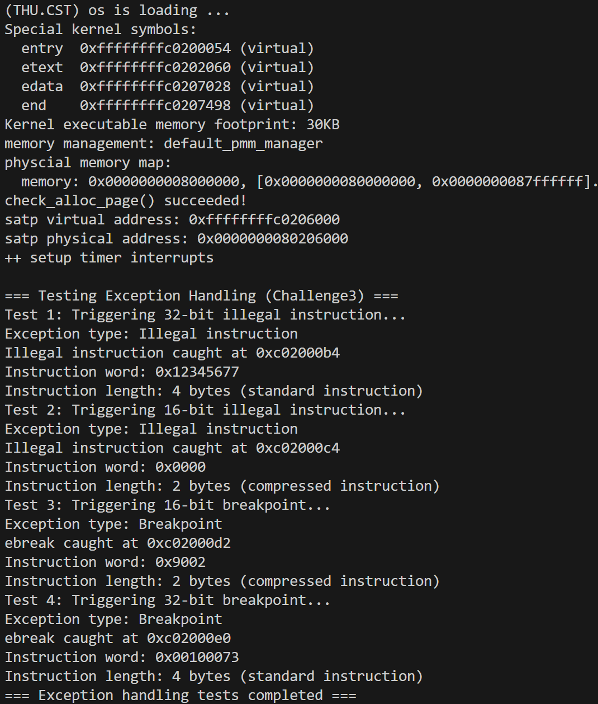

# 2025 操作系统 Lab3
> 团队成员: 2313857陈天祺 & 2311208魏来 & 2312166王旭

## 实验目的
---

实验 3 主要讲解的是 ==中断处理机制==。操作系统是计算机系统的监管者，必须能对计算机系统状态的突发变化做出反应，这些系统状态可能是程序执行出现异常，或者是突发的外设请求。当计算机系统遇到突发情况时，不得不停止当前的正常工作，应急响应一下，这是需要操作系统来接管，并跳转到对应处理函数进行处理，处理结束后再回到原来的地方继续执行指令。这个过程就是中断处理过程。

本章知识点包括：

1. riscv 的中断相关知识
2. 中断前后如何进行上下文环境的保存与恢复
3. 处理最简单的断点中断和时钟中断

## 实验内容
---

### 练习1：完善中断处理 （需要编程）

编程完善 `trap.c` 中的中断处理函数 `trap`：在对时钟中断进行处理的部分填写 `kern/trap/trap.c` 函数中处理时钟中断的部分，使操作系统每遇到 100 次时钟中断后，调用 `print_ticks` 子程序，向屏幕上打印一行文字 *”100 ticks”*，在打印完 10 行后调用 `sbi.h` 中的 `shut_down()` 函数关机。

要求：
1. 相关函数实现，提交改进后的源代码包（可以编译执行）
2. 在实验报告中简要说明实现过程和定时器中断中断处理的流程

> 实现要求的部分代码后，运行整个系统，大约每1秒会输出一次”100 ticks”，输出10行。

### 扩展练习 Challenge1：描述与理解中断流程

要求回答：

1. 描述 ucore 中处理中断异常的流程（从异常的产生开始），其中 `mov a0，sp` 的目的是什么？
2. SAVE_ALL 中寄寄存器保存在栈中的位置是什么确定的？
3. 对于任何中断，`__alltraps` 中都需要保存所有寄存器吗？请说明理由。

### 扩展练习 Challenge2：理解上下文切换机制

要求回答：

1. 在trapentry.S中汇编代码 `csrw sscratch, sp；csrrw s0, sscratch, x0` 实现了什么操作，目的是什么？
2. save all 里面保存了 stval scause 这些 csr，而在 restore all 里面却不还原它们，那这样 store 的意义何在呢？

### 扩展练习Challenge3：完善异常中断

编程完善 kern/trap/trap.c 的异常处理函数，对异常和断点进行处理，简单输出异常类型和异常指令触发地址，即“Illegal instruction caught at 0x(地址)”，“ebreak caught at 0x（地址）”与“Exception type:Illegal instruction"，“Exception type: breakpoint”。（

## 实验过程
---

### 练习 1

#### 1. 时钟中断初始化

在系统启动时，`kern/init/init.c` 的 `kern_init` 函数中依次调用：
```c
idt_init();    // 初始化中断描述符表
clock_init();  // 初始化时钟中断
intr_enable(); // 使能中断
```

##### 1.1 中断描述符表初始化

在 `kern/trap/trap.c` ：
```c
void idt_init(void) {
    // 声明外部函数 __alltraps，这是在 trapentry.S 中定义的中断/异常统一入口
    extern void __alltraps(void);
    // 设置 sscratch 寄存器为 0，表示当前在内核态执行
    write_csr(sscratch, 0);
    // 设置中断向量表的基地址，指向 __alltraps
    // 当发生任何中断或异常时，CPU 会自动跳转到 stvec 指向的地址（即 __alltraps）
    write_csr(stvec, &__alltraps);
}
```

##### 1.2 时钟设备初始化

在 `kern/driver/clock.c` ：
```c
void clock_init(void) {
    // 在 sie 寄存器中使能定时器中断
    set_csr(sie, MIP_STIP);
    // 设置第一次时钟中断
    clock_set_next_event();
    // 初始化计数器
    ticks = 0;
    cprintf("++ setup timer interrupts\n");
}
```

##### 1.3 设置下次时钟中断
```c
void clock_set_next_event(void) { 
    sbi_set_timer(get_cycles() + timebase); 
}
```

#### 2. 时钟中断触发与处理

##### 2.1 硬件处理

1. **保存关键状态**：
   - `sepc`（Supervisor Exception Program Counter）：保存发生中断时的 PC 值
   - `scause`（Supervisor Cause）：保存中断原因（对于时钟中断，值为 `IRQ_S_TIMER | 0x8000000000000000`）
   - `sstatus`（Supervisor Status）：保存处理器状态
   - `stval`（Supervisor Trap Value）：对于时钟中断，此值通常无意义

2. **修改控制流**：
   - 将 PC 设置为 `stvec` 寄存器的值（即 `__alltraps` 的地址）
   - 将 `sstatus.SPP` 设置为之前的特权级
   - 将 `sstatus.SIE` 清零（禁用中断）
   - 跳转到 `__alltraps`

##### 2.2 软件处理

**步骤1：保存上下文**

```assembly
__alltraps:
    SAVE_ALL        # 保存所有寄存器到栈
    move  a0, sp    # 将栈指针（trapframe地址）作为参数传递
    jal trap        # 调用C语言trap函数
```

`SAVE_ALL` 宏：
1. 保存当前 `sp` 到 `sscratch`，并将 `sscratch` 原值（0）换到 `s0`
2. 在栈上分配 36 × REGBYTES 的空间
3. 保存所有通用寄存器（`x0` ~ `x31`）
4. 保存 CSR 寄存器：
   - `sstatus` → `s1`
   - `sepc` → `s2`
   - `sbadaddr` → `s3`（新版叫 `stval`）
   - `scause` → `s4`
5. 使用 `store` 将这些 CSR 寄存器的值保存到栈上

上下文保存为一个 `trapframe` 结构体：
```c
struct trapframe {
    struct pushregs gpr;  // 所有通用寄存器
    uintptr_t status;     // sstatus
    uintptr_t epc;        // sepc
    uintptr_t badvaddr;   // stval
    uintptr_t cause;      // scause
};
```

**步骤2：调用 trap 函数**

```c
void trap(struct trapframe *tf) {
    trap_dispatch(tf);  // 分发处理
}
```

**步骤3：trap_dispatch 分发**

```c
static inline void trap_dispatch(struct trapframe *tf) {
    if ((intptr_t)tf->cause < 0) {
        // cause 的最高位为1表示是中断
        interrupt_handler(tf);
    } else {
        // cause 的最高位为0表示是异常
        exception_handler(tf);
    }
}
```

**步骤4：interrupt_handler 处理中断**

```c
void interrupt_handler(struct trapframe *tf) {
    intptr_t cause = (tf->cause << 1) >> 1;  // 清除最高位，获取中断类型
    switch (cause) {
        case IRQ_S_TIMER:  // 时钟中断
            // 设置下次时钟中断
            clock_set_next_event();
            
            // 计数器加一
            ticks++;
            
            // 每 100 次时钟中断打印一次
            if(ticks >= 100){
                print_ticks();  
                num++;
                ticks = 0;
            }
            
            // 打印10次后关机
            if(num == 10){
                sbi_shutdown();
            }
            break;
        // ... 其他中断类型
    }
}
```

**时钟中断处理的关键操作**：
1. **设置下次中断**：调用 `clock_set_next_event()`，通过 SBI 设置下一次定时器中断
2. **更新计数器**：`ticks++` 记录已经发生的时钟中断次数
3. **定期输出**：每 100 次时钟中断输出一次 "100 ticks"
4. **自动关机**：输出 10 次后（即 1000 次时钟中断后）调用 `sbi_shutdown()` 关机

**步骤5：恢复上下文并返回**

`trap` 函数返回后：
```assembly
__trapret:
    RESTORE_ALL  # 恢复所有寄存器
    sret         # 从中断返回
```

`RESTORE_ALL` 宏：
1. 从栈中恢复 `sstatus` 和 `sepc`
2. 写回 CSR 寄存器
3. 恢复所有通用寄存器（`x1` ~ `x31`）
4. 最后恢复 `sp`

`sret` 指令（Supervisor Return）：
- 恢复 `sstatus.SPIE` 中保存的中断使能状态
- 恢复 `sstatus.SPP` 中保存的特权级
- 将 PC 设置为 `sepc` 的值，跳转到用户程序中断发生位置继续执行

#### 3. 运行结果


### Challenge 1

#### 1. RISCV 中断处理流程

**阶段1：异常/中断产生**

异常或中断可以由以下情况触发：
- **中断**（Interrupt）：异步事件，如时钟中断、外部设备中断
- **异常**（Exception）：同步事件，如非法指令、断点、缺页异常

**阶段2：硬件自动保存状态**

1. **保存异常/中断信息到 CSR 寄存器**：
   ```c
   sepc                        # 保存当前程序计数器 PC
   scause                      # 保存异常/中断原因代码
   stval                       # 附加信息，如访问错误的地址
   sstatus.SPIE                # 保存中断使能状态（sstatus.SIE）
   sstatus.SPP                 # 保存当前（引发中断）的特权级
   sstatus.SIE                 # 禁用中断
   ```

2. **跳转到中断处理程序**：
   ```c
   PC                          # 跳转到中断处理程序入口（stvec）
   ```

**阶段3：中断入口点（__alltraps）**

```assembly
    .globl __alltraps
    .align(2)
__alltraps:
    SAVE_ALL                        # 调用 SAVE_ALL 宏
    move  a0, sp                    
    jal trap                        # 调用 trap 函数处理中断
```

**`SAVE_ALL` 宏展开**：
```assembly
.macro SAVE_ALL
    # 保存当前 sp，为后续恢复做准备
    csrw sscratch, sp
    
    # 在栈上分配 trapframe 空间（36个寄存器宽度）
    addi sp, sp, -36 * REGBYTES
    
    # 保存所有通用寄存器 x0-x31
    STORE x0, 0*REGBYTES(sp)
    STORE x1, 1*REGBYTES(sp)
    STORE x3, 3*REGBYTES(sp)
    # ... 
    STORE x31, 31*REGBYTES(sp)
    
    # 读取并保存 CSR 寄存器
    csrrw s0, sscratch, x0    # 读取原来的 sp（存在sscratch中），同时清零
    csrr s1, sstatus          # 读取 sstatus
    csrr s2, sepc             # 读取 sepc
    csrr s3, stval            # 读取 stval (异常地址)
    csrr s4, scause           # 读取 scause (异常原因)
    
    # 保存到栈上
    STORE s0, 2*REGBYTES(sp)   # 原始的 sp
    STORE s1, 32*REGBYTES(sp)  # sstatus
    STORE s2, 33*REGBYTES(sp)  # sepc
    STORE s3, 34*REGBYTES(sp)  # stval
    STORE s4, 35*REGBYTES(sp)  # scause
.endm
```

`move a0, sp` 分析：

这条指令实际上是一个伪指令，会被汇编器翻译成 `addi a0, sp, 0`，作用是将栈指针寄存器 `sp` 的值复制到寄存器 `a0` 中。

在 RISCV 架构中， `a0` 是第一号函数参数寄存器，`move a0, sp` 事实上是将 `sp` 作为参数传递到后面的 C 函数 `trap` 中作为 `trapframe` 的指针接收，这样 `trap` 函数就能够通过该指针访问栈上保存的寄存器信息。

**阶段4：C 语言处理**

```c
void trap(struct trapframe *tf) {
    trap_dispatch(tf);
}

static inline void trap_dispatch(struct trapframe *tf) {
    if ((intptr_t)tf->cause < 0) {
        interrupt_handler(tf);  // 处理中断
    } else {
        exception_handler(tf);  // 处理异常
    }
}
```

**阶段5：恢复上下文并返回**

```assembly
__trapret:
    RESTORE_ALL
    sret
```

`RESTORE_ALL` 宏：
```assembly
.macro RESTORE_ALL
    # 恢复 CSR 寄存器
    LOAD s1, 32*REGBYTES(sp)  # sstatus
    LOAD s2, 33*REGBYTES(sp)  # sepc
    csrw sstatus, s1
    csrw sepc, s2
    
    # 恢复所有通用寄存器（除了 sp）
    LOAD x1, 1*REGBYTES(sp)
    # ... (省略 x3-x31)
    
    # 最后恢复 sp
    LOAD x2, 2*REGBYTES(sp)
.endm
```


#### 2. SAVE_ALL 中寄存器在栈中的保存位置

寄存器在栈中的位置由 **trapframe 结构体的定义** 确定。

##### 2.1 trapframe 结构体定义

```c
struct pushregs {
    uintptr_t zero;  // x0   - 偏移 0*REGBYTES
    uintptr_t ra;    // x1   - 偏移 1*REGBYTES
    uintptr_t sp;    // x2   - 偏移 2*REGBYTES
    uintptr_t gp;    // x3   - 偏移 3*REGBYTES
    uintptr_t tp;    // x4   - 偏移 4*REGBYTES
    uintptr_t t0;    // x5   - 偏移 5*REGBYTES
    uintptr_t t1;    // x6   - 偏移 6*REGBYTES
    uintptr_t t2;    // x7   - 偏移 7*REGBYTES
    uintptr_t s0;    // x8   - 偏移 8*REGBYTES
    uintptr_t s1;    // x9   - 偏移 9*REGBYTES
    uintptr_t a0;    // x10  - 偏移 10*REGBYTES
    uintptr_t a1;    // x11  - 偏移 11*REGBYTES
    uintptr_t a2;    // x12  - 偏移 12*REGBYTES
    uintptr_t a3;    // x13  - 偏移 13*REGBYTES
    uintptr_t a4;    // x14  - 偏移 14*REGBYTES
    uintptr_t a5;    // x15  - 偏移 15*REGBYTES
    uintptr_t a6;    // x16  - 偏移 16*REGBYTES
    uintptr_t a7;    // x17  - 偏移 17*REGBYTES
    uintptr_t s2;    // x18  - 偏移 18*REGBYTES
    uintptr_t s3;    // x19  - 偏移 19*REGBYTES
    uintptr_t s4;    // x20  - 偏移 20*REGBYTES
    uintptr_t s5;    // x21  - 偏移 21*REGBYTES
    uintptr_t s6;    // x22  - 偏移 22*REGBYTES
    uintptr_t s7;    // x23  - 偏移 23*REGBYTES
    uintptr_t s8;    // x24  - 偏移 24*REGBYTES
    uintptr_t s9;    // x25  - 偏移 25*REGBYTES
    uintptr_t s10;   // x26  - 偏移 26*REGBYTES
    uintptr_t s11;   // x27  - 偏移 27*REGBYTES
    uintptr_t t3;    // x28  - 偏移 28*REGBYTES
    uintptr_t t4;    // x29  - 偏移 29*REGBYTES
    uintptr_t t5;    // x30  - 偏移 30*REGBYTES
    uintptr_t t6;    // x31  - 偏移 31*REGBYTES
};

struct trapframe {
    struct pushregs gpr;   // 偏移 0-31*REGBYTES
    uintptr_t status;      // 偏移 32*REGBYTES (sstatus)
    uintptr_t epc;         // 偏移 33*REGBYTES (sepc)
    uintptr_t badvaddr;    // 偏移 34*REGBYTES (stval)
    uintptr_t cause;       // 偏移 35*REGBYTES (scause)
};
```

##### 2.2 分析说明

1. **结构对应**：
   - 汇编代码中的寄存器保存顺序必须与 C 语言的 `trapframe` 结构体定义完全一致，以保证 C 代码能够正确访问各个字段

2. **内存匹配**：
   - C 编译器会按照结构体成员的声明顺序分配内存
   - 汇编代码按相同顺序保存，确保内存布局匹配

#### 3. __alltraps 寄存器问题

对于中断而言，事实上只有在中断处理程序中可能被覆盖（处理逻辑复用寄存器）、被修改（处理逻辑修改寄存器）从而影响到原程序执行的寄存器需要保存/恢复。

但在实际应用中，出于安全性和通用性考虑，一般会采取保存所有寄存器的方式来进行上下文切换。

### Challenge 2
#### 1.汇编代码`csrw sscratch, sp`的操作与目的

```assembly
#include <riscv.h>

    .macro SAVE_ALL

    csrw sscratch, sp

    addi sp, sp, -36 * REGBYTES
    # save x registers
    STORE x0, 0*REGBYTES(sp)
    STORE x1, 1*REGBYTES(sp)
    STORE x3, 3*REGBYTES(sp)
    # ...
```
`sscratch` 是一个专门给S-Mode使用的“草稿”寄存器，非常适合用来暂存数据，而不会破坏任何通用寄存器。

`csrw` (CSR Write - 写CSR), 格式: `csrr 目标通用寄存器, 源CSR寄存器`; 把一个通用寄存器中的值，复制写到一个CSR中,我们这里的指令是`csrw sscratch, sp`，也就是将当前 `sp` (栈指针) 寄存器的值，写入到 `sscratch` 这个特殊的CSR寄存器中。

**目的**：
由于我们的这条指令`csrw sscratch, sp` 是在 `SAVE_ALL` 宏的开头执行的，我们的`SAVE_ALL` 宏需要负责把发生中断前的上下文即所有的寄存器的值保存到栈中(包括通用寄存器和CSR)，但是保存这些内容需要首先开辟栈中的一片`struct trapframe`的空间，这需要依赖于我们的`sp`栈指针的移动，因此我们需要在移动栈指针`sp`之前(对应trapentry.S中使用 `STORE`指令保存各通用寄存器之前)，首先保存好当前`sp`的值，将当前的栈指针 `sp` 的值保存到 `sscratch` 中，防止后续`sp`值改动后保存了错误的`sp`值。

#### 2.汇编代码`csrrw s0, sscratch, x0`的操作与目的

```assembly
    csrrw s0, sscratch, x0
    csrr s1, sstatus
    csrr s2, sepc
    csrr s3, sbadaddr
    csrr s4, scause

    STORE s0, 2*REGBYTES(sp)
    STORE s1, 32*REGBYTES(sp)
    STORE s2, 33*REGBYTES(sp)
    STORE s3, 34*REGBYTES(sp)
    STORE s4, 35*REGBYTES(sp)
    .endm
```
 `csrr`(CSR Read - 读CSR), 格式: `csrr 目标通用寄存器, 源CSR寄存器`;把一个CSR的值，复制到一个通用寄存器中。

 `csrrw` (CSR Read and Write - 读写CSR), 格式: `csrrw 目标通用寄存器, 读写CSR寄存器, 源通用寄存器`，他起到下面的这两个分步的作用，分别对应着`Read`与`Write`:
 1.读取CSR的原始值，并将其存入“目标通用寄存器”。2.将“源通用寄存器”的值，写入到同一个CSR中。

因此我们这里的`csrrw s0, sscratch, x0`指令的作用就是，把`sscratch`寄存器中的值(也就是之前保存的`sp`值)，读取出来，存入到`s0`通用寄存器中，同时将`x0`寄存器的值(恒为0)写入到`sscratch`寄存器中，从而清空`sscratch`寄存器。这里我们之所以要清空`sscratch`寄存器，是为了防止后续代码误用`sscratch`寄存器时，读到的是之前保存的`sp`值，从而引发错误。


**目的**：
我们的这条指令`csrrw s0, sscratch, x0` 是在 `SAVE_ALL` 宏的结尾部分执行的，这是我们在保存完所有通用寄存器之后，进行`sp`寄存器与 `CSR` 寄存器的保存前的准备工作，我们需要把之前保存在 `sscratch` 寄存器中的 `sp` 值，读取出来，存入到 `s0` 寄存器中，由于无法直接将`CSR`寄存器的值存入到栈中，因此我们需要先将`sp`值存入到一个通用寄存器中(这里选择`s0`)，然后再通过`STORE`指令将`s0`寄存器的值存入到栈中对应的`trapframe`结构体中的`sp`字段中。

#### 3. save all 里面保存了 stval scause 这些 csr，而在 restore all 里面却不还原它们，那这样 store 的意义何在呢？

##### (1) `SAVE_ALL`和`RESTORE_ALL`对于`CSR`寄存器的保存与还原

SAVE_ALL 里面完整保存了四个 CSR 寄存器：`sstatus`、`sepc`、`stval`（即为 `sbadaddr`）和 `scause`。这些寄存器保存了中断发生时的处理器状态和异常信息。当中断或异常发生时，硬件会自动将相关信息存储到这些 CSR 寄存器中，以便操作系统能够正确地处理中断或异常。
```assembly 
    csrrw s0, sscratch, x0
    csrr s1, sstatus
    csrr s2, sepc
    csrr s3, sbadaddr
    csrr s4, scause

    STORE s0, 2*REGBYTES(sp)
    STORE s1, 32*REGBYTES(sp)
    STORE s2, 33*REGBYTES(sp)
    STORE s3, 34*REGBYTES(sp)
    STORE s4, 35*REGBYTES(sp)
```

`RESTORE_ALL` 只还原了 `sstatus` 和 `sepc`，而没有还原 `stval` 和 `scause`。

```assembly 
    .macro RESTORE_ALL

    LOAD s1, 32*REGBYTES(sp)
    LOAD s2, 33*REGBYTES(sp)

    csrw sstatus, s1
    csrw sepc, s2
```

##### (2) 保存 `stval` 和 `scause` 的意义

保存 `stval` 和 `scause` (以及`sepc`)的主要目的是为了在异常处理过程中能够访问和分析这些信息。当中断/异常发生时，硬件会自动把原因码填入 `scause`，把相关地址填入 `stval`。它们是硬件为我们生成的“案情报告”。软件（我们的中断处理程序）的责任是读取这份报告，搞清楚发生了什么事，以便做出正确的处理。在我们C语言所处理的`trap.c`中的异常处理函数（如 `exception_handler`）中，这些寄存器的值可以被用来确定异常的类型和原因，从而采取相应的处理措施。

##### (3) 不还原 `stval` 和 `scause` 的原因:

这是因为我们**中断处理完成后就不需要恢复了**：`stval` 和 `scause` 主要用于我们`trap.c`中异常处理期间的诊断和决策。一旦我们的异常处理完成，这些寄存器的值就不再需要恢复，因为它们只在异常发生时有意义。当下一次Trap发生时，硬件会自动用新的报告内容覆盖掉 scause 和 stval 寄存器的旧值，因此没有必要在恢复上下文时还原它们。


### Challenge 3

#### 1. 实现代码

该实验的核心实现在 `kern/trap/trap.c` 文件的 `exception_handler()` 函数中，具体代码如下：

```c
case CAUSE_ILLEGAL_INSTRUCTION:
    // 非法指令异常处理
    /* LAB3 CHALLENGE3   2311208 :  */
    /*(1)输出指令异常类型（ Illegal instruction）
     *(2)输出异常指令地址
     *(3)更新 tf->epc寄存器
    */
    cprintf("Exception type: Illegal instruction\n");
    cprintf("Illegal instruction caught at 0x%08x\n", tf->epc);

    // 检查指令长度，如果是压缩指令（16位）则+2，否则+4
    {
        unsigned short *instr = (unsigned short*)tf->epc;
        unsigned short instruction = *instr;

        if ((instruction & 0x3) != 0x3) {
            // 压缩指令 (16位)
            cprintf("Instruction word: 0x%04x\n", instruction);
            tf->epc += 2;
            cprintf("Instruction length: 2 bytes (compressed instruction)\n");
        } else {
            // 标准指令 (32位)
            unsigned int full_instruction = *(unsigned int*)tf->epc;
            cprintf("Instruction word: 0x%08x\n", full_instruction);
            tf->epc += 4;
            cprintf("Instruction length: 4 bytes (standard instruction)\n");
        }
    }
    break;

case CAUSE_BREAKPOINT:
    //断点异常处理
    /* LAB3 CHALLLENGE3   2311208 :  */
    /*(1)输出指令异常类型（ breakpoint）
     *(2)输出异常指令地址
     *(3)更新 tf->epc寄存器
    */
    cprintf("Exception type: Breakpoint\n");
    cprintf("ebreak caught at 0x%08x\n", tf->epc);

    // 检查指令长度，如果是压缩指令（16位）则+2，否则+4
    {
        unsigned short *instr = (unsigned short*)tf->epc;
        unsigned short instruction = *instr;

        if ((instruction & 0x3) != 0x3) {
            // 压缩指令 (16位)
            cprintf("Instruction word: 0x%04x\n", instruction);
            tf->epc += 2;
            cprintf("Instruction length: 2 bytes (compressed instruction)\n");
        } else {
            // 标准指令 (32位)
            unsigned int full_instruction = *(unsigned int*)tf->epc;
            cprintf("Instruction word: 0x%08x\n", full_instruction);
            tf->epc += 4;
            cprintf("Instruction length: 4 bytes (standard instruction)\n");
        }
    }
    break;
```

#### 2 实现过程说明

##### 2.1 异常检测与分发机制

```c
static inline void trap_dispatch(struct trapframe *tf) {
    if ((intptr_t)tf->cause < 0) {
        // 中断
        interrupt_handler(tf);
    } else {
        // 异常
        exception_handler(tf);
    }
}
```

**工作原理**：
- 通过`tf->cause`的符号位判断是中断还是异常
- 负值表示中断，非负值表示异常
- 调用相应的处理函数

##### 2.2 指令长度检测算法

```c
unsigned short *instr = (unsigned short*)tf->epc;
unsigned short instruction = *instr;

if ((instruction & 0x3) != 0x3) {
    // 压缩指令 (16位)
    cprintf("Instruction word: 0x%04x\n", instruction);
    tf->epc += 2;
} else {
    // 标准指令 (32位)
    unsigned int full_instruction = *(unsigned int*)tf->epc;
    cprintf("Instruction word: 0x%08x\n", full_instruction);
    tf->epc += 4;
}
```

**算法详解**：
1. **读取指令前2字节**：`*(unsigned short*)tf->epc`
2. **检查低2位**：`instruction & 0x3`
3. **长度判断**：
   - 低2位≠11 → 2字节压缩指令
   - 低2位=11 → 4字节标准指令
4. **格式化输出**：
   - 16位：`0x%04x`格式
   - 32位：`0x%08x`格式

##### 2.3 程序计数器调整策略

- **跳过异常指令**：确保不会重复触发同一异常
- **正确步进**：根据实际指令长度调整`tf->epc`
- **恢复执行**：异常处理后从下一条指令继续执行

#### 3 实验演示与结果分析

##### 3.1 测试用例设计

| 测试用例 | 指令编码 | 指令长度 | 预期异常类型 |
|---------|---------|---------|-------------|
| Test 1 | 0x12345677 | 4字节 | Illegal instruction |
| Test 2 | 0x0000 | 2字节 | Illegal instruction |
| Test 3 | 0x9002 | 2字节 | Breakpoint |
| Test 4 | 0x00100073 | 4字节 | Breakpoint |

##### 3.2 实验结果分析



**Test 1 - 32位非法指令**：
```
Test 1: Triggering 32-bit illegal instruction...
Exception type: Illegal instruction
Illegal instruction caught at 0xc02000b4
Instruction word: 0x12345677
Instruction length: 4 bytes (standard instruction)
```
- 指令`0x12345677`被正确识别为4字节指令
- 低2位`0x77 & 0x3 = 0x3`，符合标准指令特征
- 程序计数器正确增加4字节

**Test 2 - 16位非法指令**：
```
Test 2: Triggering 16-bit illegal instruction...
Exception type: Illegal instruction
Illegal instruction caught at 0xc02000c4
Instruction word: 0x0000
Instruction length: 2 bytes (compressed instruction)
```
- 指令`0x0000`被正确识别为2字节压缩指令
- 低2位`0x0000 & 0x3 = 0x0`，符合压缩指令特征
- 程序计数器正确增加2字节

**Test 3 - 16位断点**：
```
Test 3: Triggering 16-bit breakpoint...
Exception type: Breakpoint
ebreak caught at 0xc02000d2
Instruction word: 0x9002
Instruction length: 2 bytes (compressed instruction)
```
- `0x9002`是标准的`c.ebreak`压缩指令
- 成功触发断点异常
- 正确识别为2字节指令

**Test 4 - 32位断点**：
```
Test 4: Triggering 32-bit breakpoint...
Exception type: Breakpoint
ebreak caught at 0xc02000e0
Instruction word: 0x00100073
Instruction length: 4 bytes (standard instruction)
```
- `0x00100073`是标准的`ebreak`基础指令
- 成功触发断点异常
- 正确识别为4字节指令

##### 3.3 实验结论

1. **指令长度检测准确**：成功区分2字节和4字节指令
2. **异常类型识别正确**：准确识别非法指令和断点异常
3. **程序计数器调整恰当**：根据指令长度正确调整执行流
4. **输出信息完整**：提供详细的异常诊断信息

#### 4 问题回答

##### 4.1 异常触发时机问题

**问题**：非法指令可以加在任意位置，但是要注意什么时候异常触发了才会被处理？

**回答**：

异常要能被正确处理，必须满足以下条件：

1. **中断系统已启用**
```c
intr_enable();  // 启用中断和异常处理
```

2. **异常向量已设置**
```c
idt_init();     // 设置stvec指向__alltraps
```

3. **异常处理函数已实现**
```c
// 在exception_handler()中有对应的case分支
case CAUSE_ILLEGAL_INSTRUCTION:
    // 处理代码
```

**异常触发时机**：
异常触发的时机遵循以下流程：
1. **指令执行时刻**：CPU实际执行到异常指令时
2. **硬件响应时刻**：CPU识别异常后的硬件自动处理
3. **软件处理时刻**：操作系统接管后的软件处理

##### 4.2 异常类型判断方法

**问题**：查阅参考资料，判断自己触发的异常属于什么类型的，在相应的情况下进行代码修改。

**回答**：

**RISC-V异常编码标准**：
根据RISC-V规范，异常类型通过`scause`寄存器的值标识：

```c
// 在riscv.h中定义的异常编码
#define CAUSE_MISALIGNED_FETCH  0x0   // 指令地址不对齐
#define CAUSE_FAULT_FETCH      0x1   // 指令访问错误
#define CAUSE_ILLEGAL_INSTRUCTION 0x2 // 非法指令
#define CAUSE_BREAKPOINT        0x3   // 断点
#define CAUSE_MISALIGNED_LOAD   0x4   // 加载地址不对齐
#define CAUSE_FAULT_LOAD       0x5   // 加载访问错误
#define CAUSE_MISALIGNED_STORE  0x6   // 存储地址不对齐
#define CAUSE_FAULT_STORE      0x7   // 存储访问错误
#define CAUSE_USER_ECALL       0x8   // 用户态系统调用
#define CAUSE_SUPERVISOR_ECALL 0x9   // 管态系统调用
```

**异常类型识别方法**：
```c
// 在异常处理函数中
switch (tf->cause) {
    case CAUSE_ILLEGAL_INSTRUCTION:
        // 处理非法指令异常
        break;
    case CAUSE_BREAKPOINT:
        // 处理断点异常
        break;
}
```
