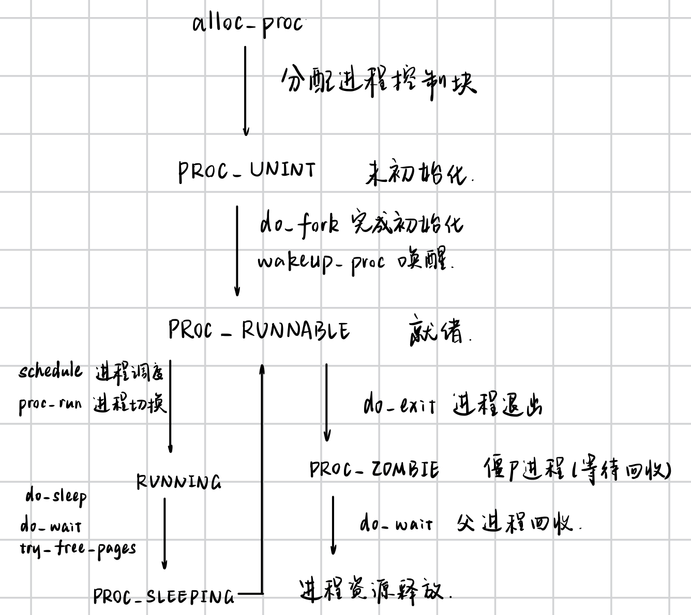

# 2025 操作系统 Lab5

> 团队成员: 2313857陈天祺 & 2311208魏来 & 2312166王旭

## 实验目的

---

- 了解第一个用户进程创建过程
- 了解系统调用框架的实现机制 
- 了解ucore如何实现系统调用sys_fork/sys_exec/sys_exit/sys_wait来进行进程管理

## 实验内容

---

### 练习0：填写已有实验

本实验依赖实验2/3/4。请把你做的实验2/3/4的代码填入本实验中代码中有“LAB2”/“LAB3”/“LAB4”的注释相应部分。注意：为了能够正确执行lab5的测试应用程序，可能需对已完成的实验2/3/4的代码进行进一步改进。

### 练习1: 加载应用程序并执行（需要编码）

`do_execv` 函数调用 `load_icode`（位于 kern/process/proc.c）来加载并解析一个处于内存中的ELF执行文件格式的应用程序。你需要补充 `load_icode` 的第6步，建立相应的用户内存空间来放置应用程序的代码段、数据段等，且要设置好proc_struct结构中的成员变量trapframe中的内容，确保在执行此进程后，能够从应用程序设定的起始执行地址开始执行。需设置正确的trapframe内容。

请在实验报告中简要说明你的设计实现过程，并回答以下问题：
**请简要描述这个用户态进程被ucore选择占用CPU执行（RUNNING态）到具体执行应用程序第一条指令的整个经过。**

### 练习2: 父进程复制自己的内存空间给子进程（需要编码）

创建子进程的函数 `do_fork` 在执行中将拷贝当前进程（即父进程）的用户内存地址空间中的合法内容到新进程中（子进程），完成内存资源的复制。具体是通过 `copy_range` 函数（位于kern/mm/pmm.c）实现的，请补充 `copy_range` 的实现，确保能够正确执行。

请在实验报告中简要说明你的设计实现过程，并回答以下问题：
**如何设计实现Copy on Write机制？给出概要设计，鼓励给出详细设计。**

> Copy-on-write（简称COW）的基本概念是指如果有多个使用者对一个资源A（比如内存块）进行读操作，则每个使用者只需获得一个指向同一个资源A的指针，就可以该资源了。若某使用者需要对这个资源A进行写操作，系统会对该资源进行拷贝操作，从而使得该“写操作”使用者获得一个该资源A的“私有”拷贝—资源B，可对资源B进行写操作。该“写操作”使用者对资源B的改变对于其他的使用者而言是不可见的，因为其他使用者看到的还是资源A。

### 练习3: 阅读分析源代码，理解进程执行 fork/exec/wait/exit 的实现，以及系统调用的实现（不需要编码）

请在实验报告中简要说明你对 fork/exec/wait/exit函数的分析，并回答如下问题：

1. 请分析 fork/exec/wait/exit 的执行流程。重点关注哪些操作是在用户态完成，哪些是在内核态完成？内核态与用户态程序是如何交错执行的？内核态执行结果是如何返回给用户程序的？

2. 请给出ucore中一个用户态进程的执行状态生命周期图（包执行状态，执行状态之间的变换关系，以及产生变换的事件或函数调用）。（字符方式画即可）

执行：`make grade`。如果所显示的应用程序检测都输出ok，则基本正确。（使用的是qemu-1.0.1）

### 扩展练习 Challenge

#### Challenge1：实现 Copy on Write （COW）机制

给出实现源码,测试用例和设计报告（包括在 cow 情况下的各种状态转换（类似有限状态自动机）的说明）。

这个扩展练习涉及到本实验和上一个实验“虚拟内存管理”。在ucore操作系统中，当一个用户父进程创建自己的子进程时，父进程会把其申请的用户空间设置为只读，子进程可共享父进程占用的用户内存空间中的页面（这就是一个共享的资源）。当其中任何一个进程修改此用户内存空间中的某页面时，ucore会通过page fault异常获知该操作，并完成拷贝内存页面，使得两个进程都有各自的内存页面。这样一个进程所做的修改不会被另外一个进程可见了。请在ucore中实现这样的COW机制。

由于COW实现比较复杂，容易引入bug，请参考 https://dirtycow.ninja/ 看看能否在ucore的COW实现中模拟这个错误和解决方案。需要有解释。

#### Challenge2：回答问题

1. 说明该用户程序是何时被预先加载到内存中的？
2. 与我们常用操作系统的加载有何区别，原因是什么？

## 实验过程

---

### 练习1：加载应用程序并执行

#### 设计实现过程

需要在 `load_icode` 函数的第6步设置trapframe，使得用户进程能够从内核态正确切换到用户态执行。

**实现代码**（`kern/process/proc.c`）：

```c
tf->gpr.sp = USTACKTOP;
tf->epc = elf->e_entry;
tf->status = (sstatus & ~SSTATUS_SPP) | SSTATUS_SPIE;
```

**关键点说明**：

1. **`tf->gpr.sp = USTACKTOP;`**：设置用户栈指针为用户栈顶
2. **`tf->epc = elf->e_entry;`**：设置程序计数器为ELF文件的入口地址
3. **`tf->status = (sstatus & ~SSTATUS_SPP) | SSTATUS_SPIE;`**：
   - 清除SPP位：返回用户态（U-mode）
   - 设置SPIE位：允许中断在用户态被启用

#### 用户态进程从被调度到执行第一条指令的完整过程

```
阶段1：init_main 被调度执行
--------------------------------------
1. 调度器选择 initproc
   schedule() → proc_run(initproc) → switch_to()

2. initproc 开始执行 init_main():
   int pid = kernel_thread(user_main, NULL, 0);  ← 创建 user_main 内核线程 (PID 2)

3. initproc 等待子进程：
   while (do_wait(0, NULL) == 0) {
       schedule();  ← 让出CPU，等待子进程退出
   }

阶段2：user_main 内核线程被调度执行
--------------------------------------
1. 调度器选择 user_main (PID 2)
   schedule() → proc_run(user_main) → switch_to()

2. user_main 首次执行流程：
   - switch_to() 的 ret 指令跳转到 forkret()
   - forkret() → forkrets() → __trapret → sret
   - 跳转到 kernel_thread_entry() → 调用 user_main()

3. user_main 函数开始执行：
   user_main(void *arg) {
       KERNEL_EXECVE(exit);  ← 加载用户程序 "exit"
       panic("user_main execve failed.\n");
   }

阶段3：kernel_execve 触发 ebreak 异常
--------------------------------------
1. KERNEL_EXECVE 展开为 kernel_execve("exit", ...)

2. kernel_execve 执行：
   asm volatile(
       "li a0, SYS_exec\n"        // 设置系统调用号
       "lw a1, %2\n"              // a1 = name
       "lw a2, %3\n"              // a2 = len
       "lw a3, %4\n"              // a3 = binary
       "lw a4, %5\n"              // a4 = size
       "li a7, 10\n"              // a7 = 10 (特殊标记)
       "ebreak\n"                 // ← 触发断点异常！
   );

阶段4：ebreak 异常处理 - 关键转换！
--------------------------------------
1. 硬件自动响应 ebreak 异常：
   - PC ← __alltraps  (跳转到异常处理入口)
   - 进入内核态处理异常

2. 异常处理流程：
   case CAUSE_BREAKPOINT:
     if (tf->gpr.a7 == 10) {              // 检查是否是 kernel_execve
         tf->epc += 4;                    // 跳过 ebreak 指令
         syscall();                       // 调用系统调用处理
         kernel_execve_ret(tf, kstacktop); // 特殊返回机制
     }

阶段5：syscall 处理 SYS_exec
--------------------------------------
1. syscall() → sys_exec() → do_execve()

2. do_execve 执行进程转换：
   // 释放当前内核线程的内存空间 (user_main 的 mm 为 NULL)

   // 创建用户内存空间
   struct mm_struct *mm = mm_create();
   setup_pgdir(mm);
   current->mm = mm;

   // 加载 ELF 用户程序
   load_icode(binary, size):
     - 解析 ELF 文件
     - 建立代码段、数据段、BSS段
     - 分配用户栈空间

     // 设置 trapframe - 关键！
     current->tf->gpr.sp = USTACKTOP;           // 用户栈指针
     current->tf->epc = elf->e_entry;           // 用户程序入口
     current->tf->status = (sstatus & ~SSTATUS_SPP) | SSTATUS_SPIE; // 用户态标志

阶段6：kernel_execve_ret 特殊返回
--------------------------------------
此时 user_main 内核线程已经转换成用户进程！

1. kernel_execve_ret 复制 trapframe：
   - 将当前 trapframe 复制到新的位置
   - move sp, 新的 trapframe 地址
   - j __trapret  ← 直接跳转到标准返回路径

阶段7：__trapret 返回用户态
--------------------------------------
1. __trapret 恢复用户态上下文：
   __trapret:
       RESTORE_ALL        // 从 trapframe 恢复所有寄存器：
       - sp ← USTACKTOP  (用户栈)
       - 其他通用寄存器恢复
       - sepc ← elf->e_entry (用户程序入口)

       sret               // 返回用户态

2. sret 指令执行：
   - PC ← sepc           (跳转到用户程序第一条指令)
   - 特权级切换到 U-mode (用户态)
   - 中断使能恢复

阶段8：用户程序开始执行
--------------------------------------
现在 CPU 处于用户态：
- PC = 用户程序入口地址 (如 exit.c 的 main 函数)
- SP = USTACKTOP (用户栈顶)
- 特权级 = U-mode
- 开始执行用户程序的第一条指令！
```

### 练习 2

#### 实现过程

##### 步骤1：获取源页面的内核虚拟地址

```c
void *src_kvaddr = page2kva(page);
```

- `page` 是从父进程页表中获取的物理页面描述符
- `page2kva()` 函数将 `Page` 结构体指针转换为该物理页面对应的内核虚拟地址
- 这个地址是内核可以直接访问的，使得内核能够读取父进程的页面内容

##### 步骤2：获取目标页面的内核虚拟地址

```c
void *dst_kvaddr = page2kva(npage);
```

- `npage` 是通过 `alloc_page()` 为子进程新分配的物理页面
- 同样使用 `page2kva()` 转换为内核虚拟地址
- 这个地址用于写入复制的数据

##### 步骤3：复制页面内容

```c
memcpy(dst_kvaddr, src_kvaddr, PGSIZE);
```

- 使用 `memcpy()` 函数将完整的页面内容从源地址复制到目标地址
- `PGSIZE` 是页面大小（4KB = 4096 字节）
- 这一步实现了实际的数据复制，确保子进程获得父进程内存内容的完整副本

##### 步骤4：建立虚拟地址映射

```c
ret = page_insert(to, npage, start, perm);
```

- `page_insert()` 在子进程的页表中建立映射关系
- 参数说明：
  - `to`：子进程的页目录基地址
  - `npage`：新分配的物理页面
  - `start`：虚拟地址（与父进程中相同）
  - `perm`：页面权限（从父进程页表项中提取）
- 完成后，子进程可以通过虚拟地址 `start` 访问到复制的内容


#### 核心设计

1. **物理隔离性**：父子进程使用不同的物理页面（`page` 和 `npage`），修改互不影响
2. **虚拟地址一致性**：父子进程使用相同的虚拟地址 `start`，保证程序逻辑不变
3. **权限继承**：子进程页面权限 `perm` 从父进程复制，保持一致的访问控制
4. **完整性保证**：通过 `memcpy` 复制整个页面（4KB），确保数据完整

#### 执行结果

```bash
myname@LAPTOP-R0L8L50O:/mnt/f/Homework/TY_part1/OS/lab5$ make qemu

OpenSBI v0.4 (Jul  2 2019 11:53:53)
   ____                    _____ ____ _____
  / __ \                  / ____|  _ \_   _|
 | |  | |_ __   ___ _ __ | (___ | |_) || |
 | |  | | '_ \ / _ \ '_ \ \___ \|  _ < | |
 | |__| | |_) |  __/ | | |____) | |_) || |_
  \____/| .__/ \___|_| |_|_____/|____/_____|
        | |
        |_|

Platform Name          : QEMU Virt Machine
Platform HART Features : RV64ACDFIMSU
Platform Max HARTs     : 8
Current Hart           : 0
Firmware Base          : 0x80000000
Firmware Size          : 112 KB
Runtime SBI Version    : 0.1

PMP0: 0x0000000080000000-0x000000008001ffff (A)
PMP1: 0x0000000000000000-0xffffffffffffffff (A,R,W,X)
DTB Init
HartID: 0
DTB Address: 0x82200000
Physical Memory from DTB:
  Base: 0x0000000080000000
  Size: 0x0000000008000000 (128 MB)
  End:  0x0000000087ffffff
DTB init completed
(THU.CST) os is loading ...

Special kernel symbols:
  entry  0xc020004a (virtual)
  etext  0xc02059da (virtual)
  edata  0xc0297328 (virtual)
  end    0xc029b7d8 (virtual)
Kernel executable memory footprint: 622KB
memory management: default_pmm_manager
physcial memory map:
  memory: 0x08000000, [0x80000000, 0x87ffffff].
vapaofset is 18446744070488326144
check_alloc_page() succeeded!
check_pgdir() succeeded!
check_boot_pgdir() succeeded!
use SLOB allocator
kmalloc_init() succeeded!
check_vma_struct() succeeded!
check_vmm() succeeded.
++ setup timer interrupts
kernel_execve: pid = 2, name = "forktest".
Breakpoint
I am child 31
I am child 30
I am child 29
I am child 28
I am child 27
I am child 26
I am child 25
I am child 24
I am child 23
I am child 22
I am child 21
I am child 20
I am child 19
I am child 18
I am child 17
I am child 16
I am child 15
I am child 14
I am child 13
I am child 12
I am child 11
I am child 10
I am child 9
I am child 8
I am child 7
I am child 6
I am child 5
I am child 4
I am child 3
I am child 2
I am child 1
I am child 0
forktest pass.
all user-mode processes have quit.
init check memory pass.
kernel panic at kern/process/proc.c:601:
    initproc exit.
```

#### Copy on Write (COW) 机制设计

**问题背景**：

当前实现采用的是"立即复制"策略，即在 `fork()` 时立即复制所有页面。这种方式简单但效率低下：

- 子进程可能只使用很少的内存就执行 `exec()` 替换为新程序
- 大量的复制操作浪费时间和内存资源
- 如果父子进程只读取共享数据，复制是不必要的

**COW 机制概述**：

Copy-on-Write（写时复制）是一种延迟复制优化技术，核心思想是：

- **fork 时**：父子进程共享相同的物理页面，不进行实际复制
- **只读访问**：父子进程都可以正常读取共享页面
- **写入时**：当任一进程尝试写入时，触发页面复制，创建私有副本

##### 概要设计

**1. 数据结构修改**

在页表项中需要利用保留位来标记 COW 页面：

```c
// 在 mmu.h 中定义新的标志位
#define PTE_COW  0x800  // 使用保留位标记写时复制页面
```

**2. fork 时的处理流程**

修改 copy_range() 函数：

1. 不分配新页面 (取消 alloc_page)      
2. 共享父进程的物理页面                 
3. 将父子进程的页表项都设置为只读       
4. 设置 PTE_COW 标志位                  
5. 增加物理页面的引用计数 

**3. 缺页异常处理**

当进程尝试写入 COW 页面时，触发缺页异常，页面错误处理流程：

1. 检查是否为 COW 页面 (PTE_COW 标志)  
2. 分配新的物理页面                     
3. 复制原页面内容到新页面              
4. 更新页表项指向新页面                 
5. 设置为可写，清除 PTE_COW 标志       
6. 减少原页面引用计数                   
7. 如果原页面引用计数为1，恢复可写   


### 练习 3

#### 1. fork/exec/wait/exit 执行流程分析

#### 1.1 系统调用总体流程

所有系统调用都遵循相同的用户态-内核态切换流程：

**用户态**                      

1. 用户程序调用封装函数 (user/libs/ulib.c)，如 `fork() / exit() / wait()` 等
2. 调用底层系统调用 (user/libs/syscall.c)，如 `sys_fork() / sys_exit() / sys_wait()` 等
3. 内联汇编触发 ecall 指令（asm volatile ("ecall")）
   - 设置 a0 寄存器为系统调用号
   - 设置 a1-a5 为参数

**硬件自动切换到内核态**

**内核态**
                         

4. CPU 跳转到异常处理入口
   - `__alltraps` (kern/trap/trapentry.S)
5. 保存用户态上下文
   - SAVE_ALL 保存所有寄存器到 trapframe
6. 调用 C 语言异常处理函数
   - `trap() `
   - `trap_dispatch() `
   - `exception_handler()`
7. 识别 ecall 异常

```c
    case CAUSE_USER_ECALL:
        syscall();
```

8. 分发系统调用 (kern/syscall/syscall.c)
   - `syscall()` 根据 a0 寄存器值分发到具体函数
   - `sys_fork / sys_exit / sys_wait / sys_exec`
9. 执行内核函数
   - `do_fork() / do_exit() / do_wait() / do_execve()`
10. 设置返回值
    - tf->gpr.a0 = 返回值

**硬件自动切换回用户态**
       

11. 恢复用户态上下文
    - __trapret (kern/trap/trapentry.S)
    - RESTORE_ALL 恢复所有寄存器
12. sret 返回用户态
    - 更新 CR 寄存器
13. 用户程序继续执行
    - 系统调用函数返回，a0 寄存器包含返回值

#### 1.2 `fork` 系统调用

fork 系统调用用于创建一个新的子进程。

**第一阶段：用户态准备**

用户程序调用 `fork()` 后，经过三层封装：

1. 应用层的 `fork()` 函数（ulib.c）
2. 系统调用封装 `sys_fork()`（syscall.c）
3. 通用系统调用接口 `syscall()`，将系统调用号 SYS_fork（值为2）放入寄存器 a0

最后通过 `ecall` 指令触发异常，CPU 从用户态切换到内核态，硬件自动保存返回地址和状态到 trapframe。

**第二阶段：内核态处理（do_fork 的7个步骤）**

1. **异常分发**：`trap()` → `exception_handler()` → `syscall()`，根据 a0 寄存器值分发到 sys_fork

2. **分配进程控制块**：`alloc_proc()` 分配并初始化 proc_struct，设置父进程指针、初始化进程关系指针

3. **分配内核栈**：`setup_kstack()` 为子进程分配 KSTACKPAGE 个页面作为内核栈

4. **复制内存空间**：`copy_mm()` 创建新的 mm_struct，调用 `copy_range()` 逐页复制父进程用户空间内存，建立独立虚拟地址空间

5. **复制执行上下文**：`copy_thread()` 设置 trapframe 和 context
   - 复制父进程 trapframe 到子进程内核栈顶
   - **关键**：将子进程 trapframe 的 a0 设为 0（子进程返回值）
   - 设置返回地址为 `forkret`，确保首次调度时正确执行

6. **注册新进程**：分配唯一 PID，加入全局哈希表和进程链表，调用 `set_links()` 建立父子关系

7. **唤醒子进程**：`wakeup_proc()` 将子进程状态设为 RUNNABLE，可被调度器选中

**第三阶段：返回用户态**

内核将子进程 PID 写入父进程 trapframe 的 a0，`__trapret` 恢复寄存器，`sret` 指令返回用户态。

**fork 的双返回值机制**：

- **父进程**：返回子进程 PID（正整数）
- **子进程**：返回 0（在 `copy_thread` 中设置）

#### 1.3 `exec` 系统调用

exec 系统调用用于将当前进程替换为新的程序，是实现程序执行的关键机制。

**第一阶段：触发系统调用**

ucore 中通过特殊的 `kernel_execve` 函数触发 exec：

- 使用 `ebreak` 指令（断点异常）而非普通 `ecall`
- 在 a7 寄存器中放入特殊标记（10）用于识别
- 传递程序名、程序二进制内容等参数

**第二阶段：内核态处理（`do_execve`）**

**步骤1：释放旧程序的内存空间**

- 切换到内核页表（避免访问即将释放的用户页表）
- 如果 mm 引用计数为0：
  - `exit_mmap()`：释放所有虚拟内存区域
  - `put_pgdir()`：释放页目录表
  - `mm_destroy()`：销毁 mm_struct
- 将 current->mm 设为 NULL

**步骤2：加载新程序（`load_icode`）**

1. **创建内存管理结构**：创建新的 mm_struct 和页目录表

2. **解析 ELF 文件**：读取 ELF 文件头和程序段头表，验证魔数

3. **加载程序段**：遍历所有 LOAD 类型的程序段：
   - 建立虚拟内存区域（mm_map）
   - 分配物理页面并复制 TEXT/DATA 段内容
   - 将 BSS 段清零（未初始化数据）

4. **建立用户栈**：在用户地址空间顶部（USTACKTOP）预留栈空间，预分配4个页面

5. **设置内存管理信息**：
   - 将新 mm 赋给 current->mm
   - 更新 current->pgdir 为新页表物理地址
   - 加载新页表到 satp 寄存器（lsatp）

6. **设置 trapframe**（关键）：
   - `tf->gpr.sp = USTACKTOP`：用户栈指针
   - `tf->epc = elf->e_entry`：程序入口地址
   - `tf->status`：清除 SPP 位（返回用户态）、设置 SPIE 位（启用中断）

**第三阶段：返回用户态**

1. `kernel_execve_ret` 执行特殊返回流程，直接跳转到 `__trapret`，恢复寄存器后执行 `sret`。

2. CPU 跳转到新程序入口地址，开始执行新程序第一条指令，旧程序完全被替换。

#### 1.4 `wait` 系统调用

wait 系统调用用于父进程等待子进程结束并回收其资源。

**第一阶段：用户态调用**

用户可以调用 `wait()` 等待任意子进程，或 `waitpid(pid, &status)` 等待特定子进程。两者最终都调用 `sys_wait()`，通过 `ecall` 进入内核。

**第二阶段：内核态处理（`do_wait`）**

**步骤1：参数检查**
检查用户传入的 code_store 指针是否在合法的用户空间范围内。

**步骤2：查找子进程**

- 如果 pid != 0：查找指定 PID 的子进程，检查是否为当前进程的子进程
- 如果 pid == 0：遍历当前进程的所有子进程（通过 cptr 和 optr 指针链表）

**步骤3：处理两种情况**

**情况A：找到僵尸子进程（PROC_ZOMBIE）**
直接跳转到 found 标签，执行资源回收：

1. 读取子进程的退出码（exit_code）
2. 从哈希表和进程链表中移除（unhash_proc, remove_links）
3. 释放子进程的内核栈（put_kstack）
4. 释放进程控制块（kfree）
5. 返回 0 表示成功

**情况B：子进程还在运行**

1. 将当前进程状态设为 PROC_SLEEPING
2. 设置等待状态为 WT_CHILD
3. 调用 `schedule()` 让出 CPU，进程进入睡眠
4. 当子进程调用 exit 时会唤醒父进程（`wakeup_proc(parent)`）
5. 父进程被重新调度后，从 schedule 之后继续执行
6. goto repeat 重新检查子进程状态

**步骤4：没有子进程**
如果既没有找到指定子进程，也没有任何子进程，返回 -E_BAD_PROC 错误。

**第三阶段：返回用户态**

通过 trapframe 的 a0 寄存器返回结果（0 表示成功），`sret` 返回用户态。

**wait 的重要作用**：

- 避免僵尸进程占用系统资源
- 获取子进程的退出状态
- 实现进程间的同步

#### 1.5 `exit` 系统调用

exit 系统调用用于终止当前进程，是进程生命周期的终点。

**第一阶段：用户态调用**

用户程序调用 `exit(error_code)`，经过封装后通过 `ecall` 进入内核，error_code 作为进程的退出状态。

**第二阶段：内核态处理（`do_exit`）**

**步骤1：安全检查**
确保不是 idleproc（空闲进程）或 initproc（初始进程）在退出，这两个特殊进程退出会导致系统崩溃。

**步骤2：释放内存资源**

- 切换回内核页表（lsatp(boot_pgdir_pa)）
- 如果 mm 引用计数降为0：
  - `exit_mmap()`：取消所有虚拟内存映射
  - `put_pgdir()`：释放页目录
  - `mm_destroy()`：销毁内存管理结构
- 将 current->mm 设为 NULL

**步骤3：设置僵尸状态**

- 将进程状态设为 PROC_ZOMBIE
- 保存退出码到 exit_code（供父进程读取）

**步骤4：处理进程关系**

**子步骤4.1：唤醒父进程**
如果父进程正在等待（wait_state == WT_CHILD），调用 `wakeup_proc(parent)` 唤醒父进程。

**子步骤4.2：托付子进程**
将当前进程的所有子进程托付给 initproc：

- 遍历当前进程的子进程链表
- 修改每个子进程的 parent 指针指向 initproc
- 重新建立子进程与 initproc 的关系链接
- 如果子进程也是僵尸状态，唤醒 initproc 去回收

这确保了所有进程最终都能被回收，不会成为永久的僵尸进程。

**步骤5：调度到其他进程**
调用 `schedule()`，此调用**永不返回**：

- 调度器会选择其他 RUNNABLE 进程执行
- 当前进程（僵尸状态）不会再被调度
- 等待父进程调用 wait 来回收资源

**exit 的特殊性**：

1. **永不返回**：调用 exit 后进程不会再回到用户态
2. **两阶段回收**：第一阶段 `exit` 终止，第二阶段 `wait` 回收
3. **进程托付**：确保所有子进程最终都能被正确回收

#### 1.6 用户态与内核态交错执行

**关键机制**：

1. **用户态 → 内核态切换**：
   - 触发条件：`ecall` 指令（系统调用）
   - 硬件自动完成：
     - 保存 `epc`（返回地址）
     - 保存 `status`（特权级状态）
     - 切换到 S-mode（内核态）
     - PC ← `stvec`（跳转到 `__alltraps`）

2. **内核态 → 用户态切换**：
   - 触发条件：`sret` 指令
   - 硬件自动完成：
     - PC ← `sepc`（返回用户程序）
     - 特权级 ← `sstatus.SPP`（恢复用户态）
     - 中断使能 ← `sstatus.SPIE`

3. **返回值传递**：
   - 内核通过 `tf->gpr.a0` 设置返回值
   - `__trapret` 恢复寄存器时，a0 被恢复
   - 用户态函数接收 a0 作为返回值

4. **参数传递**：
   - 用户态设置 a0-a5 寄存器
   - 内核从 `tf->gpr.a0` 等获取参数

**典型交错执行流程**：

1. 用户态进程 A 调用 `fork()`
2. `ecall()` 陷入内核，内核态处理 fork，创建子进程 B，设置 B 为 RUNNABLE
3. `sret()` 返回用户态进程 A 继续执行，`fork()` 返回子进程 PID
4. 时间片用尽或主动 yield，内核态调度器选择进程 B 执行（`proc_run(B)`）
5. 用户态进程 B 开始执行，`fork()` 返回 0
6. 进程 B 调用 `exec("program")`，内核态处理 exec，加载新程序
7. `sret()` 返回用户态进程 B 执行新程序
8. 新程序调用 `exit(0)`，内核态处理 exit，B 进入 ZOMBIE 状态，唤醒父进程 A
9. `schedule()` 切换到 A，用户态进程 A 从 `wait()` 返回，获得 B 的退出码
10. `wait()` 在内核态回收 B 的资源
11. `sret()` 返回用户态进程 A 继续执行


#### 问题2：用户态进程的执行状态生命周期图

#### 2.1 进程状态定义（kern/process/proc.h）

```c
PROC_UNINIT    : 未初始化状态
PROC_SLEEPING  : 睡眠状态（等待某个事件）
PROC_RUNNABLE  : 可运行状态（就绪或正在运行）
PROC_ZOMBIE    : 僵尸状态（已退出，等待父进程回收）
```

#### 2.2 状态转换函数

```c
函数名                  状态转换                      说明
─────────────────────────────────────────────────────────────────────────────
alloc_proc()           → UNINIT                     分配并初始化 PCB
wakeup_proc()          UNINIT/SLEEPING → RUNNABLE   唤醒进程
schedule()             RUNNABLE ↔ RUNNING           调度进程执行
do_sleep()             RUNNING → SLEEPING           进程主动睡眠
do_wait()              RUNNING → SLEEPING           等待子进程
                       (子进程未退出时)
do_exit()              RUNNING → ZOMBIE             进程退出
do_wait()              ZOMBIE → 销毁                回收僵尸进程
do_kill()              ANY → 设置退出标志             标记进程退出
                       SLEEPING → RUNNABLE          唤醒被杀死进程
proc_run()             RUNNABLE → RUNNING           切换到该进程执行
sys_yield()            RUNNING → RUNNABLE           主动让出 CPU
─────────────────────────────────────────────────────────────────────────────
```

#### 2.3 状态转换关系

```c
PROC_UNINIT → PROC_RUNNABLE
    触发函数：wakeup_proc()（在 do_fork() 结束时调用）
    触发场景：
    - do_fork() 创建新进程
    - 进程初始化完成
    说明：新进程被加入就绪队列，等待调度

PROC_RUNNABLE → RUNNING
    触发函数：schedule() → proc_run()
    触发场景：
    - 调度器选择该进程执行
    - 时间片轮转到该进程
    说明：RUNNING 不是独立状态，仍属于 RUNNABLE，由 current 指针标识

RUNNING → PROC_RUNNABLE
    触发函数：schedule() 切换到其他进程
    触发场景：
    - 时间片用尽（时钟中断设置 need_resched）
    - 主动调用 sys_yield() 让出 CPU
    说明：进程仍在就绪队列，等待下次调度

RUNNING → PROC_SLEEPING
    触发函数：
    - do_wait()：等待子进程退出
    - do_sleep()：进程主动睡眠
    - try_free_pages()：等待内存页面释放
    触发场景：
    - 父进程等待子进程（wait_state = WT_CHILD）
    - 等待 I/O 操作完成
    - 等待资源可用
    说明：进程从就绪队列移除，等待特定事件

PROC_SLEEPING → PROC_RUNNABLE
    触发函数：wakeup_proc()
    触发场景：
    - 子进程调用 do_exit() 唤醒父进程
    - do_kill() 唤醒被标记退出的进程
    - 等待的事件发生（如 I/O 完成）
    说明：进程重新加入就绪队列，可被调度

RUNNING → PROC_ZOMBIE
    触发函数：do_exit()
    触发场景：
    - 用户程序调用 exit()
    - 进程执行完毕（main 函数返回）
    - 进程异常终止
    操作：
    - 释放内存空间 (mm_struct)
    - 唤醒父进程
    - 将子进程托付给 initproc
    - 调用 schedule() 切换到其他进程
    说明：进程不再执行，但 PCB 保留，等待父进程回收

PROC_ZOMBIE → 完全销毁
    触发函数：do_wait()（父进程调用）
    操作：
    - 获取退出码 (exit_code)
    - 从进程表移除 (unhash_proc, remove_links)
    - 释放内核栈 (put_kstack)
    - 释放 PCB (kfree)
    说明：进程资源完全释放，生命周期结束
```

#### 2.4 状态转换场景

```c
 ----------------------- fork 创建子进程  -----------------------
父进程 (RUNNING) 
    → sys_fork() → do_fork()
    → alloc_proc() 创建子进程 (UNINIT)
    → wakeup_proc(子进程) (UNINIT → RUNNABLE)
    → 父进程继续 (RUNNING)
    → schedule() 调度子进程 (RUNNABLE → RUNNING)
子进程开始执行

 ----------------------- wait 等待子进程  -----------------------
父进程 (RUNNING)
    → sys_wait() → do_wait()
    → 检查子进程状态：未退出
    → current->state = SLEEPING (RUNNING → SLEEPING)
    → schedule() 切换到其他进程
父进程挂起...

子进程 (RUNNING)
    → sys_exit() → do_exit()
    → current->state = ZOMBIE (RUNNING → ZOMBIE)
    → wakeup_proc(父进程) (SLEEPING → RUNNABLE)
    → schedule() 切换

父进程被调度 (RUNNABLE → RUNNING)
    → do_wait() 继续执行
    → 回收子进程资源
    → 返回用户态

----------------------- exec 替换程序 -----------------------
进程 (RUNNING)
    → sys_exec() → do_execve()
    → 释放旧的 mm_struct
    → load_icode() 加载新程序
    → 返回用户态执行新程序
进程状态保持 (RUNNING)，但内存空间完全替换

 ----------------------- 进程被杀死  -----------------------
进程 (RUNNING/RUNNABLE/SLEEPING)
    → 其他进程调用 sys_kill(pid)
    → do_kill() 设置 PF_EXITING 标志
    → 如果 SLEEPING，wakeup_proc() (SLEEPING → RUNNABLE)
进程被调度执行时
    → trap() 返回前检查 PF_EXITING
    → 调用 do_exit() (→ ZOMBIE)
```


#### 2.5 状态转换图



### Challenge

---

#### Challenge1：实现 Copy on Write （COW）机制

##### 1. 设计思路与状态转换

**Copy-on-Write (COW)** 是一种内存管理优化技术。在我们lab5之前传统的 `fork` 实现中，父进程创建子进程时会在`copy_range`函数中立即复制所有物理内存页面，这在子进程立即执行 `exec` 加载新程序时会造成巨大的资源浪费。

COW 机制的核心思想是：**推迟物理页面的复制，直到真正需要写入时才进行。**

**状态转换说明（有限状态机模型）：**

我们将一个物理页面的状态在 COW 机制下抽象为以下几种流转：

1.  **初始状态 (Shared-Writable)**：
    *   父进程原本拥有的页面，具有读写权限 (`PTE_W=1`, `PTE_COW=0`)。

2.  **Fork 后状态 (Shared-Readonly-COW)**：
    *   执行 `fork` 后，父子进程共享同一物理页面。
    *   **转换动作**：将父子进程的页表项都修改为只读 (`PTE_W=0`)，并设置 COW 标志位 (`PTE_COW=1`)。
    *   此时，任何一方读取页面都不会触发异常。

3.  **写操作触发 (Page Fault)**：
    *   当任一进程尝试写入该页面时，CPU 触发 **Store/AMO Page Fault**。
    *   **转换动作**：
        1.  内核捕获异常，检测到该页面具有 `PTE_COW` 标志。
        2.  分配一个新的物理页面。
        3.  将旧页面的数据完整复制到新页面。
        4.  将当前进程的页表项指向新页面，并恢复写权限 (`PTE_W=1`)，清除 COW 标志 (`PTE_COW=0`)。
        5.  原物理页面的引用计数减 1。

4.  **最终状态 (Private-Writable)**：
    *   页面通过复制分离后，变为当前进程私有，可以自由读写。

##### 2. 代码实现

**(1) 定义 COW 标志位 (`kern/mm/mmu.h`)**

利用 RISC-V 页表项中的保留位（RSW字段，第 9 位）来标记 COW 页面。

```c
// kern/mm/mmu.h
#define PTE_COW 0x100 // 使用第9位作为 COW 标志
```

**(2) 修改内存复制逻辑 (`kern/mm/pmm.c`)**

修改 `copy_range` 函数，在 `fork` 时不进行物理复制，而是建立共享映射。

```c
// kern/mm/pmm.c - copy_range 函数
int copy_range(pde_t *to, pde_t *from, uintptr_t start, uintptr_t end, bool share) {
    // ... 遍历页表项 ...
    // do{}while循环中
        if (*ptep & PTE_V)  // 如果页表项有效
        {
            if ((nptep = get_pte(to, start, 1)) == NULL)
            {
                return -E_NO_MEM;  // 分配失败，返回内存不足错误
            }
            uint32_t perm = (*ptep & PTE_USER);  // 获取权限位
            
            // 从 ptep 获取页面 (get page from ptep)
            struct Page *page = pte2page(*ptep);
            
            // 为进程 B 分配一个页面 (alloc a page for process B)
            // struct Page *npage = alloc_page(); // LAB5 Challenge 1: 不再分配新页面
            // assert(page != NULL);
            // assert(npage != NULL);
            int ret = 0;

            /* LAB5 Challenge 1: Copy on Write 实现 */
                
            // 如果页面是可写的，则需要进行 COW 处理
            if (perm & PTE_W) {
                perm &= ~PTE_W;   // 去掉写权限
                perm |= PTE_COW;  // 标记为 COW
                
                // 1. 修改父进程的页表项（当前进程）
                // 注意：这里修改了当前正在运行的进程的页表，必须刷新 TLB
                *ptep = pte_create(page2ppn(page), perm | PTE_V);
                tlb_invalidate(from, start);
                
                // 2. 映射到子进程（共享物理页）
                // page_insert 会增加 page 的引用计数
                ret = page_insert(to, page, start, perm);
            } else {
                // 如果本来就是只读的，直接共享，不需要 COW 标记
                ret = page_insert(to, page, start, perm);
            }
            assert(ret == 0);            
            
        }
        start += PGSIZE;  // 移动到下一个页面
    // ...
}
```

**(3) 修改缺页异常处理 (`kern/mm/vmm.c`)**

在 `do_pgfault` 中处理因写入 COW 页面而触发的异常。

```c
// kern/mm/vmm.c - do_pgfault 函数
int do_pgfault(struct mm_struct *mm, uint32_t error_code, uintptr_t addr) {
    int ret = -E_INVAL;
    // 查找 vma
    struct vma_struct *vma = find_vma(mm, addr);

    // 页面错误计数+1
    pgfault_num++;
    // 查找包含该地址的虚拟内存区域
    if (vma == NULL || vma->vm_start > addr) {
        // 访问的地址不在任何有效的 VMA 中        
        cprintf("not valid addr %x, and  can not find it in vma\n", addr);
        return -E_INVAL;
    }

    // LAB5 Challenge 1: Copy on Write
    // 检查是否是写错误 (Store Page Fault)
    // 在 RISC-V 中，Store Page Fault 的 cause 是 15 (0xf)
    // error_code 是从 trap.c 传进来的 tf->cause
    if ((error_code & 0xF) == 15) { 
        pte_t *ptep = NULL;
        // 获取页表项,addr表示触发缺页异常的虚拟地址
        ptep = get_pte(mm->pgdir, addr, 0);
        
        // 如果页表项存在，且标记为 COW
        if (ptep != NULL && (*ptep & PTE_COW)) {
            // 分配新页面
            struct Page *npage = alloc_page();
            if (npage == NULL) {
                return -E_NO_MEM;
            }
            
            // 获取旧页面
            struct Page *page = pte2page(*ptep);
            
            // 复制页面内容：从旧页面(只读)到新页面(私有)
            void *src_kvaddr = page2kva(page);
            void *dst_kvaddr = page2kva(npage);
            memcpy(dst_kvaddr, src_kvaddr, PGSIZE);
            
            // 建立新映射
            // 1. 权限：保留原有用户权限，去掉 COW 标记，加上写权限(PTE_W)
            uint32_t perm = (*ptep & PTE_USER) & ~PTE_COW;
            perm |= PTE_W;
            
            // 2. 插入新映射
            // page_insert 会自动处理引用计数：
            // - 增加 npage 的引用计数
            // - 移除旧映射时减少 page 的引用计数
            ret = page_insert(mm->pgdir, npage, addr, perm);
            return ret;
        }
    }

    // 如果不是 COW 错误，或者是其他类型的缺页（Lab5 默认不处理按需分页）
    cprintf("do_pgfault: unhandled page fault, error_code=0x%x, addr=0x%x\n", error_code, addr);
    return -E_INVAL;
}
```

##### 3. 测试用例 (cowtest)

为了验证 COW 机制，设计了如下测试程序 `user/cowtest.c`：

```c
#include <stdio.h>
#include <ulib.h>
#include <string.h>

// 定义一个全局变量，用于测试数据共享和隔离
volatile int shared_data = 100;

int main(void) {
    int pid;
    
    cprintf("COW Test Start: shared_data = %d\n", shared_data);

    // 创建子进程
    pid = fork();

    if (pid == 0) {
        // 子进程执行路径
        cprintf("Child: I am child process. Reading shared_data = %d\n", shared_data);
        
        // 此时父子进程应该共享同一物理页，读取操作不应触发 Page Fault（或者说不触发 COW 复制）
        
        cprintf("Child: Now I am going to modify shared_data...\n");
        // 这一步写操作应该触发 Store Page Fault，内核执行 COW，复制页面
        shared_data = 200;
        
        cprintf("Child: Modified shared_data = %d\n", shared_data);
        cprintf("Child: Exiting...\n");
        exit(0);
    } else {
        // 父进程执行路径
        assert(pid > 0);
        
        // 等待子进程结束，确保子进程已经完成了修改
        if (wait() != 0) {
            panic("wait failed");
        }
        
        cprintf("Parent: Child has exited.\n");
        
        // 检查父进程的数据是否被子进程修改
        // 如果 COW 正常工作，父进程的 shared_data 应该保持为 100
        // 如果 COW 失败（比如直接共享了物理页且没复制），这里可能会变成 200
        cprintf("Parent: Reading shared_data = %d\n", shared_data);
        
        if (shared_data == 100) {
            cprintf("Parent: shared_data is unchanged. COW works!\n");
            cprintf("COW Test Passed.\n");
        } else {
            cprintf("Parent: shared_data CHANGED to %d! COW failed!\n", shared_data);
            panic("COW Test Failed");
        }
    }
    return 0;
}
```

**预期结果与分析：**

1.  `fork` 后，父子进程共享 `shared_data` 所在的物理页。
2.  子进程读取 `shared_data`，此时未发生复制。
3.  子进程修改 `shared_data` 为 200。此时应触发 Page Fault，内核复制页面给子进程。
4.  子进程修改的是自己的私有副本。
5.  父进程读取 `shared_data`，应仍为 100，证明父子进程内存已隔离。

##### 4. `make qemu`执行结果

**在proc.c中修改user_main中的执行函数为`cowtest`：**

```c
// user_main - kernel thread used to exec a user program
static int
user_main(void *arg)
{
#ifdef TEST
    KERNEL_EXECVE2(TEST, TESTSTART, TESTSIZE);
#else
    KERNEL_EXECVE(cowtest);
#endif
    panic("user_main execve failed.\n");
}
```

执行`make qemu`后结果如下:

```bash
OpenSBI v0.4 (Jul  2 2019 11:53:53)
   ____                    _____ ____ _____
  / __ \                  / ____|  _ \_   _|
 | |  | |_ __   ___ _ __ | (___ | |_) || |
 | |  | | '_ \ / _ \ '_ \ \___ \|  _ < | |
 | |__| | |_) |  __/ | | |____) | |_) || |_
  \____/| .__/ \___|_| |_|_____/|____/_____|
        | |
        |_|

Platform Name          : QEMU Virt Machine
Platform HART Features : RV64ACDFIMSU
Platform Max HARTs     : 8
Current Hart           : 0
Firmware Base          : 0x80000000
Firmware Size          : 112 KB
Runtime SBI Version    : 0.1

PMP0: 0x0000000080000000-0x000000008001ffff (A)
PMP1: 0x0000000000000000-0xffffffffffffffff (A,R,W,X)
DTB Init
HartID: 0
DTB Address: 0x82200000
Physical Memory from DTB:
  Base: 0x0000000080000000
  Size: 0x0000000008000000 (128 MB)
  End:  0x0000000087ffffff
DTB init completed
(THU.CST) os is loading ...

Special kernel symbols:
  entry  0xc020004a (virtual)
  etext  0xc02058ee (virtual)
  edata  0xc02b13b8 (virtual)
  end    0xc02b586c (virtual)
Kernel executable memory footprint: 727KB
memory management: default_pmm_manager
physcial memory map:
  memory: 0x08000000, [0x80000000, 0x87ffffff].
vapaofset is 18446744070488326144
check_alloc_page() succeeded!
check_pgdir() succeeded!
check_boot_pgdir() succeeded!
use SLOB allocator
kmalloc_init() succeeded!
check_vma_struct() succeeded!
check_vmm() succeeded.
++ setup timer interrupts
kernel_execve: pid = 2, name = "cowtest".
Breakpoint
COW Test Start: shared_data = 100
Store/AMO page fault
Child: I am child process. Reading shared_data = 100
Child: Now I am going to modify shared_data...
Store/AMO page fault
Store/AMO page fault
Child: Modified shared_data = 200
Child: Exiting...
Parent: Child has exited.
Parent: Reading shared_data = 100
Parent: shared_data is unchanged. COW works!
COW Test Passed.
all user-mode processes have quit.
init check memory pass.
kernel panic at kern/process/proc.c:602:
    initproc exit.
```

与COW的预期结果相符，触发 `Page Fault` 且子进程修改的是自己的私有副本，父进程读取 `shared_data`仍为 100。

##### 5. 关于 Dirty COW 的分析与说明

**5.1 Dirty COW 漏洞原理解析**

Dirty COW是 Linux 内核内存子系统中的一个严重竞态条件漏洞。其核心问题在于内核处理写时复制（COW）页面的逻辑与 `madvise` 系统调用之间存在竞争窗口。

正常情况下，当一个线程尝试写入只读的 COW 页面时，内核会执行以下步骤：

1.  **缺页异常**：CPU 触发缺页异常。
2.  **分配新页**：内核分配一个新的物理页面。
3.  **复制数据**：将原始只读页面的内容复制到新页面。
4.  **更新页表**：将页表项指向新页面，并标记为可写。

然而，Dirty COW 利用了 Linux 内核中的 `get_user_pages` 函数（用于获取用户内存页面的引用）的逻辑缺陷。攻击者通过两个线程制造竞争：

*   **线程 A**：**进行写操作（Write Fault）**，不断尝试写入只读映射的内存区域（触发 COW 缺页处理）。
*   **线程 B**：**进行丢弃操作（Madvise）**，不断调用 `madvise(addr, length, MADV_DONTNEED)`，通知内核丢弃该内存区域的页面映射。

**竞态过程**：

1.  线程 A 触发缺页，内核开始处理 COW，分配并复制了新页面。
2.  在内核更新页表之前或过程中，线程 B 的 `madvise` 介入，导致内核清空了该页表项。
3.  当线程 A 的写操作重试（或内核逻辑回溯）时，由于页表项被清空，内核重新解析地址。
4.  在旧版 Linux 内核的特定逻辑下，重新解析可能错误地返回了**原始的只读物理页面**（而非新复制的页面），并且为了满足线程 A 的写需求，内核错误地移除了只读限制（`FOLL_WRITE` 标志）。
5.  **后果**：线程 A 的写入操作直接修改了底层的只读文件（如 passwd 或可执行二进制文件），造成提权。

**5.2 为何没有在 ucore 中成功模拟该错误**

虽然我们在前面的分析中成功实现了基础的 COW 机制，但在当前的 ucore 实验环境中我们并没有成功模拟复现该 Dirty COW 漏洞，主要原因如下：

1.  **缺乏多线程支持 (Lack of Multithreading)**：
    *   Dirty COW 的利用前提是**多线程共享同一地址空间**。一个线程负责写，另一个线程负责 `madvise`。
    *   目前我们在Lab4与lab5中虽然实现了进程控制块（PCB）和内核线程，但用户态进程通常是单线程的。我们尚未实现完善的 `pthread` 库或类似 `clone(CLONE_VM)` 的系统调用来创建共享内存空间的用户态线程。

2.  **缺乏 `madvise` 系统调用**：
    *   ucore 的内存管理并没有实现内存建议相关的 `sys_madvise`，也就是并没有实现 `madvise` 系统调用。
    *   `madvise(MADV_DONTNEED)` 是触发 Dirty COW 的关键，它允许用户主动要求内核丢弃页面。没有这个机制，很难在用户态精确控制页面的生命周期来制造竞争。

3.  **非抢占式内核与单核环境**：
    *   我们的实验环境通常运行在 QEMU 模拟的单核 RISC-V CPU 上。
    *   ucore 在处理异常（如缺页中断）的核心逻辑通常是**不可抢占**的。这意味着当内核正在处理 `do_pgfault` 时，不会被另一个用户线程打断。
    *   Dirty COW 依赖于极其精确的指令级竞争。在单核非抢占环境下，指令是串行执行的，无法构造出“在处理 COW 的中间时刻插入另一个操作”的场景。

**5.3 理论上的解决方案**

尽管无法模拟，但我们可以从理论上给出在 ucore 中防止此类漏洞的方案，这也是我们在实现 COW 时应当遵循的安全准则：

1.  **页表锁 (Page Table Locking)**：
    在 `do_pgfault` 处理 COW 的关键临界区（从检查页表项到更新页表项的整个过程），必须持有页表锁或内存描述符锁（`mm->page_table_lock`）。这能防止其他线程（如果有的话）在同一时刻修改页表结构。

2.  **严格的引用计数与权限检查**：
    在执行写操作（`page_insert` 带有 `PTE_W`）之前，必须再次确认当前操作的对象是**新分配的私有页面**，绝不能对引用计数大于 1 的物理页面赋予写权限。

3.  **原子操作**：
    确保页表项的更新（从只读指向共享页 -> 可写指向私有页）是原子的，避免出现中间状态被其他核心观测到。

---


#### Challenge2：回答问题

**1. 说明该用户程序是何时被预先加载到内存中的？**

用户程序是在**系统启动阶段，随内核镜像一起被加载到物理内存中**的。

*   **构建阶段**：在编译 ucore 时，`Makefile` 会将用户程序（如 `exit.c`, `cowtest.c` 等）编译为二进制文件，然后通过链接器（ld）将这些二进制文件直接嵌入到内核的可执行文件（kernel image）的数据段中。链接器会生成特殊的全局符号（如 `_binary_obj___user_cowtest_out_start` 和 `_binary_obj___user_cowtest_out_size`）来标识这些数据在内核中的位置。
*   **运行阶段**：当 Bootloader（OpenSBI）将整个内核镜像加载到物理内存（DRAM）中时，这些内嵌的用户程序二进制数据也随之进入了物理内存。
*   **执行阶段**：当 `user_main` 调用 `KERNEL_EXECVE` 时，实际上是直接使用这些内存中的地址指针来获取程序内容，并调用 `load_icode` 将其解析并复制/映射到新创建的用户进程的虚拟地址空间中。

**2. 与我们常用操作系统的加载有何区别，原因是什么？**

*   **区别**：
    *   **常用操作系统（如 Linux/Windows）**：用户程序通常以文件的形式存储在**持久化存储设备（硬盘/SSD）的文件系统**中。当需要运行程序时，操作系统通过文件系统驱动程序（File System Driver）从磁盘读取可执行文件，或者通过内存映射文件（Memory Mapped File）的方式将其加载到内存。
    *   **ucore **：用户程序**内嵌在内核镜像**中，没有独立的文件系统路径，也不涉及磁盘 I/O 操作。它本质上是内核的一部分静态数据。

*   **原因**：
    *   **简化依赖**：在尚未实现文件系统的情况下，为了能够演示和测试用户进程的功能，将用户程序直接打包进内核是最简单、最直接的工程实现方式，避免了因缺少文件系统而无法加载程序的死锁。


### 
