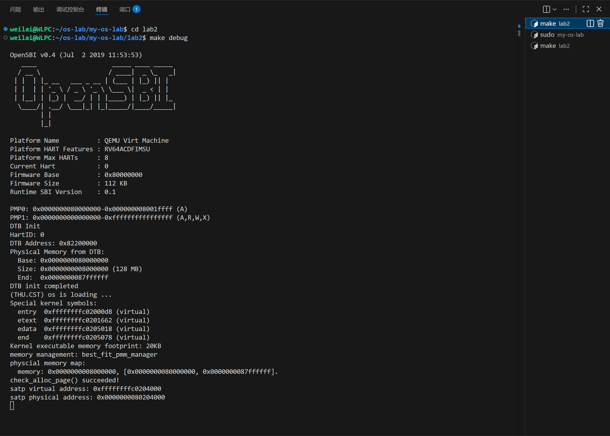
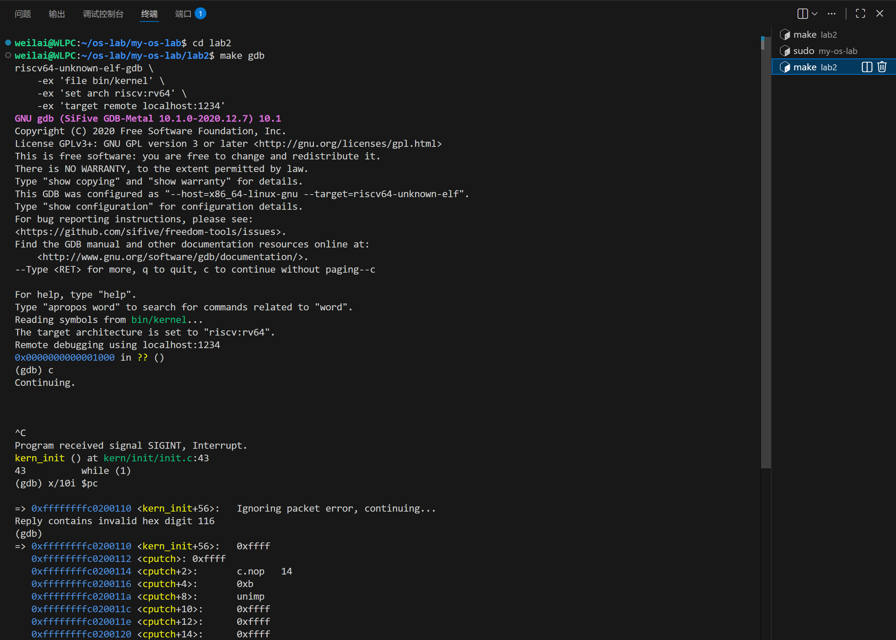
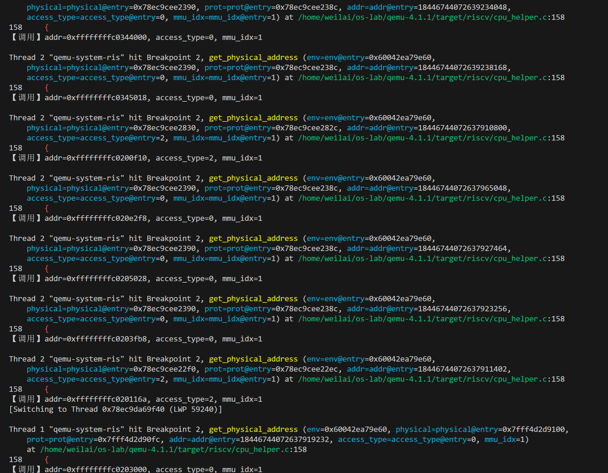

# 分支任务：gdb 调试页表查询过程

## 一、实验概述

本实验通过 GDB 双重调试技术，同时调试 QEMU 模拟器和运行其上的 ucore 内核，深入理解虚拟地址到物理地址的翻译过程，观察 TLB 和页表的工作机制。

## 二、三终端调试环境搭建

### 2.1 准备带调试信息的 QEMU

QEMU 默认编译不包含调试信息，需要重新编译：

```bash
cd qemu-4.1.1
make distclean
./configure --target-list=riscv32-softmmu,riscv64-softmmu --enable-debug
make -j$(nproc)
# 注意：不执行 make install，保留两个版本的 QEMU
```

验证调试信息：
```bash
file riscv64-softmmu/qemu-system-riscv64
# 输出应包含 "with debug_info, not stripped"
```

### 2.2 修改 Makefile

修改 `lab2/Makefile`，使用调试版 QEMU：

```makefile
QEMU := /home/weilai/os-lab/qemu-4.1.1/riscv64-softmmu/qemu-system-riscv64
```

### 2.3 三终端调试架构


*图1：终端1 - 启动 QEMU 等待调试连接*


*图2：终端2 - 调试 QEMU 进程的 GDB 会话*


*图3：终端3 - 调试 ucore 内核的 GDB 会话*

**三终端分工**：
```
终端1: 运行 QEMU (make debug)
  ↓ 提供 GDB stub (端口 1234)

终端3: riscv64-gdb
  → 连接 QEMU 的 GDB stub
  → 控制 ucore 内核执行

终端2: x86_64-gdb
  → attach 到 QEMU 进程
  → 在 QEMU 源码中设置断点
  → 观察地址翻译的软件实现
```

## 三、QEMU 源码分析

### 3.1 关键函数定位


*图4：在 GDB 中查看 QEMU 源码（cpu_helper.c:155-160）*

**文件位置**：`target/riscv/cpu_helper.c`

#### 函数 1：`riscv_cpu_tlb_fill` (第 435 行)

```c
bool riscv_cpu_tlb_fill(CPUState *cs, vaddr address, int size,
                        MMUAccessType access_type, int mmu_idx,
                        bool probe, uintptr_t retaddr)
```

**功能**：TLB miss 时的处理入口
- 当 CPU 访存时 TLB 未命中，此函数被调用
- 调用 `get_physical_address` 进行页表查询
- 查询成功后调用 `tlb_set_page` 填充 TLB

#### 函数 2：`get_physical_address` (第 155 行)

```c
static int get_physical_address(CPURISCVState *env, hwaddr *physical,
                                int *prot, target_ulong addr,
                                int access_type, int mmu_idx)
```

**功能**：虚拟地址到物理地址转换的核心实现

**关键逻辑流程**：

##### 第一步：检查是否需要地址转换 (165-175 行)

```c
int mode = mmu_idx;

if (mode == PRV_M && access_type != MMU_INST_FETCH) {
    if (get_field(env->mstatus, MSTATUS_MPRV)) {
        mode = get_field(env->mstatus, MSTATUS_MPP);
    }
}

if (mode == PRV_M || !riscv_feature(env, RISCV_FEATURE_MMU)) {
    *physical = addr;  // 物理地址 = 虚拟地址
    *prot = PAGE_READ | PAGE_WRITE | PAGE_EXEC;
    return TRANSLATE_SUCCESS;  // 直接返回，无需页表查询
}
```

**关键发现**：
- 在 **M 模式**（机器模式，mode=3）下，地址直通，不进行翻译
- 只有在 **S 模式**或 **U 模式**下才会进行页表遍历

##### 第二步：获取页表配置 (183-221 行)

```c
// 从 SATP 寄存器获取页表基址和模式
base = get_field(env->satp, SATP_PPN) << PGSHIFT;
vm = get_field(env->satp, SATP_MODE);

switch (vm) {
    case VM_1_10_SV39:
        levels = 3;      // 三级页表
        ptidxbits = 9;   // 每级索引 9 位
        ptesize = 8;     // 页表项 8 字节
        break;
    // ...
}
```

##### 第三步：页表遍历循环 (237-351 行)

```c
for (i = 0; i < levels; i++, ptshift -= ptidxbits) {
    // 1. 计算页表索引
    target_ulong idx = (addr >> (PGSHIFT + ptshift)) & ((1 << ptidxbits) - 1);

    // 2. 计算页表项地址
    target_ulong pte_addr = base + idx * ptesize;

    // 3. 读取页表项（这里会触发物理内存读取）
    target_ulong pte = ldq_phys(cs->as, pte_addr);
    target_ulong ppn = pte >> PTE_PPN_SHIFT;

    // 4. 检查有效位
    if (!(pte & PTE_V)) {
        return TRANSLATE_FAIL;
    }

    // 5. 判断是中间节点还是叶子节点
    if (!(pte & (PTE_R | PTE_W | PTE_X))) {
        // 中间节点：R/W/X 全为 0
        base = ppn << PGSHIFT;  // 更新 base，进入下一级
    } else {
        // 叶子节点：找到了最终的物理页
        target_ulong vpn = addr >> PGSHIFT;
        *physical = (ppn | (vpn & ((1L << ptshift) - 1))) << PGSHIFT;

        // 设置权限
        if ((pte & PTE_R) || ((pte & PTE_X) && mxr)) {
            *prot |= PAGE_READ;
        }
        if ((pte & PTE_X)) {
            *prot |= PAGE_EXEC;
        }
        if ((pte & PTE_W) && ...) {
            *prot |= PAGE_WRITE;
        }

        return TRANSLATE_SUCCESS;
    }
}
```

## 四、实验过程与关键数据

### 4.1 调试会话设置


*图5：终端2 - 调试 QEMU 进程全景*

**终端 1**：
```bash
cd /home/weilai/os-lab/my-os-lab/lab2
make debug
# QEMU PID: 23092
```

**终端 2**：
```bash
sudo gdb -p 23092 /home/weilai/os-lab/qemu-4.1.1/riscv64-softmmu/qemu-system-riscv64

(gdb) handle SIGPIPE nostop noprint // 忽略 SIGPIPE 信号
(gdb) set pagination off // 关闭分页，方便查看长输出
(gdb) break get_physical_address if addr > 0xffffffff00000000 // 设置条件断点
(gdb) continue
```

**终端 3**：
```bash
cd /home/weilai/os-lab/my-os-lab/lab2
make gdb

(gdb) c
(gdb) si  # 单步执行触发地址翻译
```

### 4.2 观察到的地址翻译实例

#### 实例 1：M 模式下的地址访问（无页表遍历）

**调试输出**：
```
虚拟地址: 0x0
mode: 3 (PRV_M)
mmu_idx: 3

执行路径：
  171: if (mode == PRV_M || !riscv_feature(env, RISCV_FEATURE_MMU))
  197:     *physical = addr;  // 直接返回
  198:     *prot = PAGE_READ | PAGE_WRITE | PAGE_EXEC;
  199:     return TRANSLATE_SUCCESS;
```

**结论**：在 M 模式下，虚拟地址 = 物理地址，无需页表查询。

#### 实例 2：S 模式下的虚拟地址翻译（完整页表遍历）


*图6：断点触发时的完整信息*


*图7：关键变量的打印输出（完整的调试过程）*

**目标虚拟地址**：`0xffffffffc0200000`

##### 初始参数
```
addr:        0xffffffffc0200000
access_type: 0 (MMU_INST_FETCH - 指令取址)
mmu_idx:     1 (S 模式)
mode:        1 (PRV_S)
```

##### SATP 寄存器分析
```
SATP 值: 0x8000000000080204

解析：
  [63:60] MODE = 8 → SV39 模式（三级页表）
  [59:44] ASID = 0 → 地址空间 ID
  [43:0]  PPN  = 0x80204 → 页表基物理页号

页表基址 = PPN << 12 = 0x80204000
```

##### 页表配置
```
vm:        8 (VM_1_10_SV39)
levels:    3 (三级页表)
ptidxbits: 9 (每级索引 9 位)
ptesize:   8 (页表项 8 字节)
base:      0x80204000
```

##### 虚拟地址分解（SV39）
```
虚拟地址: 0xffffffffc0200000
二进制:   1111111111111111111111111111111111000000001000000000000000000000

SV39 地址格式 (39 位有效):
  [38:30] VPN[2] = 0x1ff (111111111)
  [29:21] VPN[1] = 0x001 (000000001)
  [20:12] VPN[0] = 0x100 (100000000)
  [11:0]  Offset = 0x000
```

##### 第一级页表查询（Level 2）

```
i = 0
ptshift = 18 (两级索引，每级 9 位)

索引计算:
  idx = (addr >> (12 + 18)) & 0x1ff
      = (addr >> 30) & 0x1ff
      = 0x1ff (511)

PTE 地址:
  pte_addr = base + idx * 8
           = 0x80204000 + 511 * 8
           = 0x80204ff8

读取 PTE:
  pte = ldq_phys(0x80204ff8)
      = 0x200000cf

PTE 解析:
  [63:10] PPN = 0x80000
  [7:0]   标志位 = 0xcf
    V (Valid)   = 1 ✓
    R (Read)    = 1
    W (Write)   = 1
    X (Execute) = 1
    U (User)    = 0
    G (Global)  = 0
    A (Accessed)= 1
    D (Dirty)   = 1

判断：pte & (PTE_R | PTE_W | PTE_X) = 0xe ≠ 0
      → 这是叶子节点（大页映射，直接返回）
```

##### 计算最终物理地址

```
ppn = 0x80000
vpn = addr >> 12 = 0xffffffffc0200

超级页映射计算:
  physical = (ppn | (vpn & ((1 << ptshift) - 1))) << PGSHIFT
           = (0x80000 | (0xffffffffc0200 & 0x3ffff)) << 12
           = (0x80000 | 0x200) << 12
           = 0x80200 << 12
           = 0x80200000
```

##### 权限设置

```
prot 初始值: 0

if (pte & PTE_R) || ((pte & PTE_X) && mxr):
    prot |= PAGE_READ  (0x1)

if (pte & PTE_X):
    prot |= PAGE_EXEC  (0x4)

if (pte & PTE_W) && ...:
    prot |= PAGE_WRITE (0x2)

最终 prot: PAGE_READ | PAGE_EXEC | PAGE_WRITE = 0x7
```

##### 翻译结果总结

```
输入虚拟地址: 0xffffffffc0200000
输出物理地址: 0x80200000
权限:         PAGE_READ | PAGE_WRITE | PAGE_EXEC

映射类型:     1GB 超级页（大页映射）
遍历层数:     1 级（在第一级就找到了叶子节点）
```

## 五、问题解答

### 5.1 理解 QEMU 源码的关键调用路径和分支语句

#### 5.1.1 QEMU 源码关键位置


*图8：在 GDB 中定位到 cpu_helper.c 的关键函数*

**核心文件**：`target/riscv/cpu_helper.c`

**关键函数**：
- `riscv_cpu_tlb_fill`（第 435 行）：TLB miss 时的处理入口
- `get_physical_address`（第 155 行）：地址翻译的核心实现

#### 5.1.2 完整的调用路径

```
访存指令 (RISC-V ld/sd)
  ↓
[1] TCG 生成的代码
  ↓
[2] load_helper() / store_helper()
    文件：accel/tcg/cputlb.c:1248 / 1501
  ↓
[3] 计算 TLB 索引并查找
    index = tlb_index(env, mmu_idx, addr)
    entry = tlb_entry(env, mmu_idx, addr)
  ↓
[4] tlb_hit() 检查
    if (!tlb_hit(tlb_addr, addr))
    ├─ TLB Hit  → 直接返回物理地址
    └─ TLB Miss → 继续
  ↓
[5] tlb_fill()
    文件：accel/tcg/cputlb.c:868
  ↓
[6] cc->tlb_fill() → riscv_cpu_tlb_fill()
    文件：target/riscv/cpu_helper.c:435
  ↓
[7] get_physical_address()
    文件：target/riscv/cpu_helper.c:155
  ↓
[8] 检查特权模式 (171-174 行)
    if (mode == PRV_M) → 直接返回
  ↓
[9] 从 SATP 获取页表基址 (183-221 行)
  ↓
[10] 三级页表遍历循环 (237-351 行)
  ↓
[11] 返回物理地址和权限
  ↓
[12] tlb_set_page() 填充 TLB
    文件：accel/tcg/cputlb.c:843
  ↓
完成内存访问
```

#### 5.1.3 关键分支语句详解

**分支 1：TLB Hit 判断**（accel/tcg/cputlb.c:1271）

```c
if (!tlb_hit(tlb_addr, addr)) {
    // TLB Miss，进入慢速路径
    if (!victim_tlb_hit(...)) {
        tlb_fill(...);  // 查询页表
    }
}
// TLB Hit，快速路径
```

**作用**：这是性能的关键分支
- TLB Hit：1-2 个时钟周期
- TLB Miss：数十到上百个时钟周期

---

**分支 2：特权模式检查**（target/riscv/cpu_helper.c:171-174）

```c
if (mode == PRV_M || !riscv_feature(env, RISCV_FEATURE_MMU)) {
    *physical = addr;  // 物理地址 = 虚拟地址
    *prot = PAGE_READ | PAGE_WRITE | PAGE_EXEC;
    return TRANSLATE_SUCCESS;  // 直接返回
}
```

**作用**：M 模式下，地址不翻译，直接返回。

---

**分支 3：叶子节点判断**（target/riscv/cpu_helper.c:259-261）

```c
if (!(pte & (PTE_R | PTE_W | PTE_X))) {
    // 中间节点：R=W=X=0
    base = ppn << PGSHIFT;  // 进入下一级页表
} else {
    // 叶子节点：找到了物理页
    *physical = (ppn | (vpn & ((1L << ptshift) - 1))) << PGSHIFT;
    return TRANSLATE_SUCCESS;
}
```

**作用**：判断是否找到目标物理页
- 第一级遇到叶子节点 → 1GB 大页
- 第二级遇到叶子节点 → 2MB 大页
- 第三级遇到叶子节点 → 4KB 小页

### 5.2 单步调试页表翻译流程

（详见第三和第四部分）

### 5.3 查找 TLB 的 C 代码

#### 5.3.1 TLB 查找代码位置


**TLB 查找在 `load_helper()` 函数的开头**。

**文件位置**：`accel/tcg/cputlb.c:1248-1280`

```c
static inline uint64_t load_helper(
    CPUArchState *env, target_ulong addr, TCGMemOpIdx oi, ...
) {
    uintptr_t mmu_idx = get_mmuidx(oi);

    // === TLB 查找开始 ===

    // 步骤 1: 计算 TLB 索引
    uintptr_t index = tlb_index(env, mmu_idx, addr);

    // 步骤 2: 从 TLB 数组中取出条目
    CPUTLBEntry *entry = tlb_entry(env, mmu_idx, addr);

    // 步骤 3: 获取 TLB 条目中保存的虚拟地址
    target_ulong tlb_addr = entry->addr_read;  // 或 addr_code/addr_write

    // 步骤 4: TLB Hit 检查
    if (!tlb_hit(tlb_addr, addr)) {
        // === TLB Miss ===

        // 尝试 Victim TLB（8 项全相联缓存）
        if (!victim_tlb_hit(env, mmu_idx, index, ...)) {
            // Victim TLB 也 Miss，调用页表查询
            tlb_fill(env_cpu(env), addr, size,
                     access_type, mmu_idx, retaddr);

            // 重新获取 TLB 条目（已被 tlb_fill 填充）
            index = tlb_index(env, mmu_idx, addr);
            entry = tlb_entry(env, mmu_idx, addr);
        }
        tlb_addr = entry->addr_read;
    }

    // === TLB Hit，快速路径 ===

    // 使用 addend 快速计算主机地址
    void *haddr = (void *)(entry->addend + addr);

    // 直接访问内存
    return load_from_host(haddr);
}
```

#### 5.3.2 TLB Hit 判断逻辑

```c
static inline bool tlb_hit(target_ulong tlb_addr, target_ulong addr) {
    return (tlb_addr & TARGET_PAGE_MASK) == (addr & TARGET_PAGE_MASK);
}
```

**含义**：
- `TARGET_PAGE_MASK = 0xfffff000`（页对齐掩码）
- 比较 TLB 条目和当前地址的**页号**部分
- 如果匹配，TLB Hit；否则 TLB Miss

#### 5.3.3 Victim TLB 机制

**什么是 Victim TLB？**
- 当 TLB 条目被替换时，旧条目不是直接丢弃，而是放入 Victim TLB
- Victim TLB 是一个小的全相联缓存（8 项）
- 在主 TLB Miss 后，先查 Victim TLB，如果命中，恢复到主 TLB

**为什么需要？**
- 减少 TLB Miss 的代价
- 对于频繁切换的地址访问模式，Victim TLB 能显著提升性能

### 5.4 QEMU 的 TLB 和真实 CPU 的 TLB 逻辑区别

#### 5.4.1 实验设计

**目标**：对比 M 模式（虚拟地址未开启）和 S 模式（虚拟地址已开启）的调用路径。

**实验步骤**：
1. 在 `get_physical_address` 入口设置断点
2. 让 ucore 完整启动
3. 统计断点触发的 `mmu_idx` 值

---

#### 5.4.2 实验过程

**终端 2 设置断点**：
```gdb
break get_physical_address
commands
silent
printf "【调用】addr=0x%lx, access_type=%d, mmu_idx=%d\n", addr, access_type, mmu_idx
continue
end
continue
```

**终端 3 启动 ucore**：
```gdb
continue
```

#### 5.4.3 实验结果


*图9：S 模式下疯狂触发地址翻译（mmu_idx=1）*

**观察**：
- 所有调用都是 `mmu_idx=1`（S 模式）
- 虚拟地址范围：`0xffffffffc0200000 ~ 0xffffffffc0300000`
- `access_type=0`：读操作
- `access_type=1`：写操作


*图10：没有任何 M 模式的调用*


*图11：断点触发 767 次，全部是 S 模式*

**统计结果**：
```
断点触发总次数：767 次
  - mmu_idx=1 (S 模式)：767 次
  - mmu_idx=3 (M 模式)：0 次
```

**结论**：在 QEMU 中，**M 模式下完全不调用 `get_physical_address`**。

#### 5.4.4 逻辑区别分析

| 特性 | 真实 RISC-V CPU | QEMU 实现 | 实验证据 |
|------|-----------------|-----------|----------|
| **M 模式是否查 TLB** | 未定义（由实现决定） | 不查 TLB | `mmu_idx=3` 出现 0 次 |
| **M 模式 TLB 填充** | 可能填充（实现相关） | 不填充 | 无 M 模式的 `tlb_set_page` 调用 |
| **M 模式调用路径** | 硬件直通 | TCG 生成直接访存代码 | `get_physical_address` 不触发 |
| **S 模式 TLB 查找** | 硬件自动查找 | 软件模拟查找 (`load_helper`) | 触发 767 次 |
| **S 模式 TLB Miss** | 硬件自动遍历页表 | 软件遍历 (`get_physical_address`) | 每次 miss 都调用 |
| **TLB 结构** | 硬件缓存（SRAM） | 软件数组 (`CPUTLBEntry`) | - |
| **TLB 大小** | 实现相关（32-128 项） | 256 项 + 8 项 Victim TLB | - |
| **TLB 替换策略** | 实现相关（LRU/随机） | 直接映射 + Victim TLB | - |

#### 5.4.5 为什么 QEMU 这样设计？

**1. M 模式不需要地址翻译**
- RISC-V 规范：M 模式下，虚拟地址 = 物理地址
- QEMU 在 TCG 生成代码时就跳过了 MMU

**2. 性能优化**
- 避免不必要的 TLB 查找和填充
- 减少函数调用开销

**3. 简化实现**
- M 模式的直通行为在代码生成阶段就处理了
- 不需要在运行时判断

**代码证据**（target/riscv/cpu_helper.c:171-174）：
```c
if (mode == PRV_M || !riscv_feature(env, RISCV_FEATURE_MMU)) {
    *physical = addr;  // 物理地址 = 虚拟地址
    *prot = PAGE_READ | PAGE_WRITE | PAGE_EXEC;
    return TRANSLATE_SUCCESS;
}
```

但这段代码**永远不会被 M 模式访存触发**（实验证明：0 次调用）。

### 5.5 一些遇到的问题以及与大模型交互的过程

在本次实验中，我遇到了如下问题并利用大模型辅助学习：

#### 5.5.1 实验前期：对于三个终端身份的理解

- 提问："本次实验为什么需要3个终端进行调试呢？我不太理解，请使用形象的语言进行讲述。"
- 答复概述：大模型将GDB调试比喻为“舞台剧”的导演：QEMU模拟器​​ = 整个​​剧院舞台​​
、​ucore内核​​ = 舞台上正在​​表演的演员​​、​​RISCV CPU指令​​ = 演员的​​台词和动作​；第2个终端的GDB会话1（普通gdb）​​ = ​​舞台导演的控制台​，调试对象是QEMU进程本身（剧院舞台），而第3个终端的GDB会话2（riscv64-unknown-elf-gdb）​​ = ​​演员导演的耳机​，调试对象是ucore内核（舞台上的演员）。
- 以下代码可以更清晰地理解这个过程：

```bash
# 终端1：启动剧院舞台
make debug  # 启动QEMU，舞台准备就绪

# 终端2：舞台导演就位
gdb
(gdb) attach <QEMU进程PID>  # 连接舞台控制台
(gdb) b some_qemu_function  # 在舞台机械装置上设置断点

# 终端3：演员导演就位  
make gdb  # 连接演员的耳机
(gdb) b kern_init  # 告诉演员："在kern_init这里停一下"
(gdb) c  # 演员开始表演
```

#### 5.5.2 实验中期：快速定位关键代码、解决异常、学会使用条件断点

- 提问："QEMU 中 RISC-V 的地址翻译代码在哪里？"
- 答复概述：大模型通过搜索，快速找到 `target/riscv/cpu_helper.c` ，并指出 `get_physical_address` 函数是地址翻译的核心实现。

- 遇到 `SIGPIPE` 信号中断时询问原因
- 得到 `handle SIGPIPE nostop noprint` 解决方案

- 提问："如何在 GDB 中只在 S 模式时停下？"
- 答复概述：学会使用条件断点 `if mmu_idx != 3`

#### 5.5.3 实验后期：理解 QEMU TLB 机制与真实 CPU 的区别

- 提问："QEMU 的 TLB 机制和真实 CPU 有什么区别？"
- 答复概述：大模型详细对比了 QEMU 软件模拟的 TLB 和真实 CPU 硬件 TLB 的异同，帮助我理解了两者的设计理念和实现细节。
