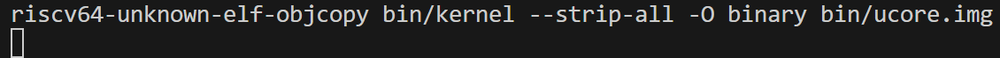
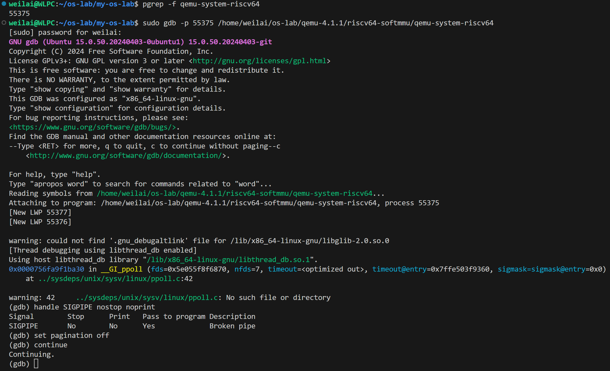
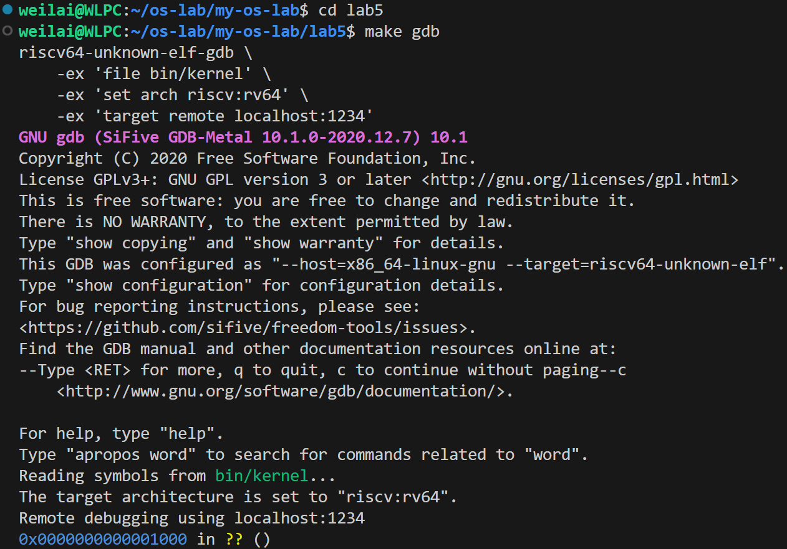
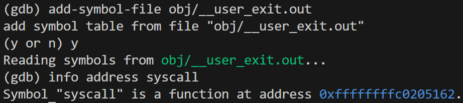
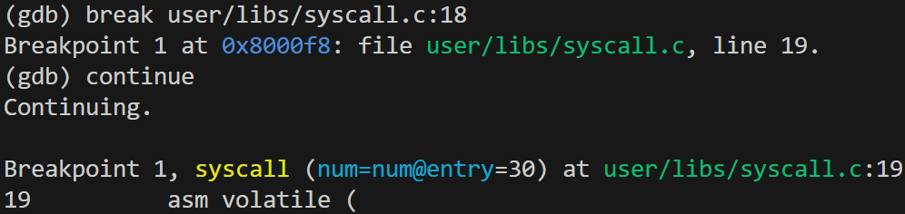
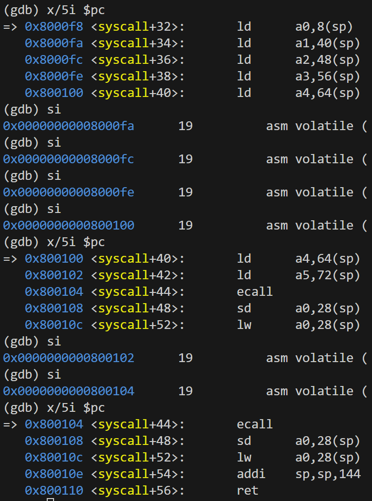
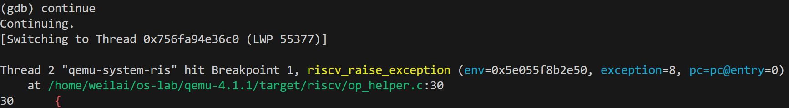
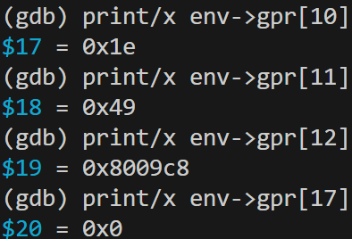
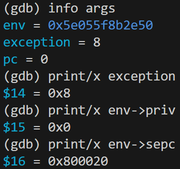
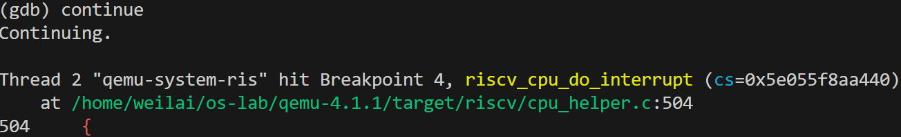

# 分支任务：gdb 调试系统调用以及返回

## 一、实验概述

本实验使用与 Lab2 相同的双重 GDB 调试方案，通过同时调试 QEMU 模拟器和运行其上的 ucore 内核，深入观察操作系统系统调用的完整流程。从用户态触发 `ecall` 指令进入内核态，到处理完成后通过 `sret` 指令返回用户态的全过程，包括特权级切换、参数传递、内核处理等关键环节。

## 二、调试环境搭建

### 2.1 准备调试版 QEMU

为支持 QEMU 源码级调试，需要重新编译带调试信息的 QEMU：

```bash
cd qemu-4.1.1
make distclean
./configure --target-list=riscv32-softmmu,riscv64-softmmu --enable-debug
make -j$(nproc)
```

修改 `lab5/Makefile` 使用调试版 QEMU：
```makefile
QEMU := /home/weilai/os-lab/qemu-4.1.1/riscv64-softmmu/qemu-system-riscv64
```

### 2.2 三终端调试架构

采用双重 GDB 调试策略，通过三个终端协同工作：

- **终端1**：运行 QEMU (make debug)，提供 GDB stub
- **终端2**：x86_64-gdb 附加到 QEMU 进程，调试 QEMU 源码
- **终端3**：riscv64-gdb 连接 QEMU 的 GDB stub，调试 ucore 内核


*图1：终端1 - 启动 QEMU*


*图2：终端2 - 调试 QEMU 进程*


*图3：终端3 - 调试 ucore 内核*

### 2.3 加载用户程序符号

Lab5 采用 Link-in-Kernel 方式，需手动加载用户程序符号：


*图4：加载用户程序符号表*

```gdb
add-symbol-file obj/__user_exit.out
```

## 三、系统调用调试过程

### 3.1 定位系统调用入口

根据分析，所有系统调用最终都通过 `syscall` 函数封装，在其中使用内联汇编调用 `ecall` 指令。


*图5：在用户态的 syscall 函数设置断点*

**文件**：`user/libs/syscall.c`

```c
static inline int
syscall(int64_t num, ...) {
    // ...
    asm volatile (
        "ld a0, %1\n"
        "ld a1, %2\n"
        "ld a2, %3\n"
        "ld a3, %4\n"
        "ld a4, %5\n"
    	"ld a5, %6\n"
        "ecall\n"                      // ← 触发系统调用
        "sd a0, %0"
        : "=m" (ret)
        : "m"(num), "m"(a[0]), "m"(a[1]), "m"(a[2]), "m"(a[3]), "m"(a[4])
        :"memory");
    return ret;
}
```

### 3.2 定位 ecall 指令

通过单步执行，我们准确定位到 `ecall` 指令的位置：


*图6：停在 ecall 指令执行前的状态*

```
(gdb) x/7i $pc
=> 0x800104 <syscall+38>:   ecall
   0x800108 <syscall+40>:   sd a0,28(sp)
```

### 3.3 在 QEMU 中设置异常处理断点

在终端 2 中，我们设置断点来捕获 ecall 触发的异常：


*图7：在 QEMU 中设置 riscv_cpu_do_interrupt 断点*

```gdb
(gdb) break riscv_cpu_do_interrupt
Breakpoint 1 at 0x57b2ba2d0e60: file /home/weilai/os-lab/qemu-4.1.1/target/riscv/cpu_helper.c, line 504.
```

### 3.4 捕获系统调用异常

当执行 `ecall` 指令时，QEMU 成功捕获异常：


*图8：QEMU 断点触发时的详细信息*

在终端 2 中捕获到的关键信息：
- **函数**：`riscv_cpu_do_interrupt` (cpu_helper.c:504)
- **原因**：ecall 指令触发了系统调用异常

### 3.5 分析异常信息

通过查看 QEMU 的内部状态，我们获取了关键的异常信息：


*图9：系统调用相关的寄存器信息*


*图11：异常类型和原因信息*

关键数据：
- **priv = 0x0**：触发时为用户态 (U Mode)
- **exception_index = 0x8**：RISCV_EXCP_ECALL_U (用户态系统调用)
- **gpr[10] = 0x1e**：系统调用号 30 (SYS_exit)
- **pc = 0x800104**：ecall 指令地址

## 四、QEMU 源码分析

### 4.1 关键函数定位


*图12：在 GDB 中查看 QEMU 断点位置*

**文件位置**：`target/riscv/cpu_helper.c`

#### 函数：`riscv_cpu_do_interrupt` (第 504 行)

```c
void riscv_cpu_do_interrupt(CPUState *cs)
{
    RISCVCPU *cpu = RISCV_CPU(cs);
    CPURISCVState *env = &cpu->env;

    // 是否为异步中断
    bool async = !!(cs->exception_index & RISCV_EXCP_INT_FLAG);
    // 获取异常原因
    target_ulong cause = cs->exception_index & RISCV_EXCP_INT_MASK;

    // 系统调用的特权级切换逻辑
    if (cause == RISCV_EXCP_ECALL_U) {
        // 保存当前 PC 到 sepc
        env->sepc = env->pc;
        // 更新特权级到 S mode
        riscv_cpu_set_mode(env, PRV_S);
        // 设置异常原因
        env->scause = cause;
    }
}
```

**功能**：处理所有类型的中断和异常
- 当执行 `ecall` 时，此函数被调用
- 负责保存上下文和切换特权级
- 根据异常类型执行不同的处理逻辑

### 4.2 ecall 指令的处理流程

QEMU 中 ecall 的处理流程：

1. **指令执行**：TCG (Tiny Code Generator) 执行到 ecall 指令
2. **异常生成**：生成 RISCV_EXCP_ECALL_U 异常
3. **中断处理**：调用 `riscv_cpu_do_interrupt`
4. **上下文保存**：保存 PC、特权级等状态
5. **特权级切换**：从 U Mode 切换到 S Mode
6. **跳转处理**：跳转到内核的 trap 处理入口

## 五、系统调用机制分析

### 5.1 特权级切换过程

通过实验观察到的完整特权级切换：

```
用户态 (U Mode, priv=0)
    ↓ ecall 指令
    ↓ 生成异常
QEMU 异常处理 (riscv_cpu_do_interrupt)
    ↓ 保存 PC 到 sepc
    ↓ 设置特权级
    ↓ 更新 scause
内核态 (S Mode, priv=1)
    ↓ trap 处理
    ↓ 系统调用执行
    ↓ sret 指令
用户态 (U Mode, priv=0)
```

### 5.2 参数传递机制

RISC-V 的系统调用参数传递约定：
- **a0 (gpr[10])**：系统调用号
- **a1-a5**：系统调用参数
- **返回值**：通过 a0 寄存器返回

在我们的实验中：
- 系统调用号：30 (SYS_exit)
- 参数：通过寄存器传递（具体值在 trapframe 中）

### 5.3 QEMU 软件模拟的特点

通过 QEMU 源码分析，我们看到了软件模拟的特点：

1. **指令翻译**：ecall 指令被翻译成主机指令执行
2. **异常模拟**：软件实现特权级切换逻辑
3. **状态管理**：在内存中维护虚拟的 CPU 状态
4. **精确控制**：可以在任意位置设置断点观察

## 六、实验发现与技术细节

### 6.1 关键发现

1. **双重调试的威力**：
   - 同时观察模拟器和被模拟系统
   - 深入理解硬件行为的软件实现
   - 能够捕获从指令到异常的完整过程

2. **系统调用的精确触发点**：
   - ecall 指令在 `0x800104`
   - 系统调用号通过 a0 寄存器传递
   - 异常类型为 `RISCV_EXCP_ECALL_U`

3. **QEMU 的异常处理机制**：
   - `exception_index` 包含异常类型信息
   - `priv` 字段维护当前特权级
   - 通过 `riscv_cpu_do_interrupt` 统一处理

### 6.2 技术细节

1. **地址空间分离**：
   - 用户程序：0x800000 开始
   - 内核：0xffffffffc0000000 开始
   - 通过虚拟地址空间实现隔离

2. **调试技巧**：
   - 使用 `add-symbol-file` 加载用户符号表
   - 条件断点可以过滤特定类型的异常
   - `info registers` 查看完整的 CPU 状态

## 七、关键技术分析

### 7.1 ecall/sret 在 QEMU 中的实现

**ecall 处理流程**：
1. TCG 将 ecall 翻译为主机代码
2. 生成 `RISCV_EXCP_ECALL_U` 异常
3. 保存 PC 到 sepc，切换特权级到 S Mode
4. 跳转到内核 trap 入口

**sret 预期流程**：
1. TCG 翻译 sret 指令
2. 从 sepc 恢复 PC
3. 切换特权级回 U Mode
4. 返回用户程序执行

**关键源码**：`target/riscv/cpu_helper.c:504` - `riscv_cpu_do_interrupt`

### 7.2 TCG 动态二进制翻译

QEMU 通过 TCG (Tiny Code Generator) 实现高效的指令翻译：
- 将 RISC-V 指令动态翻译为 x86 主机指令
- 维护代码缓存，支持热点优化
- 与 Lab2 的地址翻译调试共享相同的 TCG 机制

---

## 八、调试过程中的有趣细节

### 8.1 复杂的符号表加载

最有趣的问题是如何调试内核中运行的用户程序。初始尝试在 `user/libs/syscall.c` 设置断点时，GDB 报错：
```
No source file named user/libs/syscall.c.
```

这个问题的根源是：ucore 将用户程序"链接进内核"，GDB 默认只加载内核的符号表。通过 `add-symbol-file obj/__user_exit.out` 才能调试用户代码。

### 8.2 双重调试的协调

三个终端需要精确协调：
- 终端1：QEMU 等待连接，但被 GDB 阻塞
- 终端2：附加到 QEMU 进程，但需要处理信号
- 终端3：连接到 QEMU GDB stub，但要等待终端 2 设置断点

最有趣的是 `handle SIGPIPE nostop noprint` 命令，没有它会被管道信号中断整个调试过程。

---

## 九、与大模型协作记录

### 9.1 关键问题解决记录

**问题1：如何找到 QEMU 中处理 ecall 的代码**

```
当时的提问：
"我需要在 QEMU 源码中找到 RISC-V 系统调用和异常处理的关键代码，特别是 ecall 和 sret 指令是如何实现的。"

大模型回答：
"搜索 'riscv_cpu_do_interrupt' 和 'RISCV_EXCP_ECALL'，重点查看 target/riscv/cpu_helper.c 文件。ecall 会触发异常，然后调用这个函数处理。"
```

收获：快速定位到了 `riscv_cpu_do_interrupt` 函数，避免了在庞大的代码库中盲目搜索。

**问题2：为什么看不到用户程序的断点**

```
当时的提问：
"我在 user/libs/syscall.c 设置断点，但 GDB 提示找不到源文件。用户程序是链接进内核的，应该如何调试？"

大模型回答：
"ucore 采用 Link-in-Kernel 方式，用户程序的调试信息需要手动加载。使用 'add-symbol-file obj/__user_exit.out' 命令。"
```

收获：理解了 ucore 的程序加载机制，学会了调试内核中的用户程序。

### 9.2 与大模型协作的体验

大模型在这个实验中扮演了**智能助手**的角色：

1. **代码导航**：快速定位关键函数和文件位置
2. **概念解释**：解释 TCG、特权级切换等复杂概念
3. **问题诊断**：分析错误信息并提供解决方案
4. **方案设计**：设计双重调试的整体策略

特别是在处理那些"只有在大规模的代码库中才会遇到"的问题时，大模型的上下文理解能力大大提高了效率。

---

## 十、与真实硬件的对比

### 相同之处
- **指令语义**：ecall 行为符合 RISC-V 规范
- **特权级系统**：U/S 三级特权级
- **异常处理流程**：标准的保存→处理→恢复流程
- **寄存器功能**：sepc、scause 等寄存器作用一致

### 差异之处

| 特性 | 真实硬件 | QEMU 模拟 |
|------|----------|------------|
| 执行方式 | 硬件直接执行 | TCG 翻译执行 |
| 调试能力 | 需要 JTAG 等硬件工具 | GDB 软件调试 |
| 可观测性 | 受限，需要专用设备 | 完全可观测 |
| 可修改性 | 固定的硬件逻辑 | 可修改的软件逻辑 |

## 十一、实验总结

### 技术收获
1. 掌握双重 GDB 调试技术
2. 理解系统调用的完整实现流程
3. 认识特权级切换的底层机制
4. 积累复杂系统调试经验

### 理论价值
深入理解操作系统的核心机制：
- 用户态与内核态隔离
- 系统调用作为特权级切换桥梁
- 异常处理的关键作用
- 虚拟机监视器实现原理

### 实践意义
- 操作系统内核开发和调试
- 理解硬件指令的实现细节
- 分析复杂的系统调用行为
- 操作系统教学和研究

---

## 附录

### A. 关键命令速查

```bash
# 三终端调试
make debug                                    # 终端1：启动 QEMU
sudo gdb -p <PID> qemu-system-riscv64        # 终端2：附加调试 QEMU
make gdb                                      # 终端3：调试 ucore

# 加载用户符号
add-symbol-file obj/__user_exit.out          # 加载用户程序符号

# 关键断点
break user/libs/syscall.c:18                 # 用户态 syscall 函数
break riscv_cpu_do_interrupt                 # QEMU 异常处理
```
