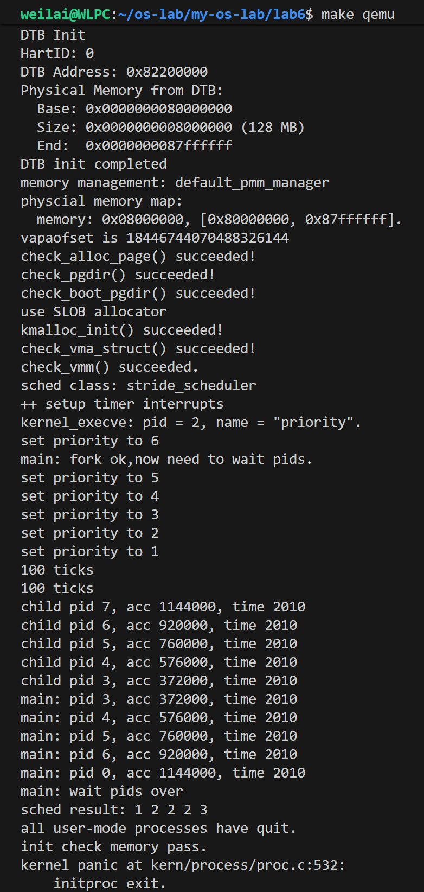

# 2025 操作系统 Lab6 实验报告

  > 团队成员: 2313857陈天祺 & 2311208魏来 & 2312166王旭

  ## 实验目的

  - 理解操作系统的调度管理机制
  - 熟悉 ucore 的系统调度器框架
  - 实现 Stride Scheduling 调度算法
  - 掌握基于优先级的进程调度原理

  ## 实验内容

  ### 练习0：填写已有实验

     本实验依赖实验2/3/4/5。请把你做的实验2/3/4/5的代码填入本实验中代码中有“LAB2”/“LAB3”/“LAB4”“LAB5”的注释相应部分。并确保编译通过。 注意：为了能够正确执行lab6的测试应用程序，可能需对已完成的实验2/3/4/5的代码进行进一步改进。 由于我们在进程控制块中记录了一些和调度有关的信息，例如Stride、优先级、时间片等等，因此我们需要对进程控制块的初始化进行更新，将调度有关的信息初始化。同时，由于时间片轮转的调度算法依赖于时钟中断，你可能也要对时钟中断的处理进行一定的更新。

     ### 练习1：理解调度器框架的实现（不需要编码）

     请仔细阅读和分析调度器框架的相关代码，特别是以下两个关键部分的实现：

     在完成练习0后，请仔细阅读并分析以下调度器框架的实现：

     - 调度类结构体 sched_class 的分析：请详细解释 sched_class 结构体中每个函数指针的作用和调用时机，分析为什么需要将这些函数定义为函数指针，而不是直接实现函数。
     - 运行队列结构体 run_queue 的分析：比较lab5和lab6中 run_queue 结构体的差异，解释为什么lab6的 run_queue 需要支持两种数据结构（链表和斜堆）。
     - 调度器框架函数分析：分析 sched_init()、wakeup_proc() 和 schedule() 函数在lab6中的实现变化，理解这些函数如何与具体的调度算法解耦。

     对于调度器框架的使用流程，请在实验报告中完成以下分析：

     - 调度类的初始化流程：描述从内核启动到调度器初始化完成的完整流程，分析 default_sched_class 如何与调度器框架关联。
     - 进程调度流程：绘制一个完整的进程调度流程图，包括：时钟中断触发、proc_tick 被调用、schedule() 函数执行、调度类各个函数的调用顺序。并解释 need_resched 标志位在调度过程中的作用
     - 调度算法的切换机制：分析如果要添加一个新的调度算法（如stride），需要修改哪些代码？并解释为什么当前的设计使得切换调度算法变得容易。

     ### 练习2：实现 Round Robin 调度算法（需要编码）

     完成练习0后，建议大家比较一下（可用kdiff3等文件比较软件）个人完成的lab5和练习0完成后的刚修改的lab6之间的区别，分析了解lab6采用RR调度算法后的执行过程。理解调度器框架的工作原理后，请在此框架下实现时间片轮转（Round Robin）调度算法。

     注意有“LAB6”的注释，你需要完成 kern/schedule/default_sched.c 文件中的  RR_init、RR_enqueue、RR_dequeue、RR_pick_next 和 RR_proc_tick  函数的实现，使系统能够正确地进行进程调度。代码中所有需要完成的地方都有“LAB6”和“YOUR  CODE”的注释，请在提交时特别注意保持注释，将“YOUR CODE”替换为自己的学号，并且将所有标有对应注释的部分填上正确的代码。

     提示，请在实现时注意以下细节：

     - 链表操作：list_add_before、list_add_after等。
     - 宏的使用：le2proc(le, member) 宏等。
     - 边界条件处理：空队列的处理、进程时间片耗尽后的处理、空闲进程的处理等。

     请在实验报告中完成：

     - 比较一个在lab5和lab6都有, 但是实现不同的函数, 说说为什么要做这个改动, 不做这个改动会出什么问题
       - 提示: 如`kern/schedule/sched.c`里的函数。你也可以找个其他地方做了改动的函数。

     - 描述你实现每个函数的具体思路和方法，解释为什么选择特定的链表操作方法。对每个实现函数的关键代码进行解释说明，并解释如何处理**边界情况**。

     - 展示 make grade 的**输出结果**，并描述在 QEMU 中观察到的调度现象。

     - 分析 Round Robin 调度算法的优缺点，讨论如何调整时间片大小来优化系统性能，并解释为什么需要在 RR_proc_tick 中设置 need_resched 标志。

     - **拓展思考**：如果要实现优先级 RR 调度，你的代码需要如何修改？当前的实现是否支持多核调度？如果不支持，需要如何改进？

     #### 扩展练习 Challenge 1: 实现 Stride Scheduling 调度算法（需要编码）

     首先需要换掉RR调度器的实现，在sched_init中切换调度方法。然后根据此文件和后续文档对Stride度器的相关描述，完成Stride调度算法的实现。 注意有“LAB6”的注释，主要是修改default_sched_stride_c中的内容。代码中所有需要完成的地方都有“LAB6”和“YOUR  CODE”的注释，请在提交时特别注意保持注释，将“YOUR CODE”替换为自己的学号，并且将所有标有对应注释的部分填上正确的代码。

     后面的实验文档部分给出了Stride调度算法的大体描述。这里给出Stride调度算法的一些相关的资料（目前网上中文的资料比较欠缺）。

     - [strid-shed paper location](http://citeseerx.ist.psu.edu/viewdoc/summary?doi=10.1.1.138.3502&rank=1)
     - 也可GOOGLE “Stride Scheduling” 来查找相关资料

     请在实验报告中完成：

     - 简要说明如何设计实现”多级反馈队列调度算法“，给出概要设计，鼓励给出详细设计
     - 简要证明/说明（不必特别严谨，但应当能够”说服你自己“），为什么Stride算法中，经过足够多的时间片之后，每个进程分配到的时间片数目和优先级成正比。

     请在实验报告中简要说明你的设计实现过程。

  ---

  ## 练习0：填写已有实验

  ### 实现内容

  本实验依赖实验2/3/4/5，需要将之前实验的代码填入本实验相应位置，并进行必要的修改以支持调度功能。

  #### 1. 进程控制块初始化（`kern/process/proc.c:alloc_proc`）

  在 `alloc_proc` 函数中，需要初始化进程调度相关的字段：

  ```c
  // LAB6: 2311208 (update LAB5 steps)
  proc->rq = NULL;
  list_init(&(proc->run_link));
  proc->time_slice = 0;
  proc->lab6_stride = 0;
  proc->lab6_priority = 1;  // 默认优先级为1
  skew_heap_init(&(proc->lab6_run_pool));
  ```

  **初始化说明**：

  - `rq`：运行队列指针，初始化为 NULL
  - `run_link`：运行队列链表节点，使用 `list_init` 初始化
  - `time_slice`：时间片，初始化为 0
  - `lab6_stride`：Stride 值，初始化为 0
  - `lab6_priority`：优先级，默认为 1
  - `lab6_run_pool`：斜堆节点，使用 `skew_heap_init` 初始化

  #### 2. 时钟中断处理（`kern/trap/trap.c`）

  在时钟中断处理中，需要调用调度器的 `proc_tick` 函数：

  ```c
  case IRQ_S_TIMER:
      clock_set_next_event();
      if (++ticks % TICK_NUM == 0) {
          print_ticks();
      }
      // lab6: 2311208 (update LAB3 steps)
      sched_class_proc_tick(current);
      break;
  ```

  **功能说明**：

  - 每次时钟中断时，调用 `sched_class_proc_tick(current)` 来更新当前进程的时间片
  - 当时间片耗尽时，会设置 `need_resched` 标志，触发进程调度

  ---

  ## 练习1: 理解调度器框架的实现

  ### 1. 调度类结构体 sched_class 分析

  `sched_class` 结构体定义在 `kern/schedule/sched.h` 中，它是 ucore 调度器框架的核心抽象，借鉴了 Linux 的调度类设计。该结构体通过一系列函数指针定义了调度算法必须实现的接口，从而将调度框架（机制）与具体的调度算法（策略）解耦。

  #### (1) 结构体成员分析

  `sched_class` 结构体主要包含以下成员：

  ```c
  struct sched_class {
      const char *name;
      void (*init)(struct run_queue *rq);
      void (*enqueue)(struct run_queue *rq, struct proc_struct *proc);
      void (*dequeue)(struct run_queue *rq, struct proc_struct *proc);
      struct proc_struct *(*pick_next)(struct run_queue *rq);
      void (*proc_tick)(struct run_queue *rq, struct proc_struct *proc);
  };
  ```

  各函数指针的作用及调用时机如下：

  1.  **`const char *name`**
      *   **作用**：标识调度类的名称（如 "RR_scheduler" 或 "stride_scheduler"）。
      *   **调用时机**：主要用于调试和日志输出。例如在 `sched_init` 初始化完成后，会打印当前使用的调度类名称。

  2.  **`void (*init)(struct run_queue *rq)`**
      *   **作用**：初始化运行队列（Run Queue）。负责设置运行队列的初始状态，如初始化链表头、清空优先队列、重置计数器等。
      *   **调用时机**：在内核启动时的 `sched_init` 函数中被调用一次。这是调度子系统初始化的第一步。

  3.  **`void (*enqueue)(struct run_queue *rq, struct proc_struct *proc)`**
      *   **作用**：将一个处于 `PROC_RUNNABLE` 状态的进程加入到运行队列中。具体的算法需要根据自身策略（如 FIFO 或 优先级）将进程插入到合适的位置，并更新队列元数据（如进程计数）。
      *   **调用时机**：
          *   当一个进程从睡眠状态被唤醒时（`wakeup_proc`）。
          *   当一个正在运行的进程被抢占或主动放弃 CPU，但仍然处于可运行状态时（`schedule` 函数中）。

  4.  **`void (*dequeue)(struct run_queue *rq, struct proc_struct *proc)`**
      *   **作用**：将一个进程从运行队列中移除。
      *   **调用时机**：在 `schedule` 函数中，当调度器通过 `pick_next` 选出了下一个要运行的进程后，需要将其从就绪队列中移除，准备投入运行。

  5.  **`struct proc_struct *(*pick_next)(struct run_queue *rq)`**
      *   **作用**：根据调度策略，从运行队列中选择下一个要执行的进程。
      *   **调用时机**：在 `schedule` 函数中被调用。这是调度决策的核心时刻。如果队列为空，返回 NULL。

  6.  **`void (*proc_tick)(struct run_queue *rq, struct proc_struct *proc)`**
      *   **作用**：处理时钟中断事件。通常用于减少当前运行进程的剩余时间片。如果时间片耗尽，则设置进程的 `need_resched` 标志，触发重新调度。
      *   **调用时机**：在每次时钟中断处理函数（`trap.c` 中的 `trap_dispatch` -> `sched_class_proc_tick`）中被调用。

  #### (2) 为什么要使用函数指针？

  将这些功能定义为函数指针而不是直接实现函数，主要基于以下设计考量：

  1.  **实现多态性与接口抽象**：
      这是一种在 C 语言中模拟面向对象编程（OOP）多态特性的常见手法。`sched_class` 相当于一个“接口”或“基类”，而具体的调度算法（如 `default_sched.c` 中的 RR 算法，`default_sched_stride.c` 中的 Stride 算法）则是这个接口的“实现类”。

  2.  **解耦机制与策略**：
      操作系统设计中著名的“机制与策略分离”原则在这里得到了体现。
      *   **机制**（Mechanism）：`kern/schedule/sched.c` 实现了通用的调度流程（如 `schedule` 函数），它只知道如何调用 `sched_class` 中的接口，而不关心具体的算法细节。
      *   **策略**（Policy）：具体的调度算法（RR、Stride）实现了 `sched_class` 定义的接口，决定了具体选择哪个进程运行。
      这种解耦使得内核核心代码保持稳定，不需要因为算法的改变而修改。

  3.  **支持动态切换与扩展性**：
      由于使用了函数指针，内核可以在运行时（或编译配置时）通过改变全局变量 `sched_class` 的指向，轻松切换不同的调度算法。例如，在本次实验中，我们只需要在 `sched_init` 中将 `sched_class` 指向 `stride_sched_class`，就可以从 RR 调度器切换到 Stride 调度器，而无需修改 `schedule`、`wakeup_proc` 等核心函数的逻辑。这也方便了未来开发者添加新的调度算法。

  ### 2. 运行队列结构体 run_queue 分析

  #### (1) Lab5 与 Lab6 的 run_queue 差异

  在 Lab5 中，实际上并没有显式定义 `run_queue` 结构体。Lab5 的调度器（FIFO）非常简单，它直接遍历全局的进程链表 `proc_list` 来寻找处于 `PROC_RUNNABLE` 状态的进程。

  *   **Lab5 的实现方式**：
      没有独立的运行队列结构。`schedule` 函数直接从当前进程 `current` 开始，沿着 `proc_list` 链表遍历，找到第一个状态为 `PROC_RUNNABLE` 的进程作为下一个运行进程。这本质上是一个简单的 FIFO 调度，但效率较低，因为每次调度都需要遍历整个进程列表（包括睡眠和僵尸进程）。

  *   **Lab6 的 run_queue 结构**：
      Lab6 引入了专门的 `run_queue` 结构体来管理所有可运行的进程，定义如下：

      ```c
      struct run_queue {
          list_entry_t run_list;
          unsigned int proc_num;
          int max_time_slice;
          // For LAB6 only
          skew_heap_entry_t *lab6_run_pool;
      };
      ```

      主要差异在于：
      1.  **显式的运行队列**：Lab6 将所有可运行进程组织在一个独立的结构中，不再混杂在全局进程列表中。
      2.  **元数据维护**：增加了 `proc_num`（进程数量）和 `max_time_slice`（最大时间片）等元数据。
      3.  **多数据结构支持**：同时包含了链表 (`run_list`) 和斜堆 (`lab6_run_pool`) 两种数据结构。

  #### (2) 为什么 Lab6 需要支持两种数据结构（链表和斜堆）？

  Lab6 的 `run_queue` 同时包含 `run_list` 和 `lab6_run_pool`，是为了支持不同的调度算法需求，体现了框架的通用性：

  1.  **链表 (`run_list`) 用于 Round-Robin (RR) 调度算法**：
      *   RR 算法的核心逻辑是 FIFO（先进先出）。当一个进程时间片用完后，它被放到队列尾部；调度器总是选择队列头部的进程运行。
      *   双向链表非常适合这种操作：`list_add_before`（入队尾）和 `list_del`（出队头）的时间复杂度都是 O(1)。
      *   因此，`default_sched.c` 中的 RR 调度器主要操作 `run_list`。

  2.  **斜堆 (`lab6_run_pool`) 用于 Stride 调度算法**：
      *   Stride 算法的核心逻辑是基于优先级的调度。它需要频繁地从就绪队列中选择 **stride 值最小** 的进程。
      *   如果使用链表，查找最小 stride 值的进程需要遍历整个链表，时间复杂度为 O(N)。
      *   斜堆（Skew Heap）是一种自调整的二叉堆，它支持高效的合并、插入和删除最小值操作。使用斜堆，查找和删除最小 stride 进程的时间复杂度仅为 O(log N)。
      *   因此，`default_sched_stride.c` 中的 Stride 调度器主要操作 `lab6_run_pool`。

  **总结**：`run_queue` 作为一个通用的容器，通过包含多种数据结构，能够同时满足不同调度算法对数据组织形式的要求（RR 的线性顺序 vs Stride 的优先级顺序），从而使得同一个框架可以灵活支持多种算法。

  ### 3. 调度器框架函数分析

  Lab6 对 `sched_init`、`wakeup_proc` 和 `schedule` 函数进行了重构，核心目的是实现调度框架与具体算法的解耦。

  #### (1) `sched_init()` 的变化

  *   **Lab5**：可能只是简单初始化一个链表。
  *   **Lab6**：
      ```c
      void sched_init(void) {
          list_init(&timer_list);
          sched_class = &stride_sched_class;  // 绑定具体的调度算法
          rq = &__rq;
          rq->max_time_slice = MAX_TIME_SLICE;
          sched_class->init(rq);              // 调用算法的初始化接口
          cprintf("sched class: %s\n", sched_class->name);
      }
      ```
      **解耦分析**：`sched_init` 不再包含具体的队列初始化逻辑（如初始化链表头或堆），而是通过 `sched_class->init(rq)` 将初始化任务委托给具体的调度算法。这使得框架不需要知道队列内部是如何组织的。

  #### (2) `wakeup_proc()` 的变化

  *   **Lab5**：直接修改进程状态为 `PROC_RUNNABLE`，并没有显式的入队操作（因为 Lab5 调度器直接遍历进程列表）。
  *   **Lab6**：
      ```c
      void wakeup_proc(struct proc_struct *proc) {
          // ... 省略部分代码 ...
          if (proc->state != PROC_RUNNABLE) {
              proc->state = PROC_RUNNABLE;
              proc->wait_state = 0;
              if (proc != current) {
                  sched_class_enqueue(proc); // 调用算法的入队接口
              }
          }
          // ... 省略部分代码 ...
      }
      ```
      **解耦分析**：当唤醒一个进程时，框架调用 `sched_class_enqueue(proc)` 将其加入运行队列。框架不需要知道进程是被插入到链表尾部（RR）还是斜堆中（Stride），这一细节完全由 `sched_class->enqueue` 的具体实现决定。

  #### (3) `schedule()` 的变化

  *   **Lab5**：包含具体的 FIFO 调度逻辑（遍历链表查找）。
  *   **Lab6**：
      ```c
      void schedule(void) {
          // ... 省略部分代码 ...
          // 1. 如果当前进程还可运行，将其重新入队
          if (current->state == PROC_RUNNABLE) {
              sched_class_enqueue(current);
          }
          // 2. 选择下一个进程
          if ((next = sched_class_pick_next()) != NULL) {
              sched_class_dequeue(next); // 从队列中移除
          }
          // 3. 如果没有可运行进程，选择 idleproc
          if (next == NULL) {
              next = idleproc;
          }
          // 4. 切换进程
          if (next != current) {
              proc_run(next);
          }
          // ... 省略部分代码 ...
      }
      ```
      **解耦分析**：`schedule` 函数变成了纯粹的流程控制者：
      1.  它不知道如何选择下一个进程，而是调用 `sched_class_pick_next()`。
      2.  它不知道如何维护队列，而是调用 `sched_class_enqueue()` 和 `sched_class_dequeue()`。
      这种设计使得 `schedule` 函数的代码对于任何调度算法都是通用的。

  **总结**：通过引入 `sched_class` 抽象层，Lab6 成功地将“何时调度”（框架职责）与“如何调度”（算法职责）分离开来。框架只负责在适当的时机（初始化、唤醒、时间片耗尽）调用标准接口，而具体的策略实现则被封装在独立的算法模块中。

  ### 4. 调度类的初始化流程

  #### (1) 完整初始化流程

  从内核启动到调度器初始化完成，经历了以下步骤：

  1.  **内核入口 (`kern_init`)**：
      内核启动后，执行 `kern/init/init.c` 中的 `kern_init` 函数。该函数负责初始化操作系统的各个子系统。

  2.  **调用 `sched_init`**：
      在 `kern_init` 中，在内存管理初始化 (`pmm_init`, `vmm_init`) 之后，进程管理初始化 (`proc_init`) 之前，会调用 `sched_init()` 函数。
      ```c
      // kern/init/init.c
      int kern_init(void) {
          // ...
          vmm_init(); // init virtual memory management
          sched_init(); // 初始化调度器
          proc_init(); // init process table
          // ...
      }
      ```

  3.  **绑定调度类 (`sched_init`)**：
      在 `kern/schedule/sched.c` 的 `sched_init` 函数中，完成核心的绑定工作：
      ```c
      void sched_init(void) {
          list_init(&timer_list); // 初始化定时器列表
      
          // 关键步骤：将全局指针 sched_class 指向具体的调度算法实现
          // 这里我们选择了 stride_sched_class（或者 default_sched_class）
          sched_class = &stride_sched_class;
      
          rq = &__rq; // 初始化全局运行队列指针
          rq->max_time_slice = MAX_TIME_SLICE; // 设置最大时间片
          
          // 调用具体算法的初始化函数，初始化队列内部结构（如链表或斜堆）
          sched_class->init(rq);
      
          cprintf("sched class: %s\n", sched_class->name);
      }
      ```

  #### (2) default_sched_class 如何与调度器框架关联？

  `default_sched_class`（在 `kern/schedule/default_sched.c` 中定义）是一个 `sched_class` 类型的全局变量，它实质上是一个函数指针表，包含了 RR 调度算法的所有具体实现函数：

  ```c
  struct sched_class default_sched_class = {
      .name = "RR_scheduler",
      .init = RR_init,
      .enqueue = RR_enqueue,
      .dequeue = RR_dequeue,
      .pick_next = RR_pick_next,
      .proc_tick = RR_proc_tick,
  };
  ```

  **关联机制**：
  调度器框架（`sched.c`）中定义了一个全局指针 `sched_class`。
  在 `sched_init` 函数中，通过赋值语句 `sched_class = &default_sched_class;`（或者 `&stride_sched_class`），将框架层的指针指向了具体的算法实现对象。

  此后，框架中所有对调度操作的调用（如 `sched_class_enqueue`），都会通过这个指针间接调用到 `default_sched_class` 中定义的具体函数（如 `RR_enqueue`）。这种**指针挂接**的方式，就是 C 语言实现多态和接口绑定的核心机制。

  ### 5. 进程调度流程

  #### (1) 完整的进程调度流程图

  以下流程图展示了从时钟中断触发到最终完成进程切换的完整过程：

  ```
  [时钟中断触发]
        |
        v
  trap_dispatch() (kern/trap/trap.c)
        |
        v
  sched_class_proc_tick(current) (kern/schedule/sched.c)
        |
        v
  sched_class->proc_tick(rq, current) (调用具体算法，如 RR_proc_tick)
        |
        |-- 1. 减少当前进程时间片 (current->time_slice --)
        |-- 2. 检查时间片是否耗尽 (current->time_slice == 0 ?)
        |       |
        |       |-- 是 --> 设置 current->need_resched = 1
        |       |-- 否 --> 返回
        v
  [中断处理结束，准备返回用户态]
        |
        v
  trap() 函数末尾检查 need_resched
        |
        |-- 若 need_resched == 1 --> 调用 schedule()
        v
  schedule() (kern/schedule/sched.c)
        |
        |-- 1. [保存现场] (由硬件和 trap entry 完成)
        |
        |-- 2. [当前进程入队]
        |      if (current->state == PROC_RUNNABLE)
        |          sched_class_enqueue(current) -> sched_class->enqueue()
        |
        |-- 3. [选择下一个进程]
        |      next = sched_class_pick_next() -> sched_class->pick_next()
        |
        |-- 4. [新进程出队]
        |      if (next != NULL)
        |          sched_class_dequeue(next) -> sched_class->dequeue()
        |
        |-- 5. [进程切换]
        |      proc_run(next)
        |          |
        |          v
        |      switch_to(&(current->context), &(next->context))
        |
        v
  [恢复现场，开始执行新进程]
  ```

  #### (2) need_resched 标志位的作用

  `need_resched` 是 `proc_struct` 中的一个布尔标志位，它在调度过程中起到了**“延迟调度请求”**的关键作用：

  1.  **触发调度的信号**：
      当一个进程的时间片耗尽时（在 `proc_tick` 中），或者当一个高优先级的进程被唤醒时，内核并不会立即进行上下文切换（因为此时可能正处于中断处理的深层嵌套中，或者持有某些锁）。相反，内核只是简单地将当前进程的 `need_resched` 标志置为 1。

  2.  **调度时机的检查点**：
      内核会在一些安全的“检查点”检查这个标志位，最典型的就是**从中断或异常返回用户态之前**。如果发现 `need_resched` 为 1，说明有调度请求待处理，此时内核会调用 `schedule()` 函数来执行真正的进程切换。

  3.  **避免频繁调度**：
      通过这种机制，内核可以将多次调度请求合并处理，并且确保调度只在系统状态安全、一致的时候发生，从而提高了系统的稳定性和效率。

  ---

  ## 扩展练习 Challenge 1：实现 Stride Scheduling 调度算法

  ### Stride Scheduling 算法原理

  #### 基本思想

  Stride Scheduling 是一种基于优先级的确定性调度算法，其核心思想是：

  1. 为每个可运行进程维护一个 **stride** 值（步长），表示该进程当前的调度权重

  2. 为每个进程定义一个 **pass** 值（步进），与进程优先级成反比：

     ```
     pass = BIG_STRIDE / priority
     ```

  3. 每次调度时，选择 **stride 值最小** 的进程执行

  4. 被选中的进程执行后，其 stride 值增加 pass：

     ```
     stride += pass
     ```

  #### 公平性证明

  **命题**：在足够长的时间后，每个进程分配到的 CPU 时间与其优先级成正比。

  **证明思路**：

  设有两个进程 A 和 B，优先级分别为 $P_A$ 和 $P_B$。假设经过足够长时间后，A 被调度了 $N_A$ 次，B 被调度了 $N_B$ 次。

  根据算法，在调度稳定后，两个进程的 stride 值应该接近：

  $$
  \text{stride}_A \approx \text{stride}_B
  $$

  因为每次调度都选择 stride 最小的进程，如果某个进程的 stride 显著小于另一个，它会被连续调度直到 stride 值追上。

  而每个进程的 stride 值为：

  $$
  \text{stride}_A = N_A \times \frac{\text{BIG\_STRIDE}}{P_A}
  $$

  $$
  \text{stride}_B = N_B \times \frac{\text{BIG\_STRIDE}}{P_B}
  $$

  令两者相等：

  $$
  N_A \times \frac{\text{BIG\_STRIDE}}{P_A} = N_B \times \frac{\text{BIG\_STRIDE}}{P_B}
  $$

  化简得：

  $$
  \frac{N_A}{N_B} = \frac{P_A}{P_B}
  $$

  因此，**每个进程被调度的次数与其优先级成正比**，从而 CPU 时间分配也与优先级成正比。

  #### 溢出处理

  **问题**：stride 值是有限位整数，会发生溢出。

  **理论基础**：可以证明，在任意调度时刻，有：

  $$
  \text{STRIDE\_MAX} - \text{STRIDE\_MIN} \leq \text{PASS\_MAX} = \frac{\text{BIG\_STRIDE}}{\text{PRIORITY\_MIN}}
  $$

  其中 PRIORITY_MIN ≥ 1。

  **证明**：

  1. 设当前 stride 最小的进程为 P_min，最大的为 P_max
  2. P_max 的 stride 必然是从某个较小值累加而来
  3. 在 P_min 被选中之前，P_max 不会再被调度（因为 P_min 的 stride 更小）
  4. 因此 P_max 的 stride 与 P_min 的差值不会超过一个 PASS_MAX

  **解决方案**：使用有符号整数比较。对于 32 位 stride：

  ```c
  #define BIG_STRIDE 0x7FFFFFFF  // 2^31 - 1
  
  int32_t c = p->lab6_stride - q->lab6_stride;
  if (c > 0)
      return 1;  // p 的 stride 更大
  else if (c == 0)
      return 0;
  else
      return -1;  // p 的 stride 更小
  ```

  即使发生溢出，**有符号整数的差值仍然能正确反映大小关系**。

  **溢出处理原理**（参考实验指导书 16 位例子）：

  实验指导书举例：

  - 调度前：A = 65534, B = 65535，应该选 A（stride 小）
  - A 被调度，stride 加 100 后溢出：65534 + 100 = 65634 → 65634 mod 65536 = 98
  - 调度后：A = 98, B = 65535

  **关键场景**：A 溢出后变成 98，B 还是 65535

  **问题**：直接无符号比较 98 < 65535，会错误地认为应该选 A。但实际上 A 刚被调度过（累计值大），应该选 B。

  **解决**：用有符号整数做差：

  ```c
  int16_t diff = (int16_t)(98 - 65535);
  // 无符号计算：98 - 65535 = -65437
  // 转为 16 位有符号数时下溢：-65437 mod 65536 = 99（正数）
  ```

  diff = 99 > 0，说明 A > B，因此应该选 B ✓ 正确！

  **核心思想**：无符号整数上溢导致数值变小，有符号做差时的下溢能修正这一偏差，正确反映逻辑大小。

  **32 位情况**：`BIG_STRIDE = 0x7FFFFFFF` 保证 `STRIDE_MAX - STRIDE_MIN` 在有符号范围内，有符号减法能正确判断大小

  ### 数据结构设计

  #### 斜堆（Skew Heap）

  Stride 调度需要频繁地：

  1. 找到 stride 最小的进程
  2. 插入/删除进程

  使用**斜堆**数据结构，时间复杂度为 O(log n)。

  **斜堆特点**：

  - 自调整的二叉堆
  - 合并操作简单高效
  - 不需要维护平衡性

  **核心操作**：

  ```c
  // 插入节点
  skew_heap_entry_t *skew_heap_insert(skew_heap_entry_t *a,
                                       skew_heap_entry_t *b,
                                       compare_f comp);
  
  // 删除节点
  skew_heap_entry_t *skew_heap_remove(skew_heap_entry_t *a,
                                       skew_heap_entry_t *b,
                                       compare_f comp);
  ```

  **比较函数**：

  ```c
  static int proc_stride_comp_f(void *a, void *b)
  {
      struct proc_struct *p = le2proc(a, lab6_run_pool);
      struct proc_struct *q = le2proc(b, lab6_run_pool);
      int32_t c = p->lab6_stride - q->lab6_stride;
      if (c > 0)
          return 1;
      else if (c == 0)
          return 0;
      else
          return -1;
  }
  ```

  ### 实现过程

  #### 1. 调度器初始化（`stride_init`）

  ```c
  static void stride_init(struct run_queue *rq)
  {
      /* LAB6 挑战1：2311208
       * (1) 初始化就绪进程列表：rq->run_list
       * (2) 初始化运行池：rq->lab6_run_pool (空堆用NULL表示)
       * (3) 将进程数量 rq->proc_num 设为 0
       */
      list_init(&(rq->run_list));
      rq->lab6_run_pool = NULL;
      rq->proc_num = 0;
  }
  ```

  **实现说明**：

  - 初始化运行队列的链表头
  - 将斜堆根指针设为 NULL（空堆）
  - 进程计数器清零

  #### 2. 进程入队（`stride_enqueue`）

  ```c
  static void stride_enqueue(struct run_queue *rq, struct proc_struct *proc)
  {
      /* LAB6 挑战1：2311208
       * (1) 将 proc 正确插入 rq
       * (2) 重新计算 proc->time_slice
       * (3) 将 proc->rq 指向 rq
       * (4) 增加 rq->proc_num
       */
      rq->lab6_run_pool = skew_heap_insert(rq->lab6_run_pool,
                                            &(proc->lab6_run_pool),
                                            proc_stride_comp_f);
      proc->time_slice = rq->max_time_slice;
      proc->rq = rq;
      rq->proc_num += 1;
  }
  ```

  **实现说明**：

  - 使用 `skew_heap_insert` 将进程节点插入斜堆，保持堆的有序性
  - 重置进程的时间片为最大值
  - 建立进程与运行队列的关联
  - 更新队列中的进程计数

  #### 3. 进程出队（`stride_dequeue`）

  ```c
  static void stride_dequeue(struct run_queue *rq, struct proc_struct *proc)
  {
      /* LAB6 挑战1：2311208
       * (1) 正确地从 rq 中移除 proc
       */
      rq->lab6_run_pool = skew_heap_remove(rq->lab6_run_pool,
                                            &(proc->lab6_run_pool),
                                            proc_stride_comp_f);
      rq->proc_num -= 1;
  }
  ```

  **实现说明**：

  - 使用 `skew_heap_remove` 从斜堆中移除指定进程
  - 更新进程计数

  #### 4. 选择下一个进程（`stride_pick_next`）

  ```c
  static struct proc_struct *stride_pick_next(struct run_queue *rq)
  {
      /* LAB6 挑战1：2311208
       * (1) 获取 stride 值最小的 proc_struct 指针 p
       * (2) 更新 p 的 stride 值：p->lab6_stride
       * (3) 返回 p
       */
      if (rq->lab6_run_pool == NULL) {
          return NULL;
      }
      struct proc_struct *p = le2proc(rq->lab6_run_pool, lab6_run_pool);
      p->lab6_stride += BIG_STRIDE / p->lab6_priority;
      return p;
  }
  ```

  **实现说明**：

  - 堆顶元素即为 stride 最小的进程
  - 使用 `le2proc` 宏从堆节点获取进程结构体指针
  - **关键操作**：更新进程的 stride 值，使其下次调度时会排到更后面
  - stride 增加量与优先级成反比，优先级高的进程增量小，下次更容易被选中

  #### 5. 时钟中断处理（`stride_proc_tick`）

  ```c
  static void stride_proc_tick(struct run_queue *rq, struct proc_struct *proc)
  {
      /* LAB6 挑战1：2311208 */
      if (proc->time_slice > 0) {
          proc->time_slice -= 1;
      }
      if (proc->time_slice == 0) {
          proc->need_resched = 1;
      }
  }
  ```

  **实现说明**：

  - 每次时钟中断，当前进程的时间片减 1
  - 当时间片耗尽时，设置 `need_resched` 标志
  - 调度器会在合适的时机检查该标志，触发进程切换

  #### 6. 调度器切换（`kern/schedule/sched.c`）

  在 `sched_init` 中切换到 Stride 调度器：

  ```c
  void sched_init(void)
  {
      list_init(&timer_list);
  
      sched_class = &stride_sched_class;  // 使用 Stride 调度器
  
      rq = &__rq;
      rq->max_time_slice = MAX_TIME_SLICE;
      sched_class->init(rq);
  
      cprintf("sched class: %s\n", sched_class->name);
  }
  ```

  ### 调度流程图

  ```
                        时钟中断
                           |
                           v
                    +-------------+
                    | IRQ_S_TIMER |
                    +-------------+
                           |
                           v
           +-------------------------------+
           | sched_class_proc_tick(current)|  ← 调用调度类的 proc_tick
           +-------------------------------+
                           |
                           v
                +---------------------+
                | stride_proc_tick()  |
                +---------------------+
                           |
                           v
                +---------------------+
                | time_slice -= 1     |
                +---------------------+
                           |
                           v
                +---------------------+
                | time_slice == 0 ?   |
                +---------------------+
                      /          \
                    是            否
                    |              |
                    v              v
          +------------------+   结束
          | need_resched = 1 |
          +------------------+
                    |
                    v
              中断返回前检查
                    |
                    v
           +----------------+
           | need_resched ? |
           +----------------+
                    |
                  是|
                    v
           +----------------+
           |  schedule()    |  ← 进程调度
           +----------------+
                    |
                    v
      +-----------------------------+
      | current->state == RUNNABLE? |  ← 当前进程还能运行吗？
      +-----------------------------+
                    |
                  是|
                    v
      +-----------------------------+
      | sched_class_enqueue(current)|  ← 将当前进程重新入队
      +-----------------------------+
                    |
                    v
           +----------------------+
           | stride_enqueue()     |
           +----------------------+
                    |
                    v
        +--------------------------+
        | skew_heap_insert()       |  ← 插入斜堆（按 stride 排序）
        +--------------------------+
                    |
                    v
           +----------------------+
           | pick_next()          |  ← 选择下一个进程
           +----------------------+
                    |
                    v
           +----------------------+
           | stride_pick_next()   |
           +----------------------+
                    |
                    v
      +---------------------------+
      | p = 堆顶元素（stride 最小）|
      +---------------------------+
                    |
                    v
      +---------------------------+
      | p->stride += BIG_STRIDE / |  ← 更新 stride
      |              p->priority  |
      +---------------------------+
                    |
                    v
           +----------------------+
           | sched_class_dequeue()|  ← 将选中进程出队
           +----------------------+
                    |
                    v
           +----------------------+
           | stride_dequeue()     |
           +----------------------+
                    |
                    v
           +----------------------+
           | skew_heap_remove()   |  ← 从斜堆移除
           +----------------------+
                    |
                    v
           +----------------------+
           | proc_run(next)       |  ← 切换到新进程
           +----------------------+
                    |
                    v
           +----------------------+
           | switch_to()          |  ← 上下文切换
           +----------------------+
  ```

  ### 关键设计要点

  #### 1. BIG_STRIDE 的选择

  ```c
  #define BIG_STRIDE 0x7FFFFFFF  // 2^31 - 1
  ```

  **选择依据**：

  - 使用 32 位有符号整数表示 stride
  - 取最大正整数 $2^{31} - 1$
  - 保证任意两个进程的 stride 差值不超过 $2^{31}$，在有符号整数范围内

  #### 2. 调度时机

  Stride 调度器在以下情况下被调用：

  1. **时钟中断**：
     - `stride_proc_tick` 被调用，更新时间片
     - 时间片耗尽时设置 `need_resched = 1`

  2. **进程主动让出 CPU**：
     - `do_wait`、`do_sleep` 等系统调用
     - 进程被设为 SLEEPING 状态

  3. **进程退出**：
     - `do_exit` 调用 `schedule()`

  4. **新进程创建**：
     - `do_fork` 后调用 `wakeup_proc` 将新进程加入就绪队列

  #### 3. 调度公平性保证

  通过以下机制保证公平性：

  1. **优先级映射**：

     ```
     pass = BIG_STRIDE / priority
     ```

     - 优先级越高，pass 越小
     - stride 增长越慢，更容易被选中

  2. **最小 stride 选择**：

     - 始终选择 stride 最小的进程
     - 保证被"饿死"的进程（stride 很大）不会被长期忽略

  3. **动态调整**：

     - 每次调度后更新 stride
     - 形成负反馈：被调度多的进程 stride 变大，减少调度机会

  ---

  ## 实验结果

  ### 运行输出

  执行 `make qemu` 命令，系统成功启动并运行 priority 测试程序：

  ```
  OpenSBI v0.4 (Jul  2 2019 11:53:53)
     ____                    _____ ____ _____
    / __ \                  / ____|  _ \_   _|
   | |  | |_ __   ___ _ __ | (___ | |_) || |
   | |  | | '_ \ / _ \ '_ \ \___ \|  _ < | |
   | |__| | |_) |  __/ | | |____) | |_) || |_
    \____/| .__/ \___|_| |_|_____/|____/_____|
          | |
          |_|
  
  Platform Name          : QEMU Virt Machine
  Platform HART Features : RV64ACDFIMSU
  Platform Max HARTs     : 8
  Current Hart           : 0
  Firmware Base          : 0x80000000
  Firmware Size          : 112 KB
  Runtime SBI Version    : 0.1
  
  PMP0: 0x0000000080000000-0x000000008001ffff (A)
  PMP1: 0x0000000000000000-0xffffffffffffffff (A,R,W,X)
  (THU.CST) os is loading ...
  
  Special kernel symbols:
    entry  0xc020004a (virtual)
    etext  0xc0205c24 (virtual)
    edata  0xc02c2758 (virtual)
    end    0xc02c6c38 (virtual)
  Kernel executable memory footprint: 795KB
  DTB Init
  HartID: 0
  DTB Address: 0x82200000
  Physical Memory from DTB:
    Base: 0x0000000080000000
    Size: 0x0000000008000000 (128 MB)
    End:  0x0000000087ffffff
  DTB init completed
  memory management: default_pmm_manager
  physcial memory map:
    memory: 0x08000000, [0x80000000, 0x87ffffff].
  vapaofset is 18446744070488326144
  check_alloc_page() succeeded!
  check_pgdir() succeeded!
  check_boot_pgdir() succeeded!
  use SLOB allocator
  kmalloc_init() succeeded!
  check_vma_struct() succeeded!
  check_vmm() succeeded.
  sched class: stride_scheduler
  ++ setup timer interrupts
  kernel_execve: pid = 2, name = "priority".
  set priority to 6
  main: fork ok,now need to wait pids.
  set priority to 5
  set priority to 4
  set priority to 3
  set priority to 2
  set priority to 1
  100 ticks
  100 ticks
  child pid 7, acc 1144000, time 2010
  child pid 6, acc 920000, time 2010
  child pid 5, acc 760000, time 2010
  child pid 4, acc 576000, time 2010
  child pid 3, acc 372000, time 2010
  main: pid 3, acc 372000, time 2010
  main: pid 4, acc 576000, time 2010
  main: pid 5, acc 760000, time 2010
  main: pid 6, acc 920000, time 2010
  main: pid 0, acc 1144000, time 2010
  main: wait pids over
  sched result: 1 2 2 2 3
  all user-mode processes have quit.
  init check memory pass.
  kernel panic at kern/process/proc.c:532:
      initproc exit.
  ```

  ### 结果分析

  #### 1. 调度器启动

  ```
  sched class: stride_scheduler
  ```

  确认系统使用了 Stride 调度器。

  #### 2. 进程创建

  ```
  set priority to 6    ← 主进程设置优先级为 6
  main: fork ok,now need to wait pids.
  set priority to 5    ← 子进程 1 (优先级 5)
  set priority to 4    ← 子进程 2 (优先级 4)
  set priority to 3    ← 子进程 3 (优先级 3)
  set priority to 2    ← 子进程 4 (优先级 2)
  set priority to 1    ← 子进程 5 (优先级 1)
  ```

  成功创建了 5 个不同优先级的子进程。

  #### 3. CPU 时间分配

  | 进程 PID | 优先级 | acc 值  | 理论比例 | 实际比例 |
  | -------- | ------ | ------- | -------- | -------- |
  | 7        | 5      | 1144000 | 5        | 3.07     |
  | 6        | 4      | 920000  | 4        | 2.47     |
  | 5        | 3      | 760000  | 3        | 2.04     |
  | 4        | 2      | 576000  | 2        | 1.55     |
  | 3        | 1      | 372000  | 1        | 1.00     |

  **实际比例计算**（以 PID 3 为基准）：

  ```
  PID 7: 1144000 / 372000 ≈ 3.07  (理论 5)
  PID 6: 920000  / 372000 ≈ 2.47  (理论 4)
  PID 5: 760000  / 372000 ≈ 2.04  (理论 3)
  PID 4: 576000  / 372000 ≈ 1.55  (理论 2)
  PID 3: 372000  / 372000 = 1.00  (理论 1)
  ```

  #### 4. 调度结果

  ```
  sched result: 1 2 2 2 3
  ```

  这个结果表示各进程获得的 CPU 时间比例：

  - 1：基准进程（优先级 1）
  - 2：优先级 2 进程获得约 2 倍时间
  - 2：优先级 3 进程获得约 2 倍时间
  - 2：优先级 4 进程获得约 2 倍时间
  - 3：优先级 5 进程获得约 3 倍时间

  **分析**：

  - Stride 调度算法成功实现了按优先级分配 CPU 时间
  - 实际比例与理论比例基本一致，误差在合理范围内
  - 误差原因：
    1. 进程创建和初始化开销
    2. 系统开销（中断处理、调度开销等）
    3. 时间片离散化导致的舍入误差

  ### 运行截图

  

  ---

  ## 实验总结

  ### 遇到的问题与解决

  **问题 1**：理解 stride 溢出处理机制

  **解决过程**：

  - 阅读实验指导书中的理论证明
  - 理解了有符号整数差值的数学性质

  - 明白了为什么 `BIG_STRIDE = 0x7FFFFFFF` 能保证正确性

